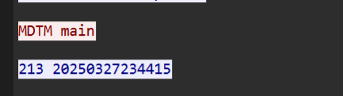

# Dicecap

题目给的是一个流量包，发现都是FTP流量，有个用户名为`USER hacker`，这个后面有用。


接着找，发现有ELF文件，导出一个main，还有`coolzip.zip`


逆向一下`main`,发现是一个密码生成器，生成密码规则为`10位时间戳+时区+用户名`，时区翻找前面的流量，发现有运行`locale`，其返回为`en_US`。


在前面FTP操作中，有对文件进行查看创建时间戳操作，根据时区进行转为`1743126255`和`1743133717`

	


编写一个简单的py来生成密码谱

```javaScript
with open('hashes.txt', 'w') as f:
    for i in range(1743126255,1743133717,1):
        f.write(str(i) + 'en_UShacker'+'\n')
```

使用john进行爆破

>  zip2john coolzip.zip > coolzip.txt
>
> john --wordlist=hashes.txt coolzip.txt


>  1743126480en_UShacker

解压缩包即可得到flag

>  dice\{5k1d_y0ur_w@y_t0_v1ct0ry_t0d4y!!!\}