# Injectics

*Can you utilise your web pen-testing skills to safeguard the event from any injection attack?*
*您能否运用您的网络渗透测试技能来保护活动免受任何注入攻击？*

靶机地址：10.10.108.231

访问网站源代码发现存在提示信息


```
<!-- Website developed by John Tim - dev@injectics.thm-->
```

存在可用用户名邮箱：`dev@injectics.thm`

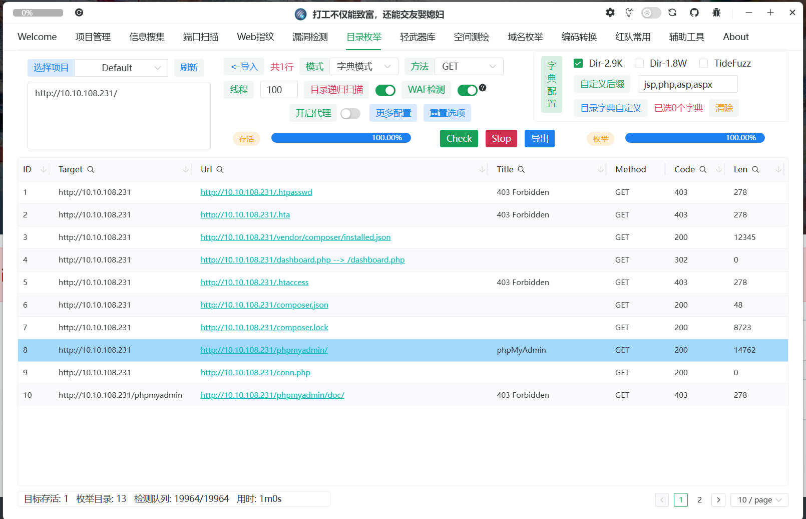

使用`xia-sql`插件发现存在万能密钥可以直接登录`dev`用户

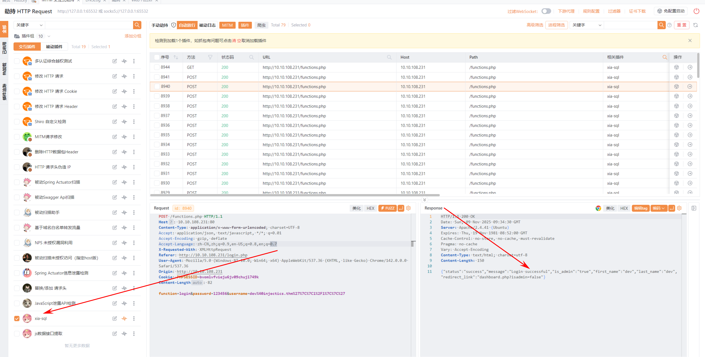

输入用户名`dev@injectics.thm'||1/1||'`，密码随意，注意不能在前端直接输入，存在`script.js`过滤

> dev@injectics.thm'||1/1||'

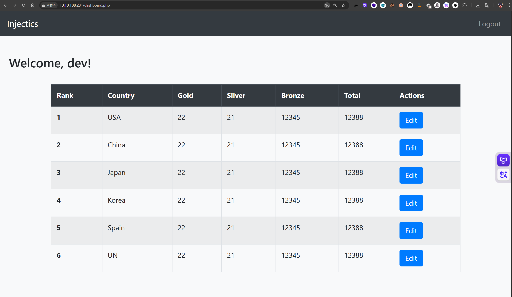

尝试测试SSTI注入，发现可以成功执行`7*7=49`,但无法使用`{`、`}`来注入模板，猜测要么是后端是eval函数或者是直接拼接SQL语句，数据库识别后执行了。

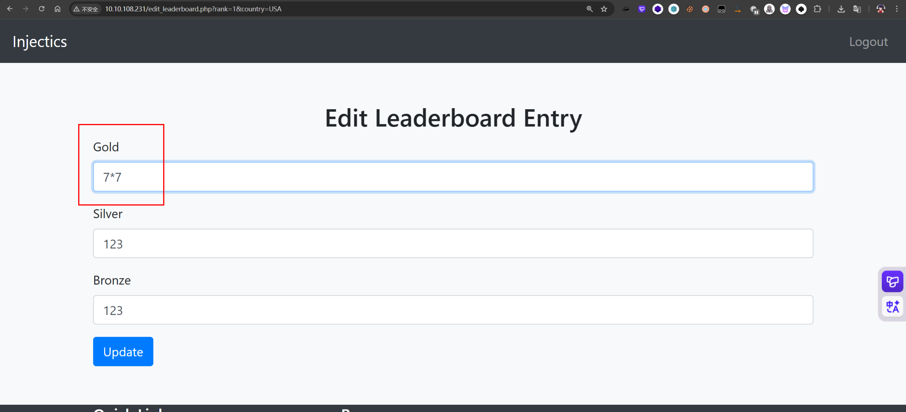

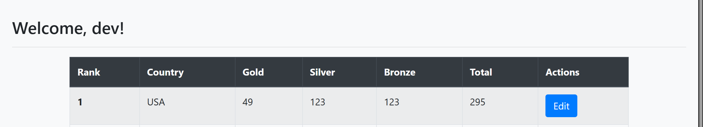

发现`mail.log`中有账号密码，要求需要删除表`users`后会重新构建新账号密码

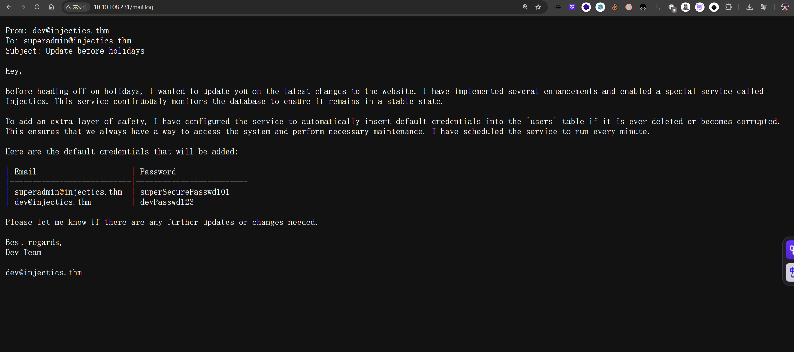

```
From: dev@injectics.thm
To: superadmin@injectics.thm
Subject: Update before holidays

Hey,

Before heading off on holidays, I wanted to update you on the latest changes to the website. I have implemented several enhancements and enabled a special service called Injectics. This service continuously monitors the database to ensure it remains in a stable state.

To add an extra layer of safety, I have configured the service to automatically insert default credentials into the `users` table if it is ever deleted or becomes corrupted. This ensures that we always have a way to access the system and perform necessary maintenance. I have scheduled the service to run every minute.

Here are the default credentials that will be added:

| Email                     | Password 	              |
|---------------------------|-------------------------|
| superadmin@injectics.thm  | superSecurePasswd101    |
| dev@injectics.thm         | devPasswd123            |

Please let me know if there are any further updates or changes needed.

Best regards,
Dev Team

dev@injectics.thm
```

破坏表`users`结构,使用堆叠注入

> 1；DROP table users;

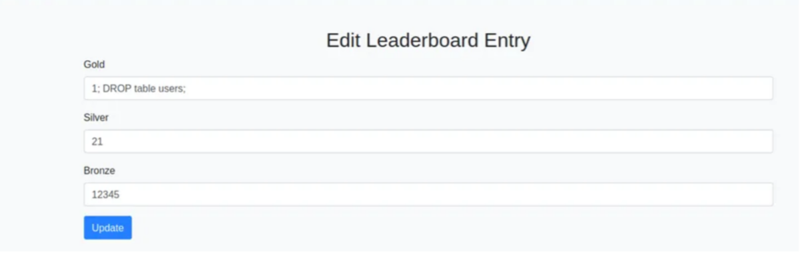

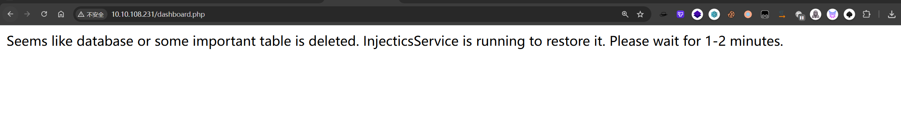

等待1-2分钟后，使用`mail.log`中账号密码登录到管理员

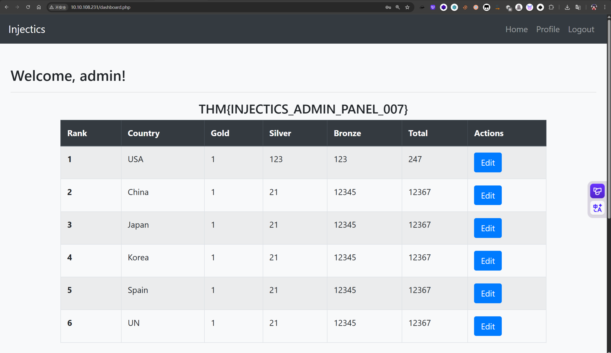

> THM\{INJECTICS\_ADMIN\_PANEL\_007\}

登录到管理员后发现存在新功能点Update Profile，猜测存在SSTI注入

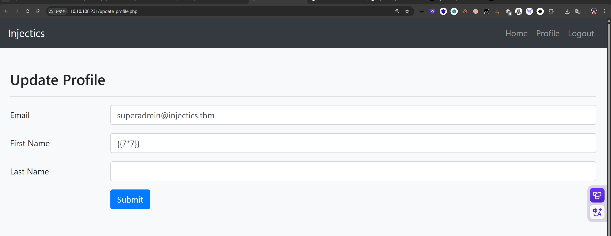

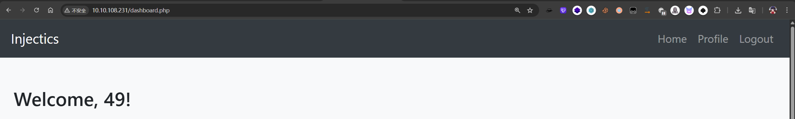

目录扫描发现存在`composer.json`文件使用`require`引入了`twig`模板

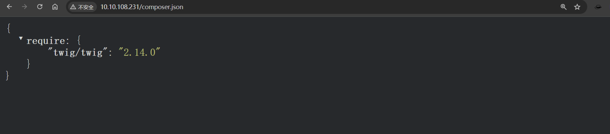

查找跟twig模板注入相关资料，利用`sort`函数性质，可以调用函数`passthru`执行命令

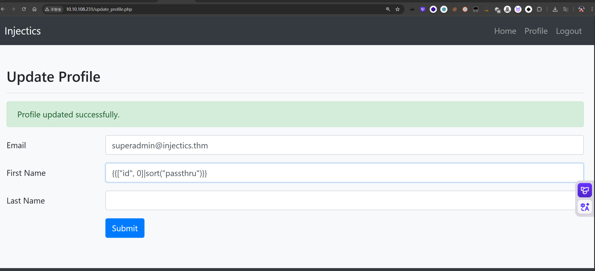

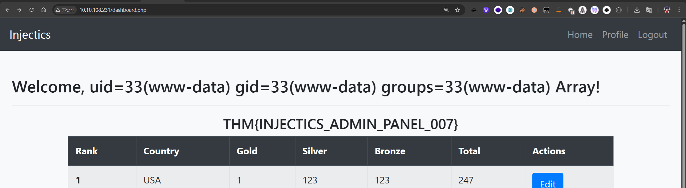

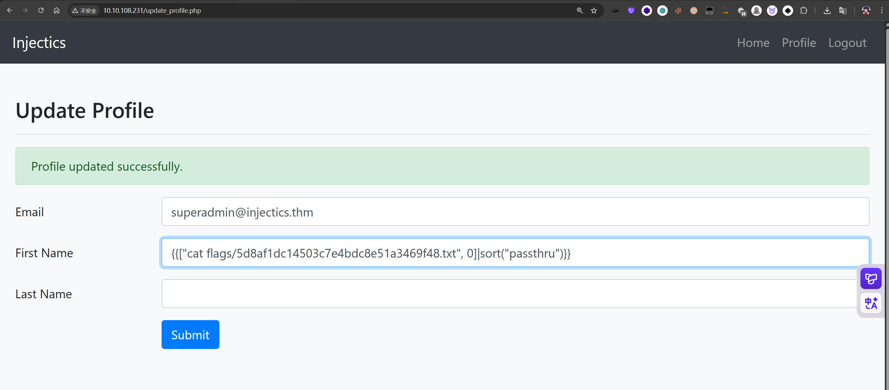

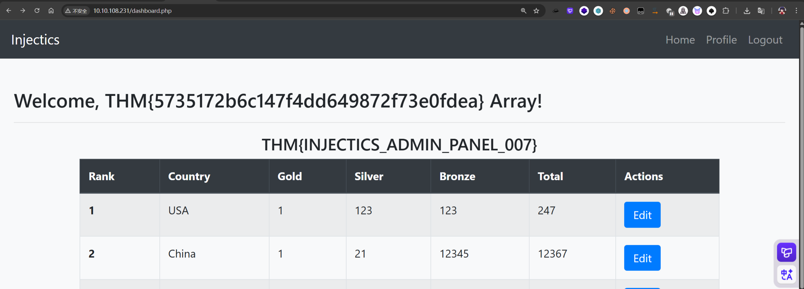

> THM\{5735172b6c147f4dd649872f73e0fdea\}