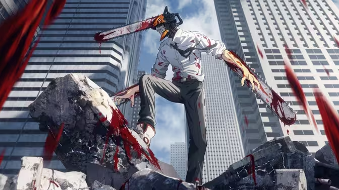
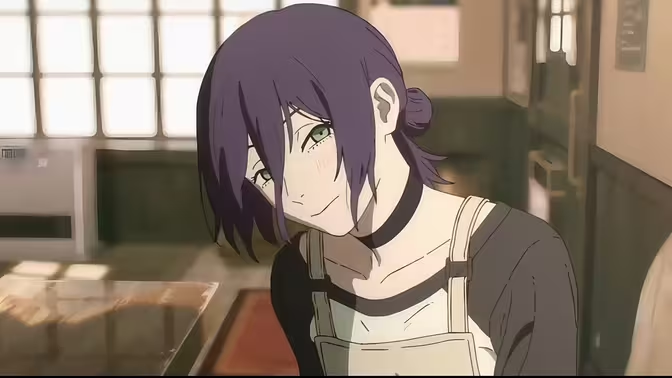
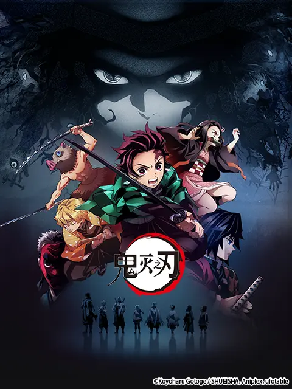
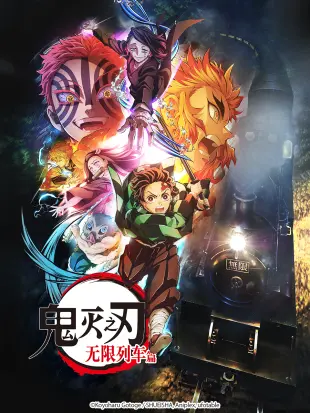
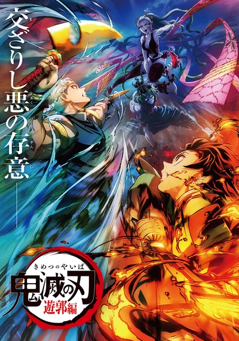
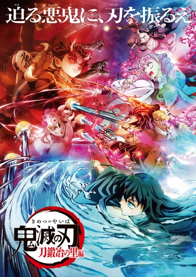
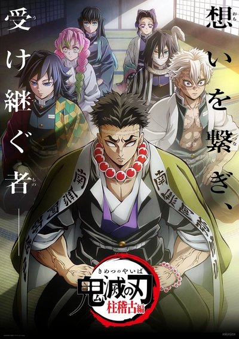
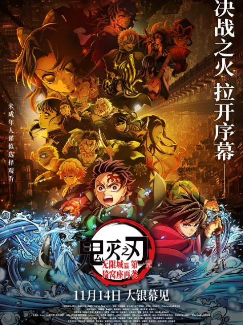

# 人类快乐秘籍
## 前言

> 很早之前就想把自己看过的动漫整理到一起，记录下每次刚看完一部作品时最真实的感受。“人生快乐秘籍”这个名字也是很早就定下来的，虽然已经忘了它的来历，但现在想想，倒也意外地贴切。

## 

## Chainsaw Man（电锯人）

### 第一季

{ width=700px }

评分：7/10

评价：设定上世界观比较扭曲，还是第一次看这种可以说是混乱的设定吧，感觉恶魔强度全靠作者自己写，想怎么写就怎么写（神人藤本树）。也算是一部臭屌丝逆袭（其实也没多逆袭），坑点槽点都感觉不少，但是呢，主角的性格加上使用电锯锯怪的感觉十分解压，剧中登场每只怪都又大又圆润，用电锯实在是选对武器了🤤🤤🤤

### 蕾塞篇
{ width=700px }

评分：8.5/10

评价：雷赛篇在剧情上看似是支线分支，但热度相比主线有过之而不及。雷赛算是很多人的意难平吧，从到电次的初遇，到学校游泳，再到烟火大会，貌似跟正常恋爱一样的流程，却是发生在如此混乱的世界中，好比在战场中的恋情一般，没人可以预知即将到来的是死亡还是美好和平。雷赛也许从得知玛奇玛是电次上司之后就明白了自己的结局，最后的赴约也只是想让电次明白真的有人喜欢电次的心😭😭😭

## 鬼灭之刃

### 立志篇
{ width=300px }

### 无限列车篇
{ width=300px }

### 游郭篇
{ width=300px }

### 刀匠村篇
{ width=300px }

### 柱训练篇
{ width=300px }

### 无限城篇

#### 第一章 猗窝座再袭
{ width=300px }