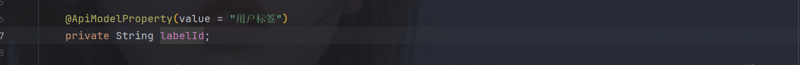
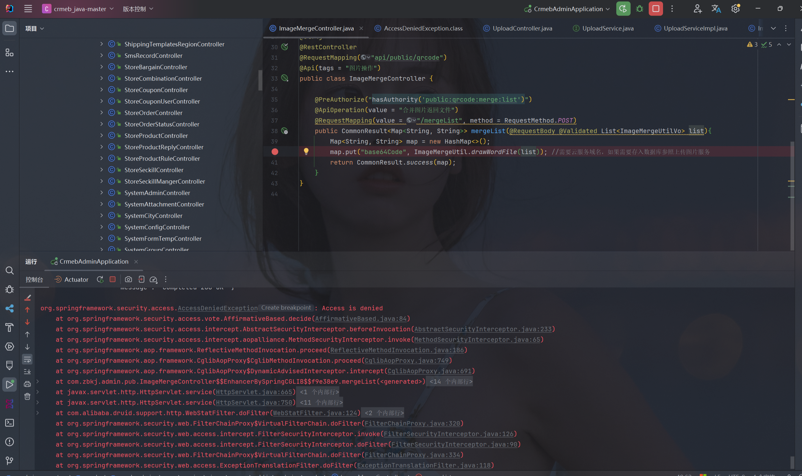

# CRMEB

## 环境搭建：

官方有参考手册：[CRMEB Java版单商户📖 序言 - CRMEB文档](https://doc.crmeb.com/java/crmeb_java/2211)

```
MySQL 5.7 
Redis 5.0
jdk 1.8 
npm 16
```

需要修改一下`crmeb-admin/src/main/resources/application.yml`下MySQL账密跟Redis的密码。

这个框架是前后端分离的，前端也需要下载依赖。

```
nvm install 16 
nvm use 16 
npm install 
npm run dev 
```

后端的话，直接SpringBoot启动就行。

## SQL注入

### 第一处(可以利用)

发现有三个接口存在SQL注入，可惜这个三个接口都在同一个路由中，而且在同一个where变量的拼接处，所以相当于只有一个注入点。

这边我们可以发现有三个可控参数，`storeId`,`dateLimit`和`keywords`，其中`storeId`类型为Int，无法进一步利用，`dateLimit`的话，使用了`DateUtil`进行类型转换也不能利用，最后只有`keywords`可以成功拼接。


```
POST /api/admin/system/store/order/list HTTP/1.1
Host: 192.168.196.156:8080
User-Agent: Mozilla/5.0 (Windows NT 10.0; Win64; x64) AppleWebKit/537.36 (KHTML, like Gecko) Chrome/134.0.0.0 Safari/537.36
Accept: application/json, text/plain, */*
Origin: http://localhost:9527
Authori-zation: 9e0adfb7b4b24cad99981679609e5fa6
Content-Type: application/x-www-form-urlencoded
Content-Length: 16

keywords=1'
```

### 第二处(无利用)

这个`uid`在表中是Int类型，大概率传入的`userIdList`也是Int类型，找到最后`getSpreadPeopleList`这个方法，能找到`userIdList`定义为Integer类型数组，无法进一步利用。


这个`tagIdSql`也差不多同理，虽然这个`labelId`是一个可控的`String`类型，但是在`getFindInSetSql`方法中，对其转为`List<Integer>`，然后在转`ArrayList<String> sqlList`，所以也是不行的。





这个`status`更不用看了，`Boolean`类型直接开除。


### 第三处(可以利用)

这个地方自己审没找到，没想着去找动态SQL。看别人文章发现的。

用idea自带的全局搜索`Ctrl+shift+F`，直接搜索`Mybatis`相关的动态SQL`QueryWrapper`。

在`StoreProductServiceImpl`类中存在SQL字符串的拼接。这个`cateId`还是字符串类型，且可控。


进一步找到接口位置就行了，跟第一个注入点差不多。


`type`参数不能为空，否则会报错。


```
GET /api/admin/store/product/list?type=1&cateId=1' HTTP/1.1
Host: 192.168.196.156:8080
User-Agent: Mozilla/5.0 (Windows NT 10.0; Win64; x64) AppleWebKit/537.36 (KHTML, like Gecko) Chrome/134.0.0.0 Safari/537.36
Accept: application/json, text/plain, */*
Origin: http://localhost:9527
Authori-zation: 9e0adfb7b4b24cad99981679609e5fa6


```

## Druid

Druid硬编码账号密码，`kf/654321`


## Swagger

默认开启`swagger`，也算不上什么漏洞吧。审了就写吧。


## XXE（无利用）

分析依赖的时候看到有dom4j，找找有没有xxe注入。


定位一下`SAXReader`直接就找到了，但是`setReaderFeature`做了XXE的防御，应该绕不了。


在找一下`DocumentBuilder`,在`WXPayXmlUtil`中，也有防御点，后面发现好像是别人挖过后面打补丁了😭😭😭


## SSRF(未利用)

不是很清除这个微信接口的权限，貌似PC管理员都无法直接使用，这里没有在去搞微信接口测试，差不多就这样，应该是有洞的这个地方。



