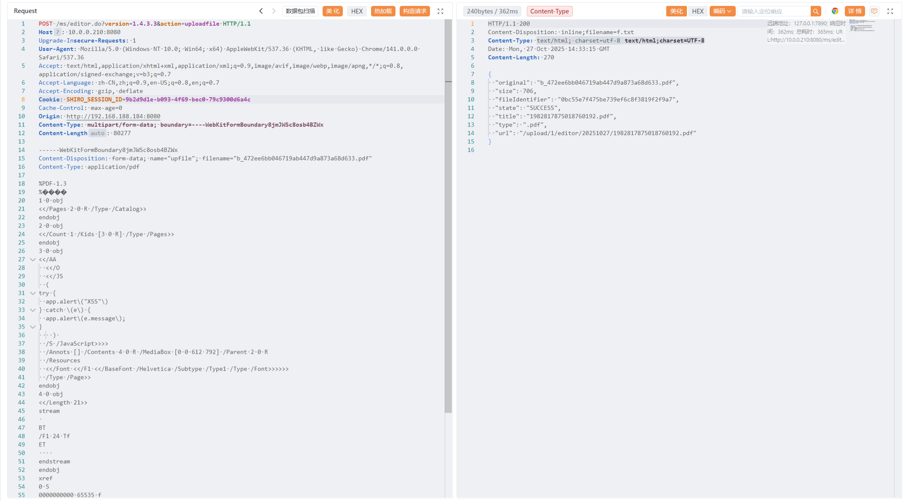

# MCMS
## 环境搭建

https://gitee.com/mingSoft/MCMS/

官方教程：

创建mcms数据库，导入`/bin`下的sql文件。

下载完`pom.xml`中的依赖后，就可以直接SpringBoot启动了。

访问`http://localhost:8080/ms/login.do`

默认账号密码：

`msopen/msopen`

## 文件上传XSS（可利用）

使用uedior 1.4.3.3版本，这个版本刚好存在文件上传XSS以及SSRF漏洞

登录后在`内容管理`->`文章管理`处添加新文章，即可查看到熟悉的ueditor页面。

这个系统不是使用默认的ueditor上传接口，即 `ueditor/jsp/controller.jsp?action=uploadfile`，而是自定义了上传的逻辑，在`src/main/java/net/mingsoft/cms/action/EditorAction.java`中可以找到相关的上传逻辑。

这个文件上传接口是存在鉴权的，删除Cookie后访问这个接口会直接302跳转

打一个正常的文件上传xml的存储型XSS，发现文件后缀被拒绝

直接全局搜索`文件后缀被拒绝`的字样，在`net.mingsoft.basic.aop/FileVerifyAop.java`下发现存在`MSProperties.upload.denied`，定义了拒绝上传的文件后缀。

导致无法进行xml XSS，但可以上传HTML和PDF XSS。

后续发现又发现好几个一样的文件上传接口，不过貌似上传HTML属实是算合法文件，

## SSRF漏洞（可利用）

常规ueditor 1.4.3版本下的SSRF，由于跟文件上传是同一个接口，只是action不一样，所以还是同样需要鉴权。

	

## API文档泄露（可利用）

默认开启Swagger

