# Spring Security-权限绕过

## 0x 01 简介

Spring Security 是 Spring 生态中用于 **身份认证与访问控制** 的核心安全框架，广泛应用于各类 Java Web 与微服务系统。它基于 Servlet Filter 链机制，在请求进入业务逻辑之前统一完成登录校验、权限判断和安全策略执行。Spring Security 支持多种认证方式，包括表单登录、HTTP Basic、JWT、OAuth2、LDAP 等，能够灵活适配不同业务场景。在授权方面，它既可以基于 URL 进行访问控制，也可以通过注解或方法级别实现细粒度权限管理。

## 0x 02 前置知识

1. 基础结构

定义一个`Spring Security`配置类通常使用注解`@Configuration`和`@EnableWebSecurity`。

如果没有写任何有关Security 配置类，Spring Boot默认会启用安全策略（这里把`SecurityConfig`配置类置空），用于保护所有的路由接口。在启动项目后会出现`security password`，默认用户名是`user`。


访问`http://192.168.1.8:8080/login`，默认需要使用上诉的凭证才能访问这个应用程序，这里使用`user:892ba854-d40f-48a0-b1f5-7b8ec798ab6c`就能成功登录。

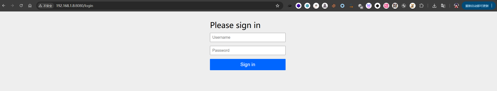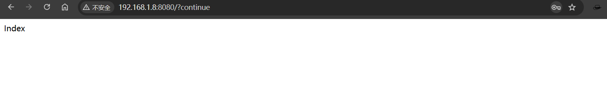

在`SecurityConfig`配置类中使用`@Bean`注解后，控制台就默认不会再显示密码了，这里编写一个简单的`UserDetailsService`认证服务。`UserDetailsService`是Spring Security默认的认证体系中的接口，也就是如果要修改认证过程就需要定义一个返回这个类的方法。这里使用`{noop}`作为密码编码器，`{noop}`默认是不编码密码，生产环境通常使用`{bcrypt}`作为密码编码器，使用`Bcrypt`进行加密处理。

```java

@Configuration
@EnableWebSecurity
public class SecurityConfig {
    @Bean
    public UserDetailsService userDetailsService() {
        UserDetails user = User.builder()
                .username("Dragonkeep")
                .password("{noop}Dragon123")
                .build();
        return new InMemoryUserDetailsManager(user);
    }

}
```

`authorizeHttpRequests`组件用于授权后决定当前用户是否有权限访问路由，大致流程为：

> 请求->是否认证->已认证->authorizeHttpRequests 匹配规则 -> 是否有权限访问 -> 允许/拒绝

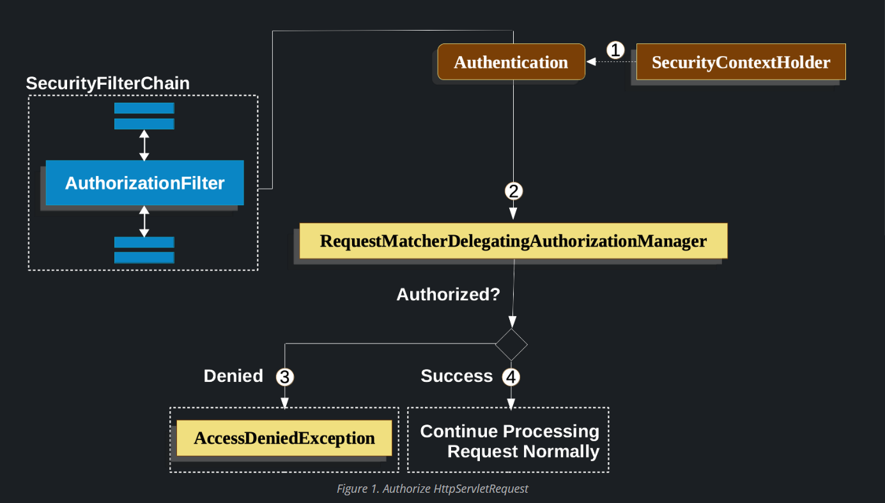

2. `Spring Security`常见路由匹配函数：

`antMatchers`函数是 Spring Security 中用于匹配请求路径的方法。它基于 Ant 风格的路径匹配规则。在Spring Security中，antMatchers() 通常用于定义需要进行安全性配置的URL模式。支持`antMatchers`函数的`Spring Security`版本为5.0.x到5.7.x，对应的Spring Boot版本为2.0.x到2.7.x。

常见的正则匹配：

```
? 匹配任意单个字符
* 匹配0个或多个字符
** 匹配0个或多个目录
```

例如：

```
antMatchers("/admin/**").access("hasRole('ADMIN')")
```

访问`/admin/**`端点需要ADMIN权限，路径中包含`/admin`下的都需要鉴权处理。

```
antMatchers("/js/**").permitAll()
```

路由`/js/`目录下的所有文件都无需权限即可访问。


## 0x 03 环境搭建

简单创建一个SpringBoot项目，记得勾选Spring Security配置。

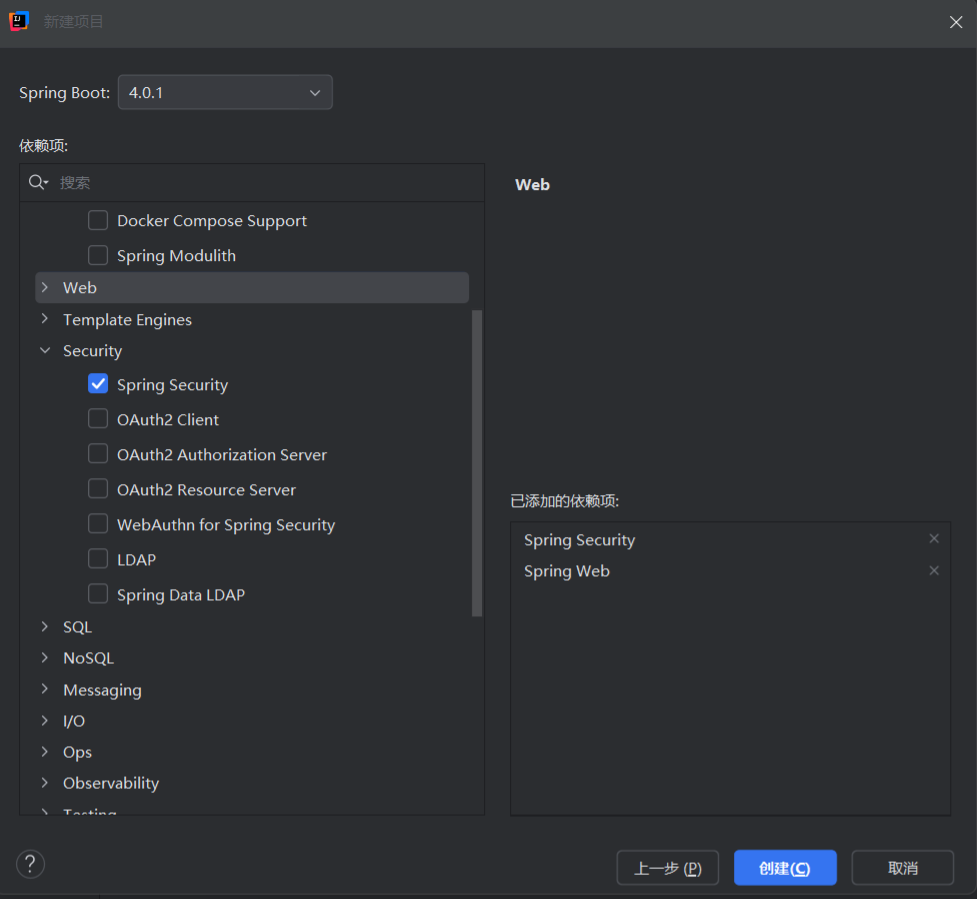

编写一个简单的Demo，等会用于测试权限绕过相关漏洞。

大致项目目录如下：

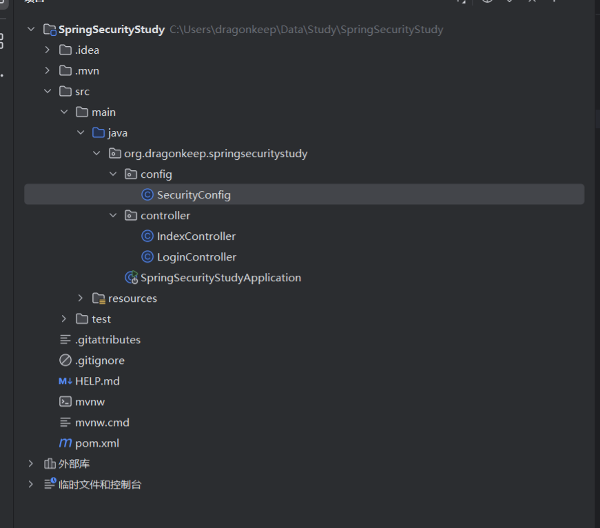

`SecurityConfig.java`

```java
@Configuration
@EnableWebSecurity
public class SecurityConfig {

    @Bean
    public SecurityFilterChain securityFilterChain(HttpSecurity http) throws Exception {

        http
                // CSRF（Lambda 写法，必须带参数）
                .csrf(csrf -> csrf.disable())

                // 授权规则
                .authorizeHttpRequests(auth -> auth
                        .requestMatchers("/", "/login").permitAll()
                        .requestMatchers("/admin").hasRole("ADMIN")
                        .requestMatchers("/user").hasRole("USER")
                        .anyRequest().authenticated()
                )

                // 表单登录
                .formLogin(form -> form
                        .loginPage("/login")
                        .loginProcessingUrl("/doLogin")
                        .usernameParameter("username")
                        .passwordParameter("password")
                        .permitAll()
                )

                // 注销
                .logout(logout -> logout
                        .logoutUrl("/logout")
                        .permitAll()
                );

        return http.build();
    }

    @Bean
    public UserDetailsService userDetailsService(PasswordEncoder encoder) {

        UserDetails user = User.withUsername("user")
                .password(encoder.encode("123456"))
                .roles("USER")
                .build();

        UserDetails admin = User.withUsername("admin")
                .password(encoder.encode("admin123"))
                .roles("ADMIN")
                .build();

        return new InMemoryUserDetailsManager(user, admin);
    }

    @Bean
    public PasswordEncoder passwordEncoder() {
        return new BCryptPasswordEncoder();
    }
}
```

`IndexController.java`

```java
@RestController
public class IndexController {
    @GetMapping("/")
    public String index() {
        return "Index";
    }

    @GetMapping("/user")
    public String user() {
        return "You are user!";
    }

    @GetMapping("/admin")
    public String admin() {
        return "You are Admin!";
    }
}

```

`LoginController.java`

```java
@Controller
public class LoginController {

    @GetMapping("/login")
    @ResponseBody
    public String login() {
        return """
        <form method='post' action='/doLogin'>
            用户名：<input name='username'/><br/>
            密码：<input type='password' name='password'/><br/>
            <button type='submit'>登录</button>
        </form>
        """;
    }
}
```


## 0x 04 漏洞复现

### 1.antMatchers函数配置不当导致权限绕过

`antMatchers`函数已经是旧版的路由匹配函数了，复现需要使用到Spring Boot 2.x版本，这里使用Spring Boot稳定版2.7.18。

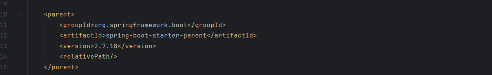

漏洞代码，`antMatchers`函数只对`/admin`端点进行权限校验，没有使用类似`/admin/**`进行匹配路由，导致攻击者可以使用`/admin/`直接绕过权限访问策略。

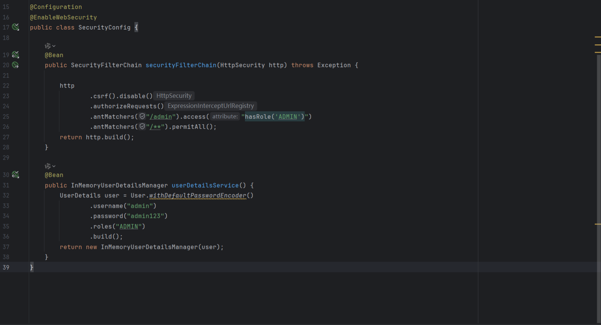

访问`/admin`路由节点，返回`403`访问未授权。

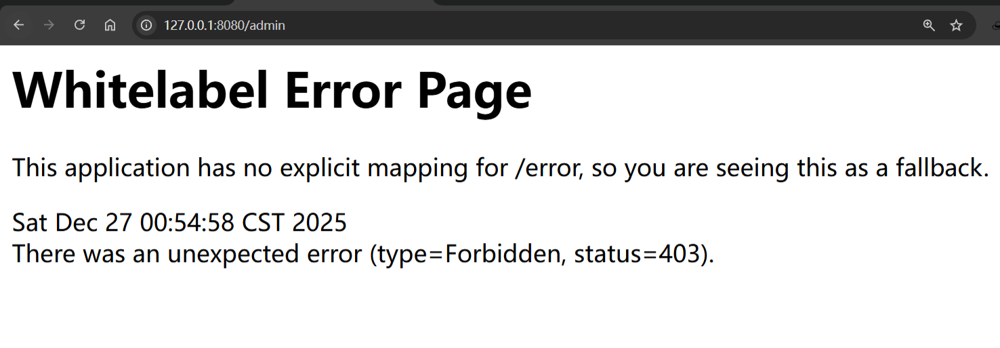

访问`/admin/`成功绕过权限。

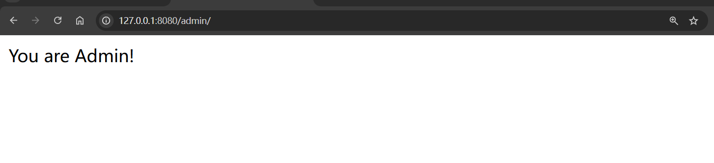

同理，如果只限制了`/admin/*`这样的路由配置，也可以轻松通过这种方式绕过。

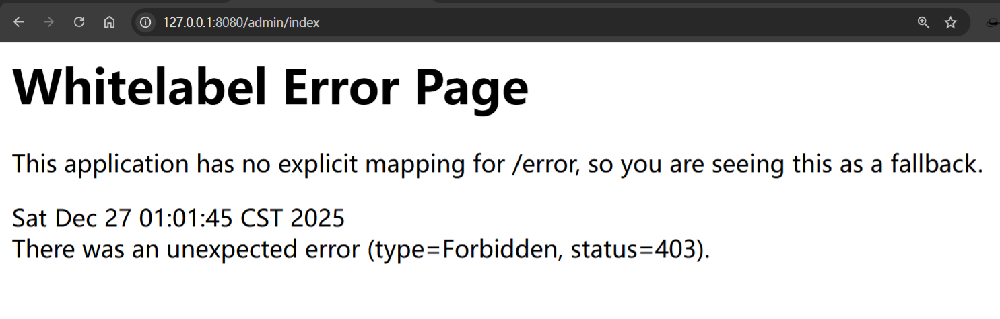

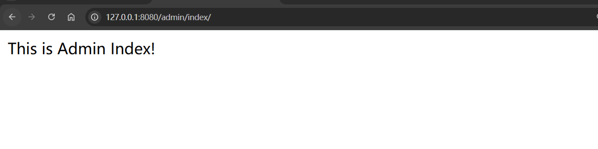

更低一点的Spring Boot版本也可以通过下面常见的方式绕过：

```
/admin//index
/admin/%2Findex
```

修复方式：

使用`antMatchers`函数需要正确编写通配符匹配路由规则，

```
antMatchers("/admin/**").access("hasRole('ADMIN')")
```

或者使用`mvcMatchers`函数

```
mvcMatchers("/admin").access("hasRole('ADMIN')")
```

### 2.regexMatchers配置不当导致权限绕过

`regexMatchers`函数使用正则表达式来匹配路由，其实跟`antMatchers`函数区别不大，`antMatchers`函数是使用`Ant`表达式。

例如：

匹配`/admin`路由前缀

```
regexMatchers("/admin.*?").access("hasRole('ADMIN')"
```

放行以`.js`结尾的文件

```
regexMatchers(".+[.]js").permitAll()
```

漏洞代码，看起来跟`antMatchers`没多大区别，也就是换了路由表达式的匹配写法而已，同样也是因为匹配规则不够严谨导致的权限绕过。

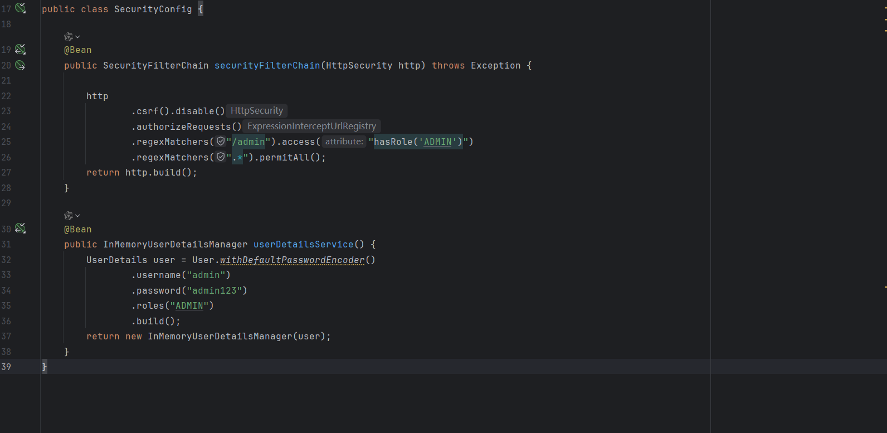

Bypass方式：

```
/admin?
/admin/
```

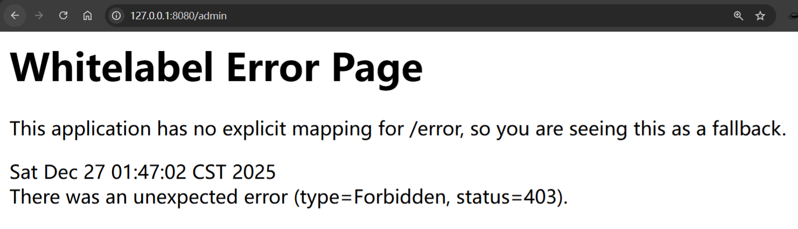

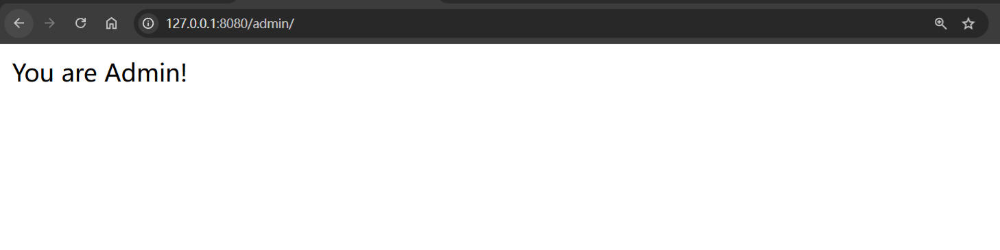

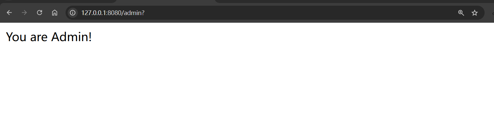

修复方式：

```
regexMatchers("/admin.*?").access("hasRole('ADMIN')")
```


### 3.CVE-2022-22978

漏洞简述：

```
Spring Security中使用RegexRequestMatcher进行权限配置，且规则中使用带点号(.)的正则表达式时，未经授权的远程攻击者可通过构造恶意数据包绕过身份认证，导致配置的权限验证失效。
```

受影响版本：

```
Spring Security 5.6.x < 5.6.4
Spring Security 5.5.x < 5.5.7
Spring Security 5.4.x <5.4.11
```

漏洞满足条件：

- 在权限config配置的时候，使用函数`regexMatchers`匹配`/admin/.*` 后所有的路由

- 在Controller的代码中，只能对`/admin/** `这种匹配所有路径的语法才能生效，如果写死路由`/admin/index`，这样子是无法绕过的，因为就算绕过权限校验，但是程序无法匹配到路由。

漏洞复现：

这个漏洞需要修改Spring Boot版本为`2.6.4`

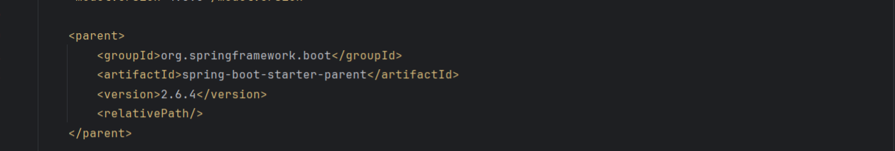

漏洞代码，使用`regexMatchers`函数，并使用正则`.`来匹配字符

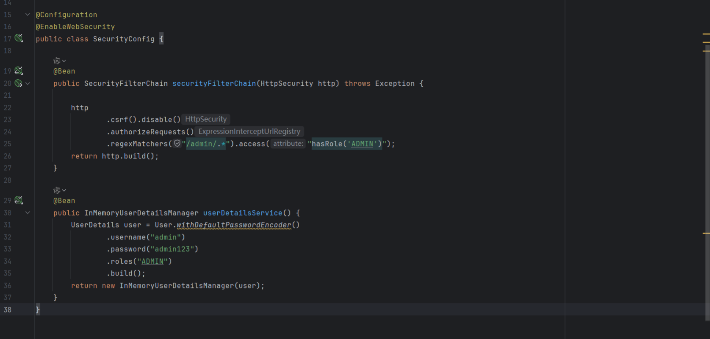

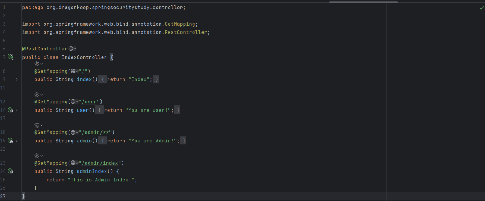

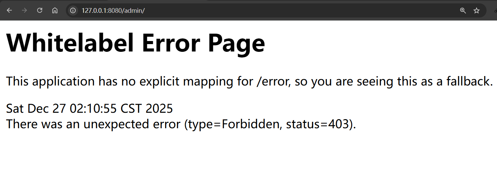

Bypass方式：

```
/admin/%0d
/admin/%0a
```

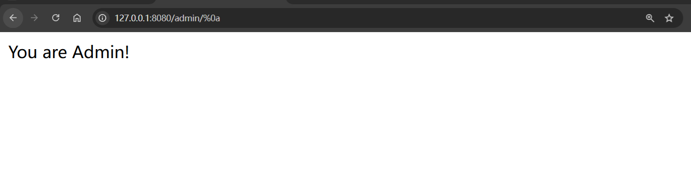

对于`/admin/index`这类写死路由，使用`/admin/index/%0d`绕过会无法正常匹配`IndexController`的正常路由逻辑。可以看到这里依旧是返回`You are Admin!`，而`/admin/index`实际应该返回`This is Admin Index!`。

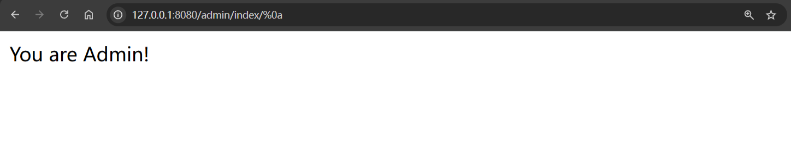

# Ref

https://www.cnblogs.com/nice0e3/p/16798843.html

https://evilpan.com/2023/08/19/url-gotchas-spring/

https://threedr3am.github.io/2021/09/22/Spring%20Security%E7%9A%84%E4%B8%80%E4%B8%AA%E7%AE%80%E5%8D%95auth%20bypass%E5%92%8C%E4%B8%80%E4%BA%9B%E5%B0%8F%E7%AC%94%E8%AE%B0/

https://stack.chaitin.com/techblog/detail/203

https://medium.com/@ansgar.nell/spring-boot-security-step-by-step-21ea836499f8