# Shiro550

## 0x 01 概述

Apache Shiro 是一个轻量级的 Java 安全框架，主要用于实现登录认证、权限控制、会话管理和简单加密等功能。它结构清晰、易于集成，通过 Subject、SecurityManager 和 Realm 等组件，实现从用户身份验证到权限校验的完整安全体系，常用于中小型 Java Web 项目的权限与安全管理。

## 0x 02 漏洞原理

Apache Shiro框架提供了记住密码的功能`RememberMe`，用户登录成功后会将用户的登录信息加密编码，然后存储在Cookie中。对于服务端，如果检测到用户的Cookie，首先会读取rememberMe的Cookie值，然后进行base64解码，然后进行AES解密再反序列化。

从攻击者的角度来看，如果攻击者成功爆破出用于加密`RememberMe`字段的AES密钥，相当于存在一个Java的反序列化入口。倘若服务端使用了存在Java 反序列漏洞依赖的组件，例如常见的`commons-collections3`、`commons-collections4`、`commons-beanutils`等等，那么攻击者利用Shiro提供的反序列入口构造出恶意的`Gadget`链，从而实现RCE。

漏洞版本：

> Apache Shiro <= 1.2.4

## 0x 03 漏洞环境搭建

配置文件`pom.xml`依赖，这里使用

```
    <dependencies>
        <dependency>
            <groupId>org.apache.shiro</groupId>
            <artifactId>shiro-core</artifactId>
            <version>1.2.4</version>
        </dependency>
        <dependency>
            <groupId>org.apache.shiro</groupId>
            <artifactId>shiro-web</artifactId>
            <version>1.2.4</version>
        </dependency>
        <dependency>
            <groupId>javax.servlet</groupId>
            <artifactId>javax.servlet-api</artifactId>
            <version>3.0.1</version>
        </dependency>
        <dependency>
            <groupId>javax.servlet</groupId>
            <artifactId>jstl</artifactId>
            <!--  这里需要将jstl设置为1.2 -->
            <version>1.2</version>
        </dependency>
        <dependency>
            <groupId>commons-logging</groupId>
            <artifactId>commons-logging</artifactId>
            <version>1.2</version>
        </dependency>
        <dependency>
            <groupId>commons-beanutils</groupId>
            <artifactId>commons-beanutils</artifactId>
            <version>1.9.4</version>
        </dependency>
    </dependencies>
```

添加依赖工件

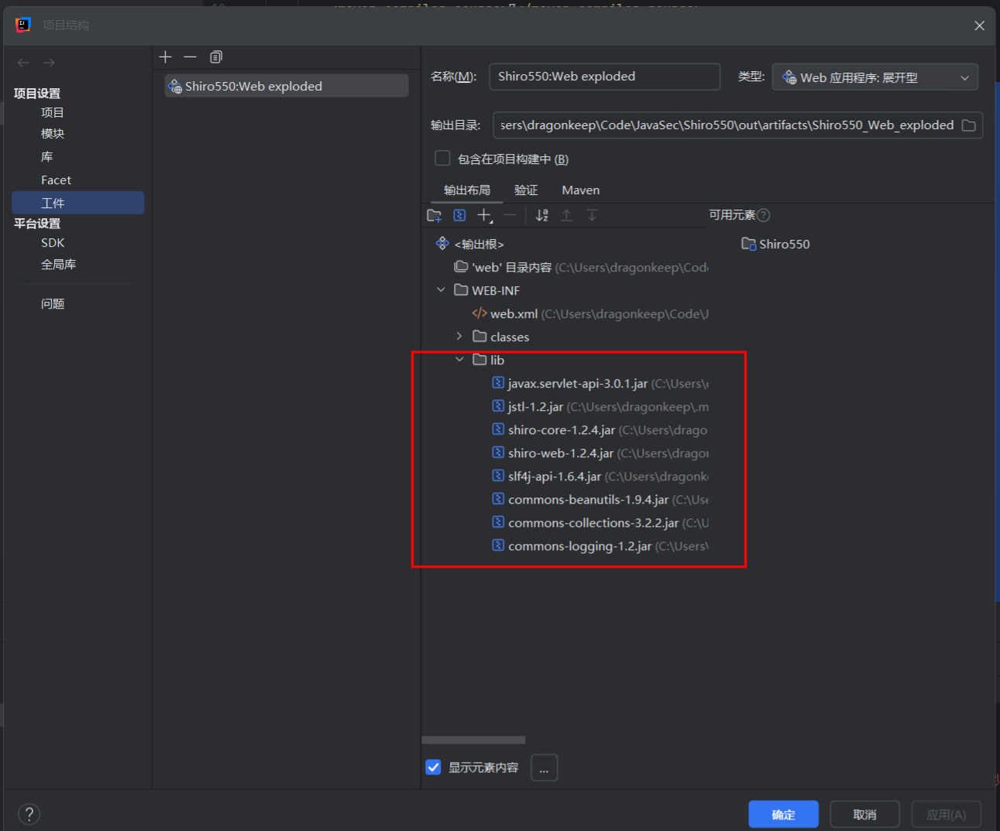

这里使用的代码是P神的测试环境代码

https://github.com/phith0n/JavaThings/blob/master/shirodemo/src/main/webapp/login.jsp

## 0x 04 漏洞调试

在官方给出的漏洞分析中，https://issues.apache.org/jira/browse/SHIRO-550

主要分析类`org.apache.shiro.web.mgt.CookieRememberMeManager`和`org.apache.shiro.mgt.AbstractRememberMeManager`中。

主要从两个方向进行分析源码，从`CookieRememberMeManager`类中是如何进行序列化加密的角度，从`getRememberedSerializedIdentity`则是从反序列化解密角度。

默认key位置

`shiro-core-1.2.4-sources.jar!/org/apache/shiro/mgt/AbstractRememberMeManager.java`文件中`DEFAULT_CIPHER_KEY_BYTES`变量。

### 反序列加密

全局搜索`CookieRememberMeManager`类，发现调用`rememberSerializedIdentity`函数用于处理Cookie序列化逻辑，我们直接查看引用，看看哪里调用了这个函数就可以进一步跟进到加密逻辑。

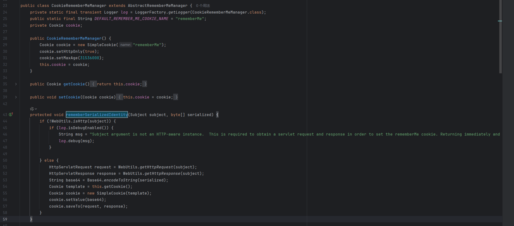

查看引用后发现只有抽象函数`AbstractRememberMeManager`也就是`CookieRememberMeManager`继承的抽象类中的函数调用`rememberIdentity`了`rememberSerializedIdentity`函数


查看`rememberIdentity`函数逻辑，传入两个参数，分别是`subject`和`accountPrincipals`。 `subject`是Shiro框架中用于代表特定身份的一个类，在此方法中用于区别不同的用户登录，`PrincipalCollection`是Apache Shiro 框架中的一个接口，用于表示一个或多个身份主体(principal)的集合，这里的`accountPrincipals`存储了用户身份认证信息。

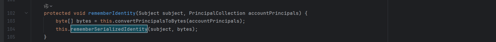

这里使用`guest/guest`登录，可以查看到相关认证信息。

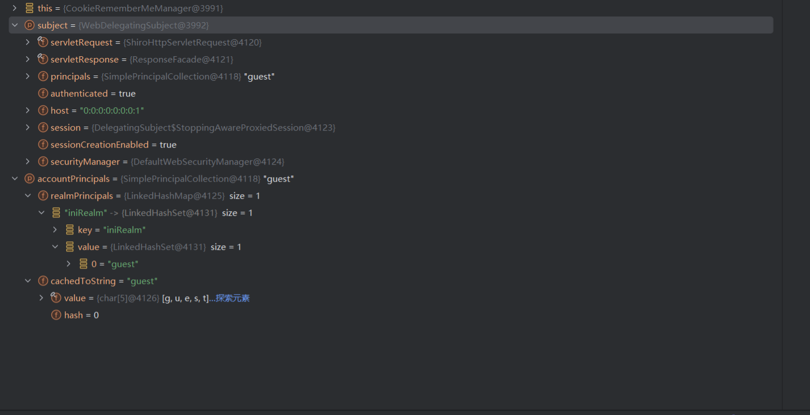

继续跟进函数`convertPrincipalsToBytes`，主要逻辑是将存储认证信息的`accountPrincipals`变量转为字节形式，其中`encrypt`函数就是对`accountPrincipals`变量进行加密。

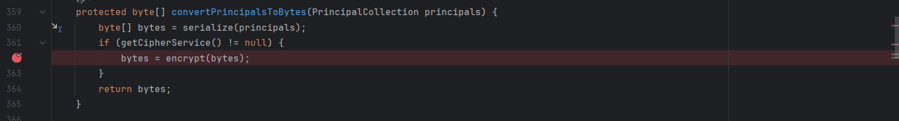

`encrypt`函数调用函数`getCipherService`实例化对象`cipherService`，直接debug可以看到使用的是`AES CBC PKCS5Padding`方法进行加密，`getEncryptionCipherKey`获取AES加密KEY，一路跟进调用，可以发现是硬编码`DEFAULT_CIPHER_KEY_BYTES`常量值为`kPH+bIxk5D2deZiIxcaaaA==`Base64解码。

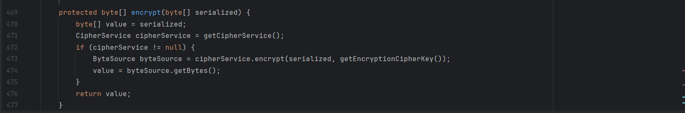

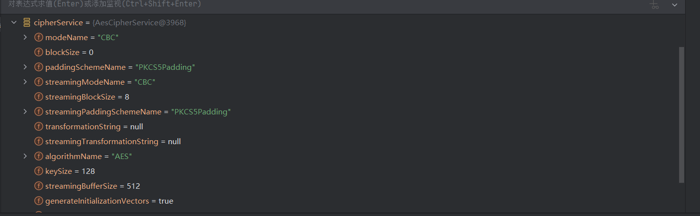

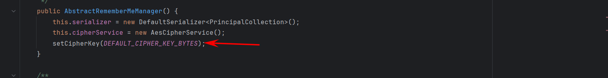

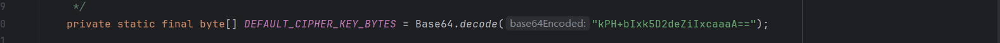

到此加密逻辑部分就差不多了，为了完整性，补充一下

如果使用RememberMe功能成功登录的话，调用函数`rememberMeSuccessfulLogin`，进一步调用`onSuccessfulLogin`方法

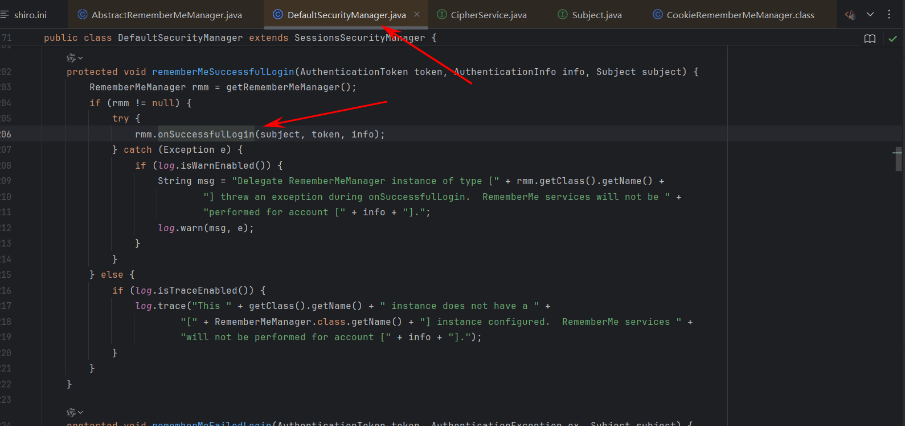

`onSuccessfulLogin`方法判断是否启用`RememberMe`功能，进一步调用函数`rememberIdentity`

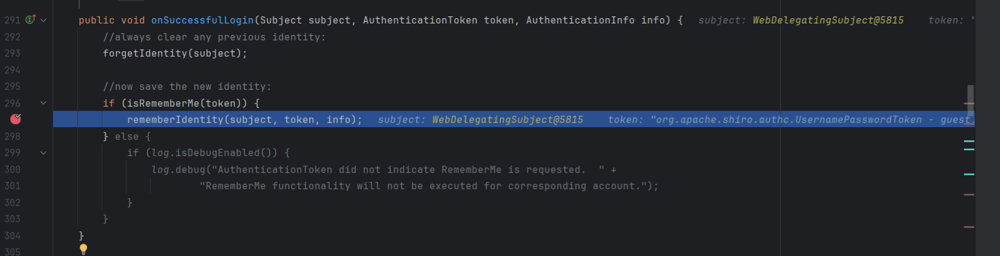

整个调用逻辑：

> rememberMeSuccessfulLogin --> onSuccessfulLogin --> rememberIdentity --> convertPrincipalsToBytes --> encrypt

### 反序列解密

在`DefaultSecurityManager`类中`getRememberedIdentity`函数接受用于区分身份认证的参数`subjectContext`，紧接着调用`AbstractRememberMeManager`抽象类下的`getRememberedPrincipals`函数。


从`getRememberedPrincipals`函数中，我们可以大概看出主要逻辑在函数`getRememberedSerializedIdentity`和`convertBytesToPrincipals`当中

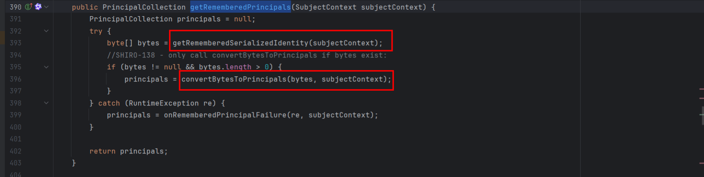

`getRememberedSerializedIdentity`函数主要判断Cookie是否合法以及`deleteMe`字段等等，把`subjectContext`当中的Cookie字段取出并Base64解密后返回

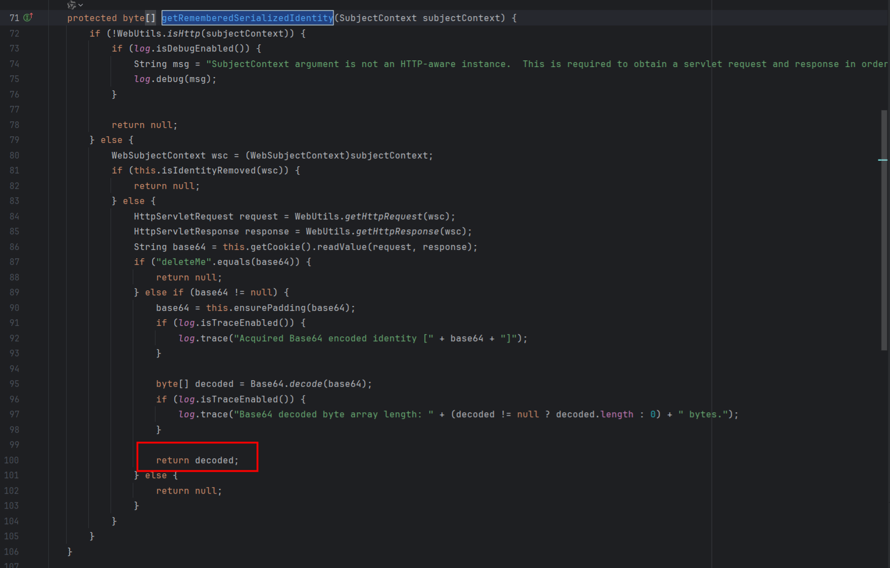

这里的`ensurePadding`函数也仅仅是对Base64判断长度补充`=`等，提高鲁棒性吧

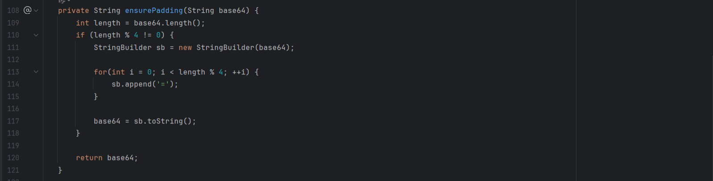

`convertBytesToPrincipals`函数主要对`getRememberedSerializedIdentity`返回的Cookie字节形式进行解密，以及反序列化处理

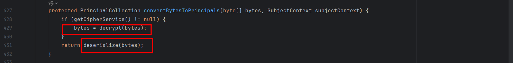

`decrypt`函数我们可以看到几乎跟前面`encrypt`一样的代码，无非是一个加密一个解密，经典的AES对称加密算法

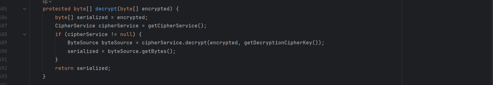

`deserialize`函数对解密后的字节进行反序列化处理，`getSerializer`函数用于获取序列化器，这个序列化器在`AbstractRememberMeManager`构造函数中有初始化，是一个为`DefaultSerializer`的序列化器

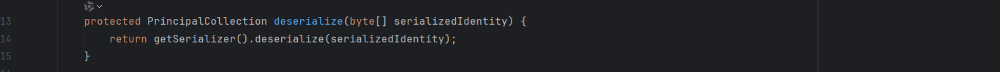

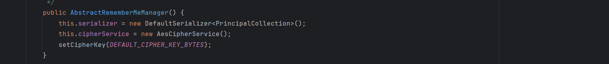

`DefaultSerializer`类的`deserialize`函数调用了`ClassResolvingObjectInputStream`类最后使用`resolveClass`进行反序列化，就不再赘述。

## 0x 05 反思

Shiro550在实战中遇到的次数还是不算少的，第一次打攻防就是用Shiro打进内网的，给我的印象还是十分深刻的。

Shiro550总的来说提供了一个Java 的反序列化入口点，让那些看起来没那么有用的Java反序列化Gadget链在实战中有机会大放异彩，不然像PHP的反序列化构造链在实战中能利用的机会少之又少。在目标服务器缺少必要反序列化依赖的情况下，也就是常说的Shiro 有key无链情况下，如果能通过heapdump或者其他一些渠道获得服务器依赖版本的情况下，也可尝试手动构造一些新链，毕竟能一把梭的工具基本都具有时效性。