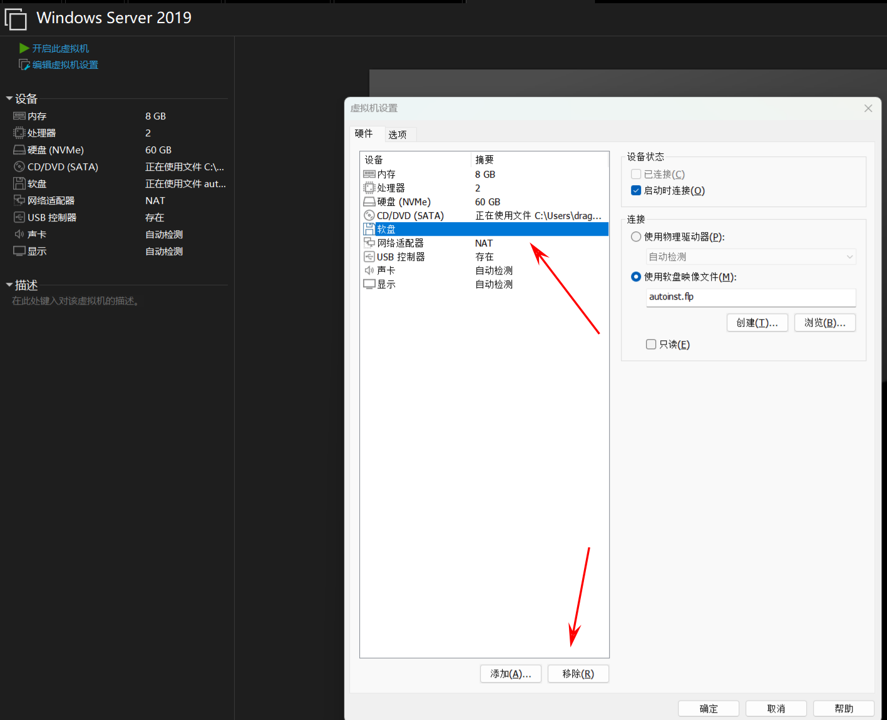
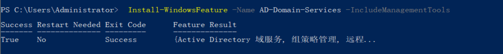

# AD域环境靶场部署

## 前言
在学习内网渗透方面知识，首先自己本地搭建一个AD域环境。
在VMware中使用Nat模式进行环境搭建。

|   主机名    | 角色  |     IP (静态)     |          操作系统          |              登录凭据              |
| :------: | :-: | :-------------: | :--------------------: | :----------------------------: |
|   DC01   | 域控  | 192.168.127.10  |  Windows Server 2019   | CORP\Administrator /  Win@2019 |
| SRV2016  | 域成员 | 192.168.127.11  |  Windows Server 2016   |    Administrator / Win@2016    |
| WIN10-PC | 域成员 | 192.168.127.100 |     Windows 10 Pro     |      dragonkeep / Dr@gon123      |
|   Kali   | 攻击机 |  192.168.127.139  |       Kali Linux       |             kali / kali         |

> Kali 需要把域名添加进/etc/hosts
> bash -c 'echo "192.168.127.10 dc01.corp.local dc01 corp.local" >> /etc/hosts' 


## Windows Server 2019 安装
https://www.microsoft.com/zh-cn/evalcenter/download-windows-server-2019

下载Windows-Server-2019的ISO镜像作为域控进行使用。
安装如果出现类似"Windows找不到Microsoft软件许可条款。请确保安装源有效，然后重新启动
安装。"的报错信息，尝试删除软盘，并在BIO中重启系统即可。

如果一直出现"EFI Timeout"类似的提示，尝试VM → 设置 → 选项 → 高级 → 固件类型 → 改为 BIOS → 确定 → 重新启动即可。

注意，在安装操作系统时候一定要选择带有**桌面体验**字样的版本，否则安装的操作系统只有命令行，不便于后续加入域环境等操作。

### 安装VM Tools
VM-> 虚拟机->安装VM Tools，等待一会就会自动执行D:\setup.exe进行安装VM Tools工具了。

### 手动配置静态IP
使用netsh指令直接配置静态IP
```powershell
netsh interface ip set address "Ethernet0" static 192.168.127.10 255.255.255.0 192.168.127.2
netsh interface ip set dns "Ethernet0" static 127.0.0.1
```
> 域控需要配置DNS转发器，不配置转发器的话，域内机器除了配置双网卡均无法访问互联网域名，因为DNS服务器在域控，而域控只解析内网域名，没有对外网域名进行解析。
> Add-DnsServerForwarder -IPAddress 8.8.8.8 -PassThru

为什么不能配置首选DNS为127.0.0.1，备用使用8.8.8.8？
Windows DNS Client 维护着一份计时表格，对每个查询统计“哪个 DNS 更快”，然后在下一次查询时直接切到快的那个。当备用的DNS命中率更高之后，可能就会把备用DNS作为主要使用，这时访问内网域名就可能存在解析出错，而且难以排查。

### 升级为域控
```
# 安装 AD DS 角色
Install-WindowsFeature -Name AD-Domain-Services -IncludeManagementTools

# 提升为域控（新建林）
Install-ADDSForest `
  -DomainName "corp.local" `
  -DomainNetbiosName "CORP" `
  -ForestMode Win2012R2 `
  -DomainMode Win2012R2 `
  -SafeModeAdministratorPassword (ConvertTo-SecureString "P@ssw0rd123" -AsPlainText -Force) `
  -InstallDNS `
  -Force
```



重启后使用 **CORP\Administrator** 登录,密码 `Win@2019`,注意不是上诉使用的DSRM下的密码P@ssw0rd123。
### 修改主机名
```powershell
Rename-Computer -NewName "DC01" -Restart
```

### 验证 DNS
```powershell
nslookup dc01.corp.local
nslookup corp.local
```
### 关闭防火墙
```powershell
netsh advfirewall set allprofiles state off
```
### 开启远程桌面
```powershell
Set-ItemProperty -Path "HKLM:\System\CurrentControlSet\Control\Terminal Server" -Name "fDenyTSConnections" -Value 0
```

### 新建域内用户
```powershell
# 普通域用户（密码不能包含用户名，用通用密码）
net user alice P@ssw0rd1 /add /domain
net user bob P@ssw0rd2 /add /domain

# 密码永不过期
Set-ADUser alice -PasswordNeverExpires $true
Set-ADUser bob -PasswordNeverExpires $true

# 服务账户（用于 Kerberoasting）
net user svc_mssql S3rviceP@ss! /add /domain
```

| 用户名            | 密码           | 账户类型  |
| -------------- | ------------ | ----- |
| CORP\alice     | P@ssw0rd1    | 普通域用户 |
| CORP\bob       | P@ssw0rd2    | 普通域用户 |
| CORP\svc_mssql | S3rviceP@ss! | 服务账户  |
## Windows Server 2016 安装
具体安装流程类似Window Server 2019.
Windows Server 2016 作为域成员加入到域当中，仍然采用配置静态IP的方式。
### 手动配置静态IP
```powershell
netsh interface ip set address "Ethernet0" static 192.168.127.11 255.255.255.0 192.168.127.2
netsh interface ip set dns "Ethernet0" static 192.168.127.10
```

### 加入到域
```powershell
Add-Computer -DomainName "corp.local" -Credential "CORP\Administrator" -Restart
```


### 验证 DNS
```powershell 
nslookup corp.local
```

### 修改主机名
```
Rename-Computer -NewName "SRV2016" -Restart
```
### 下载部署MSSQL服务
```powershell
Invoke-WebRequest -Uri "https://download.microsoft.com/download/3/7/6/3767d272-76a1-4f31-8849-260bd37924e4/SQLServer2016-SSEI-Expr.exe" -OutFile "C:\Users\Administrator\Desktop\SQLServer2016-SSEI-Expr.exe"
```


## Windows 10 
### 手动配置静态IP
```powershell
netsh interface ip set address "Ethernet0" static 192.168.127.100 255.255.255.0 192.168.127.2
netsh interface ip set dns "Ethernet0" static 192.168.127.10
```


### 加入到域
```powershell
Add-Computer -DomainName "corp.local" -Credential "CORP\Administrator" -Restart
```


### 验证 DNS
```powershell
 nslookup corp.local
```

### 修改主机名
```powershell
Rename-Computer -NewName "WIN10-PC" -Restart
```

