# 基于obsidian搭建本地AI知识库

## 0x 01 前言

个人笔记越记越多，越记越杂，即使使用siyuan、obsidian这类笔记软件管理起来也奈何不了错综复杂的内容。之前有看到别人有用腾讯知识库IMA，把知识库融入AI智能体，在知识遗忘翻找时候可以更快定位内容，也能更加针对性对于给出的问题进行回答。想着直接基于笔记软件搞个本地AI智能体跑跑，发现siyuan的大部分AI插件都要收费（这软件功能齐全就是插件基本收费），网上搜索了一下，还得是obsidian这类笔记软件社区好，更适合极客捣鼓。

## 0x 02 Claudian

GitHub：https://github.com/YishenTu/claudian
Claudian不是obsidian官方默认支持的第三方插件没法在软件中直接安装下载，但是在GitHub上已经有10kStar了。
安装也很简单，直接clone到obsidian仓库下的`.obsidian`目录下的plugins下即可。

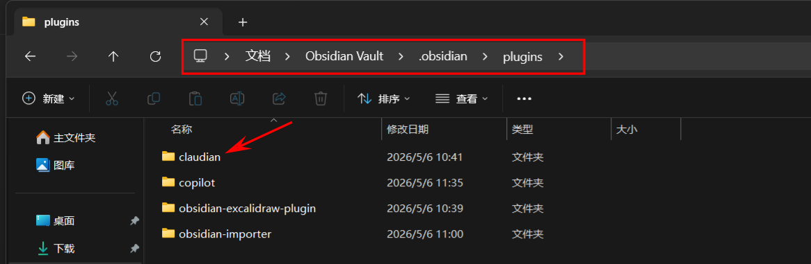

在第三方插件点下刷新就可以看到成功加载到claudian插件了。

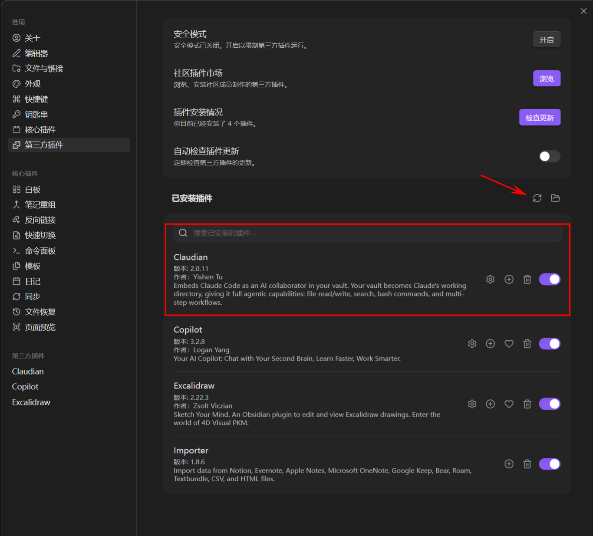

如果你本地Win主机已经配置好了Claude-cli的话，一般就可以直接使用了。

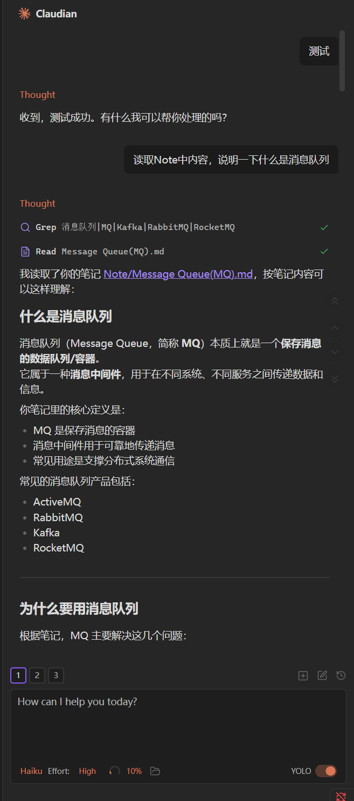

如果你默认是像我一样使用npm安装的claude-cli可能会没有识别到路径，可以在设置里面手动配置`cli-wrapper.cjs`路径。

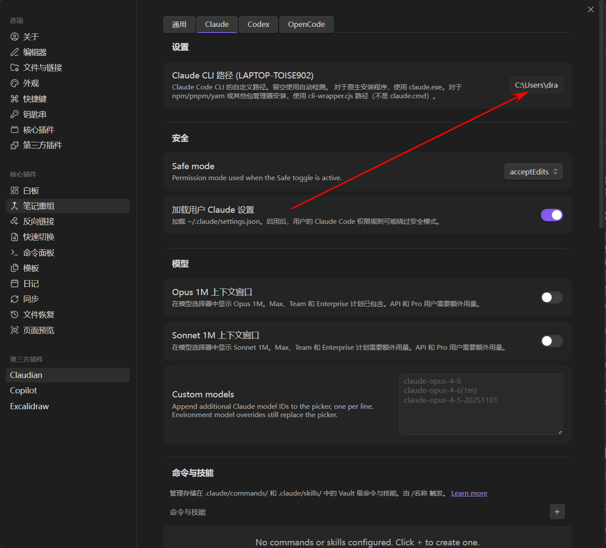

笔记软件接入Claude感觉还是太费Token（纯烧钱），本地跑个AI模型太费资源了，决定接个国产有免费额度的AI将就用用。

# 0x03 Copilot Plus

安装了obsidian默认支持的第三方插件`Copilot Plus`，里面可以配置很多模型。

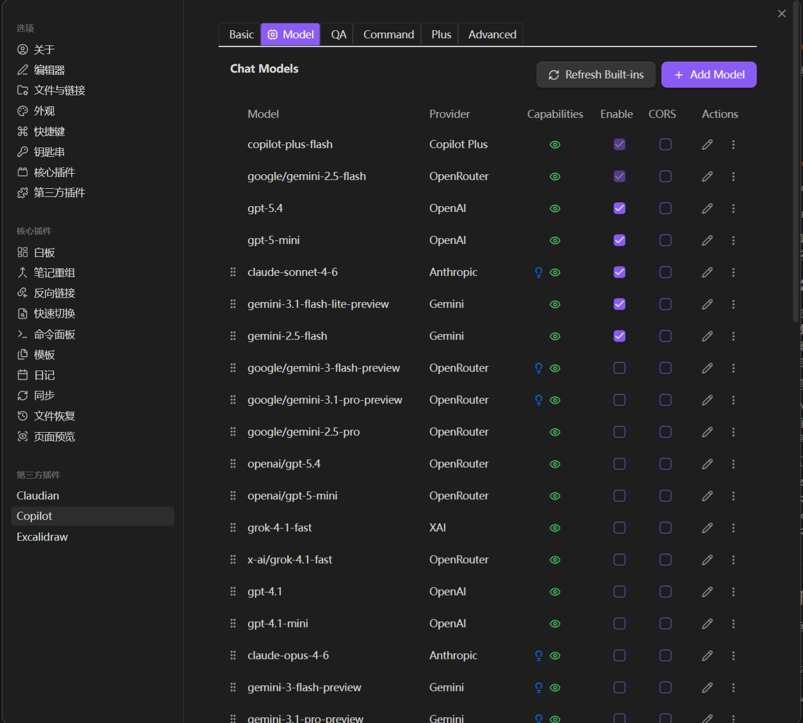

这里白嫖国产智谱AI的免费额度先将就用用，登录到[智谱](https://bigmodel.cn/)注册一个就能领免费额度了。

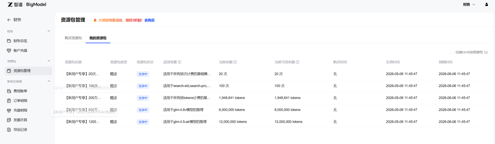

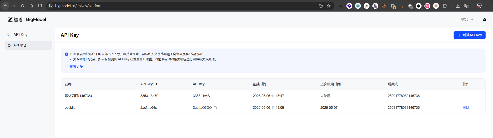

新建一个模型，把上面APIkey填进去就行了，这里的`Model Capabilities`有三个参数，分别是：

* Reasoning：推理能力，深度思考
* Vision：视觉能力，理解图片内容
* Websearch：联网搜索能力，浏览网页
根据个人需要进行勾选就行。

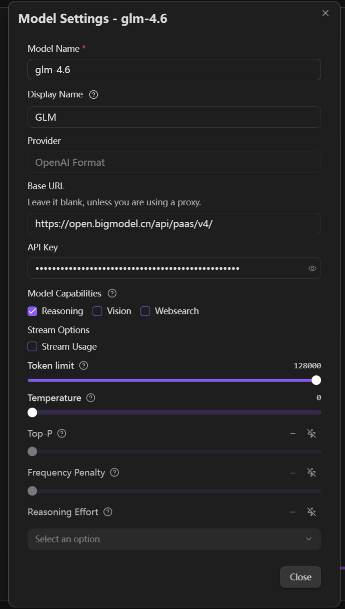

配置完`chat model`后，想让模型能够读取你笔记内容，还要配置一个`Embedding Model`，本质就是让chat模型拥有RAG检索功能，把你的笔记向量化后丢给`chat model`进行回复你的问题。
这里本来想使用`gemini-embedding-001`模型，但是obsidian默认插件配置的API路径一直有问题，没找到解决方案，后面改用`Qwen/Qwen3-Embedding-0.6B`。
配置也很简单，只需要根据提供链接获取API Key，把对应的Base URL和Key填入就行。

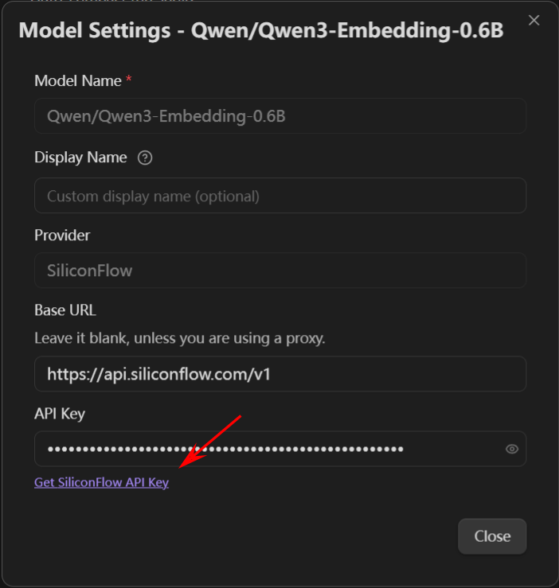

在QA这边设置好Embedding Model后，开启`Enable Semantic Search`选项后，就会自动开始索引你的笔记内容了。

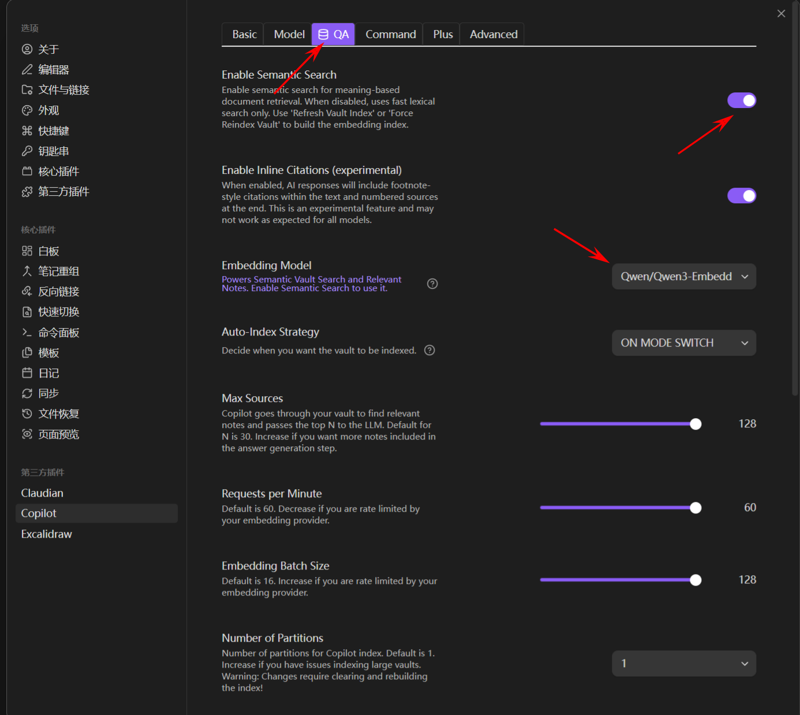

索引完成后，默认的模式只有`chat`和`vault QA`，前者貌似无法读取你笔记内容，所以在设置配置默认模式为`vault QA`。

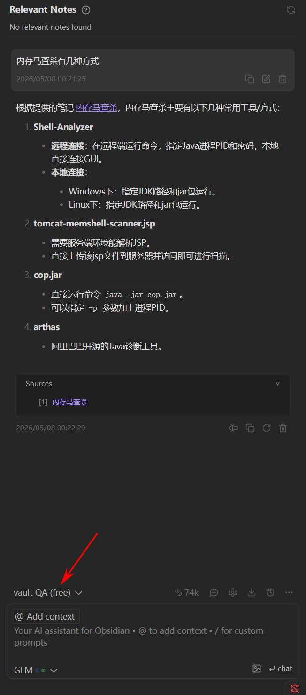

## 0x 04 总结

现在使用起来感觉查找笔记内容速度不是很快，设置的配置项基本都拉高了。还有就是Token消耗也是挺高的，就上面一个问题已经消耗了74ktoken，20w免费额度不够看，后续在考虑换一下其他或者折腾一下本地模型试试。