# 从代码审计到SRC提交

## 0x 01 前言

闲来无事，翻找一下之前下载的网站源代码，因为实习等缘故，下载的源码都没空审计，年后刚好腾出时间，稍稍看了一眼，没想到真出货了。

## 0x 02 代码审计

### 任意文件读取

在`File.aspx.cs`中使用了两个参数，分别是`image`和`file`，在之前的黑盒测试中只看到使用了`image`参数，没想到还有`file`参数直接可以读取文件。不过对参数进行了加密，我们看到调用了`MojoCube.Api.Text.Security.DecryptString`方法进行解密参数处理。

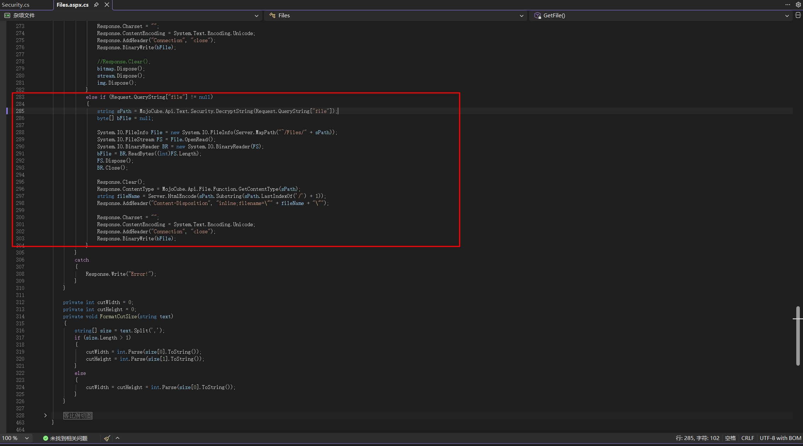

找到`MojoCube.Api.Text.Security`类中的加解密方法，好家伙，发现居然只使用了前置字符串`^$@%#!*&`进行base64就行了，这算哪门子加密啊。

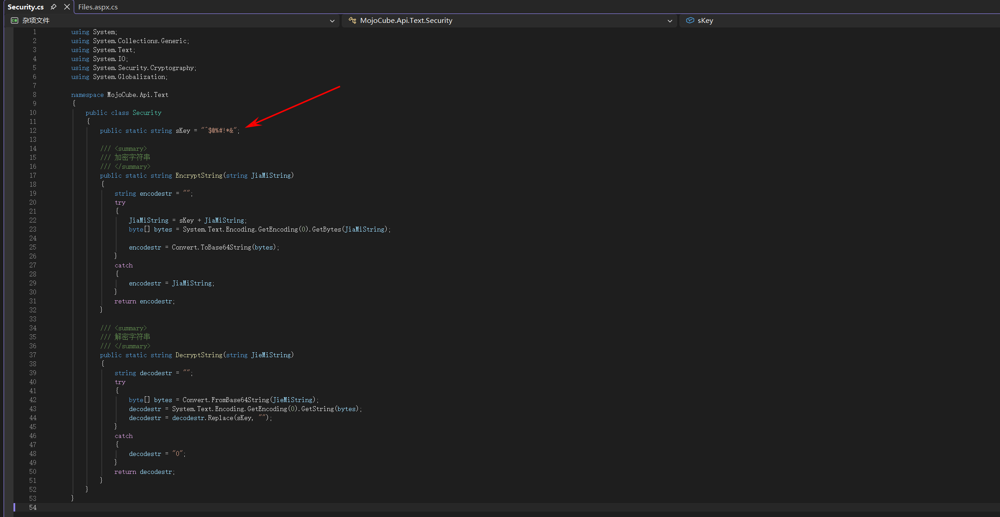

在Yakit中使用Fuzz tag直接构造file参数读取Web.config文件。

```
/Files.aspx?file={{base64(^$@%#!*&../Web.config)}}
```

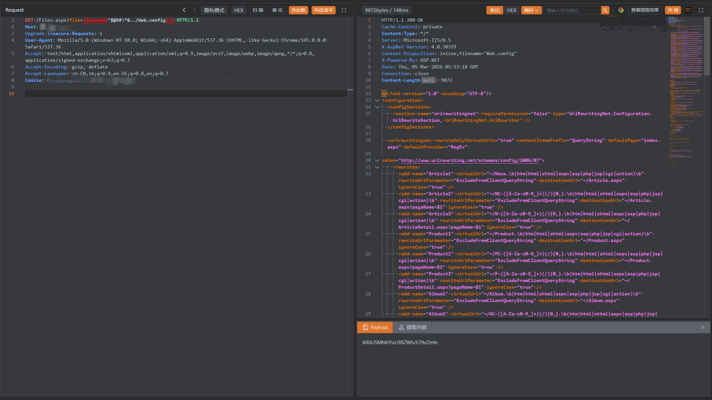

并且在Web.config中发现存在数据库账号密码，并且数据库是开放在公网上的，直接使用Navciate连接

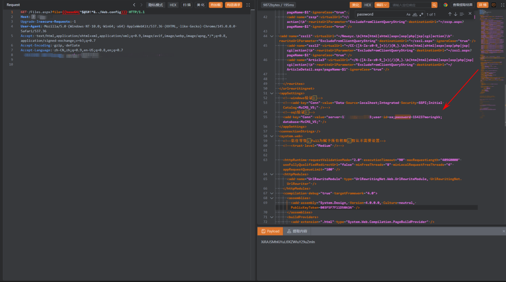

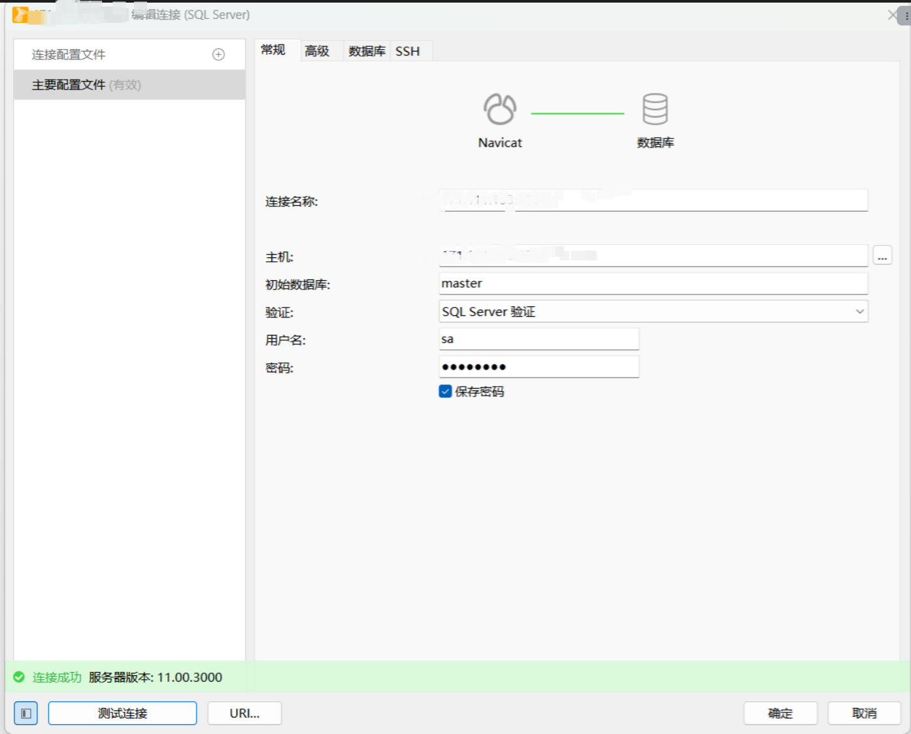

### 反射型XSS

简单让AI Agent帮我们审计一下代码，看看还有没有其他可能存在在漏洞点，通过AI给出HTTP请求包，我们进一步审计一下代码

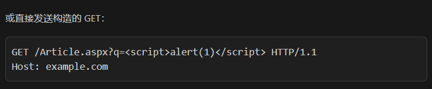

在`Article.aspx`文件中存在参数`q`的SQL拼接，但是存在函数`ojoCube.Api.Text.CheckSql.Filter`对其内容进行过滤

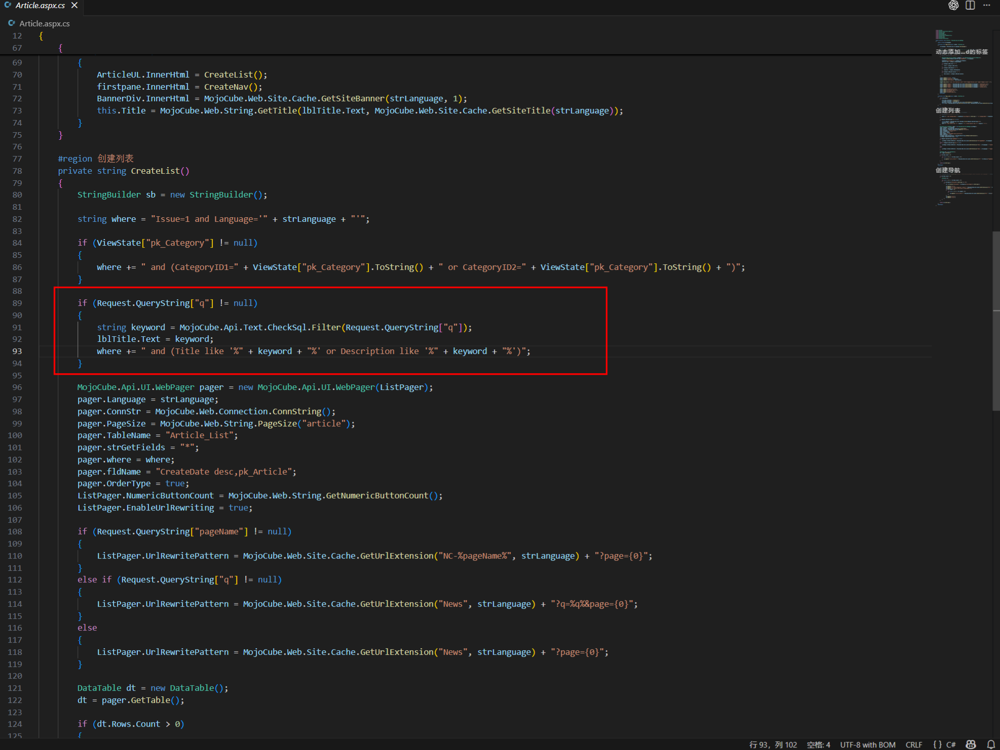

查看了一下`CheckSql.cs`中的`Filter`函数，发现会对单引号进行替换为两个单引号，观察动态SQL拼接语句也是字符型注入，没有单引号也无从注入。

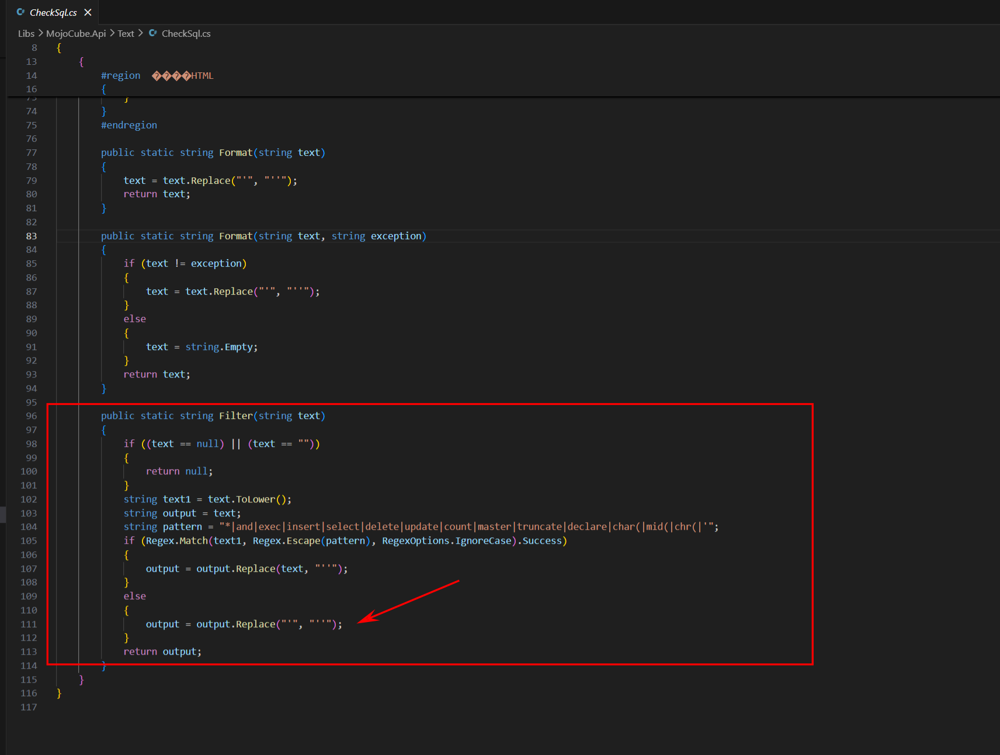

`lblTitle.Text = keyword;`会把`q`参数内容展示到HTML页面中，可以水一个反射型XSS

```
Article.aspx?q=<script>alert(1)</script>&Page=1
```

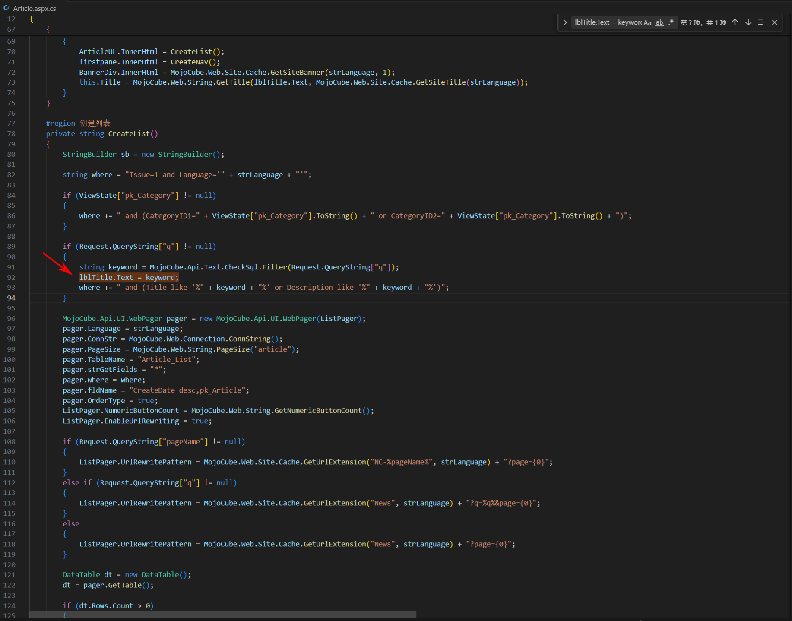

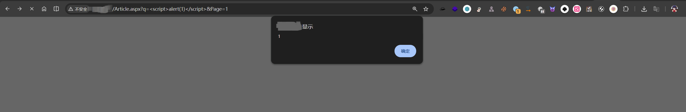

进一步发现不少页面功能都存在这个漏洞点

```
/djgh.aspx?q=<script>alert(1)</script>&Page=1
/Product.aspx?q=<script>alert(1)</script>&Page=1
/zszp.aspx?q=<script>alert(1)</script>&Page=1
```

### KindEditor 列目录

这个没啥好说的，在源代码中发现使用了`KindEditor`组件，并且版本较低为`4.1.10`

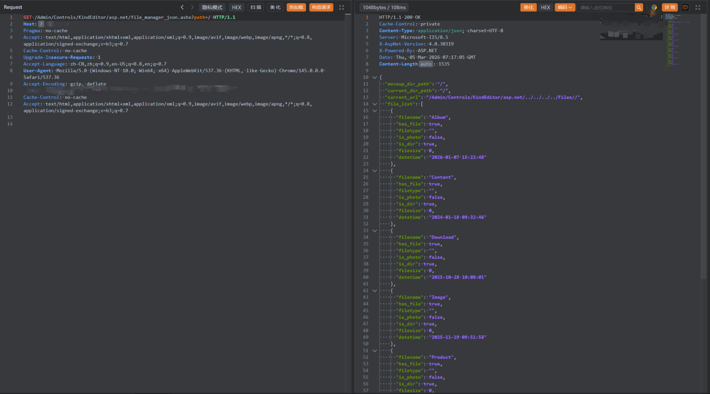

还能传一个HTML再水一个存储型XSS

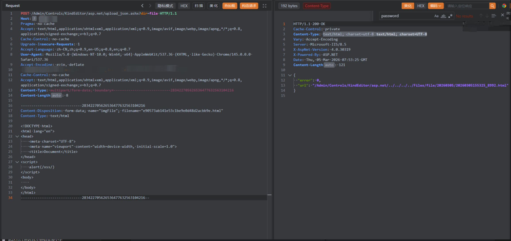

## 0x 03 后续渗透

### 弱口令

从文件读取中发现数据库账号密码，连接后发现后台/Admin路径下系统账号密码哈希，

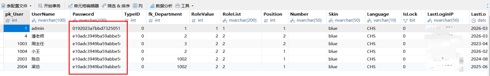

`admin`密码居然是`admin123`这种弱口令

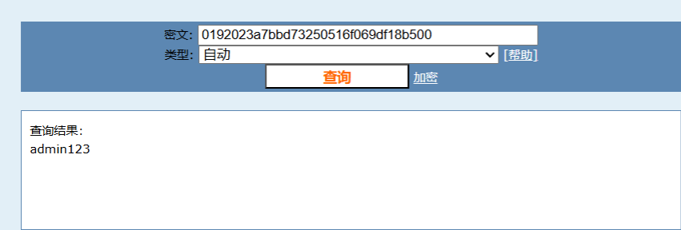

直接就登录到后台

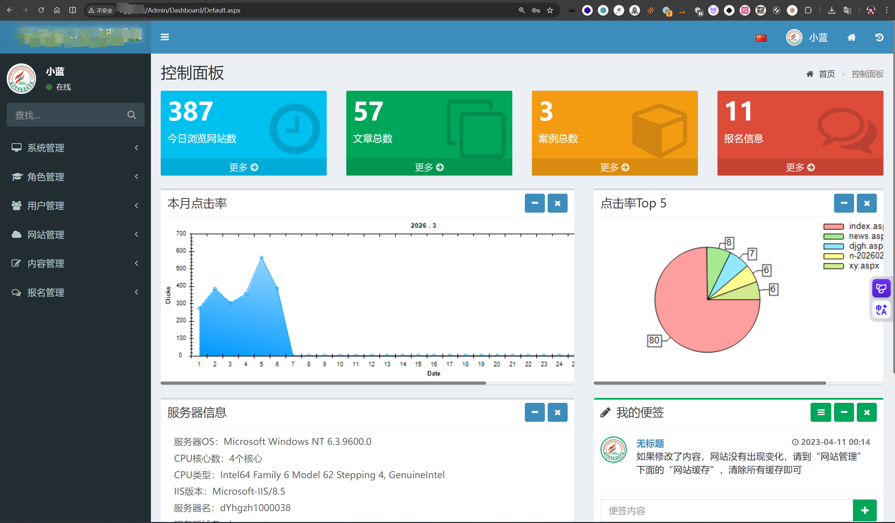

### 文件上传

在后台翻找功能点，也是成功找到三个文件上传接口，上传aspx文件后直接antsword连接了。

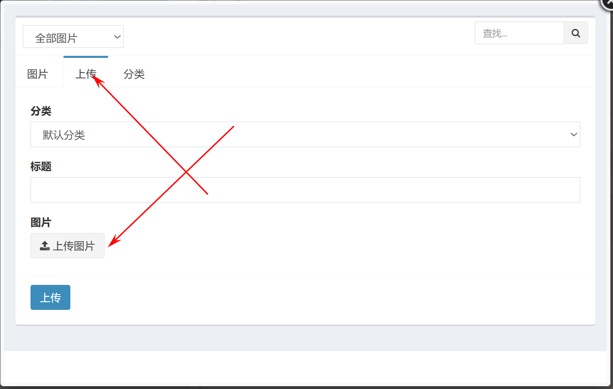

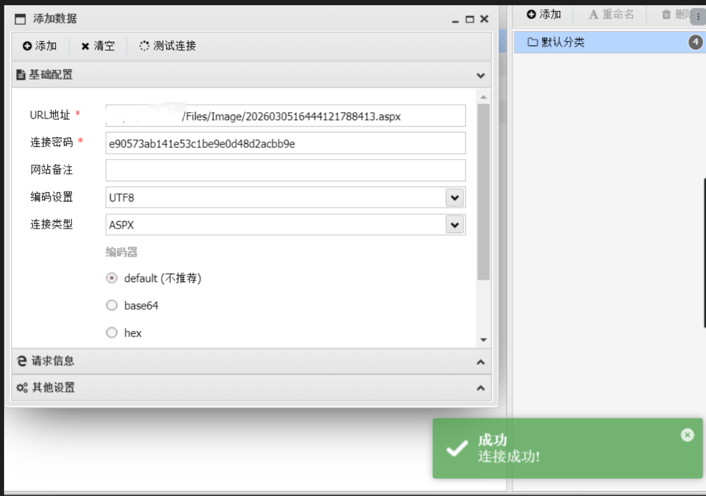

## 0x 04 反思

前前后后这个系统也是交了好多份报告，写了好多漏洞。列目录漏洞居然不收，还以为能混个低危呢。最后登录系统黑盒测试文件上传功能，在审计代码的时候居然没有发现（代码审计能力还得加强），Agent审计代码的能力看来也不太行。。。

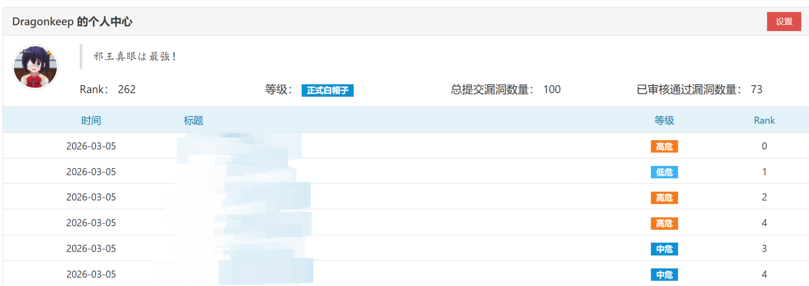