## 0x 01 前言

在日常渗透测试中，总感觉ASP站打起来比较吃力，通常一些比较旧的站都使用**`ASP.NET WebForms`**这种类似桌面开发的框架来写Web程序。这类站点在登录界面甚至整个站点都很难见到一些JS文件，也就少了很多测试接口的机会。在没有口令登录的情况下，大大增加了渗透测试的难度。故记录一下第一次打穿某ASP站点过程。

## 0x 02 渗透过程

起手是某学校教务系统的后台，观察路径为`/Login`，一般路径是大写字母打头的路径都是ASP站点居多，或者可使用`Wappalyzer`识别一下。

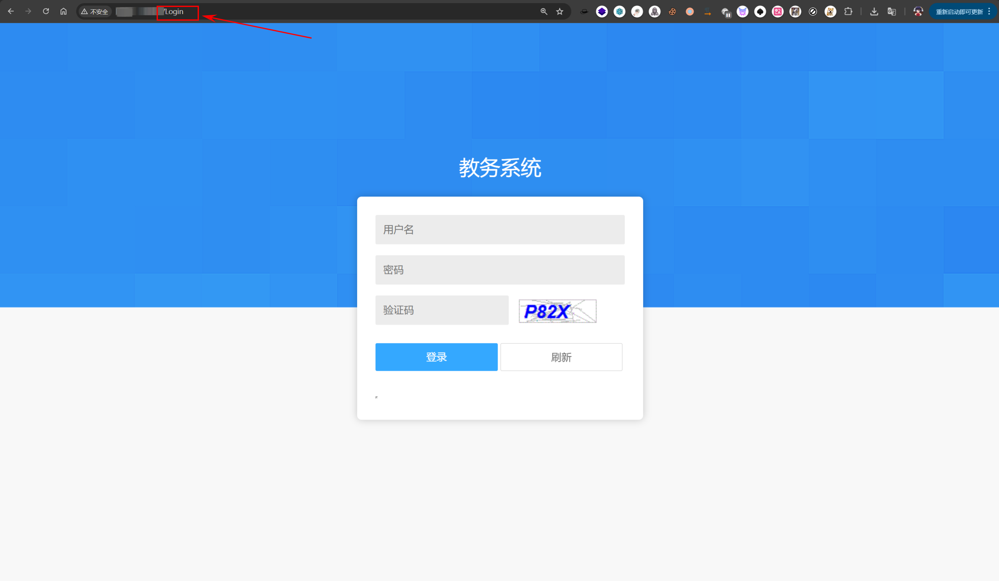

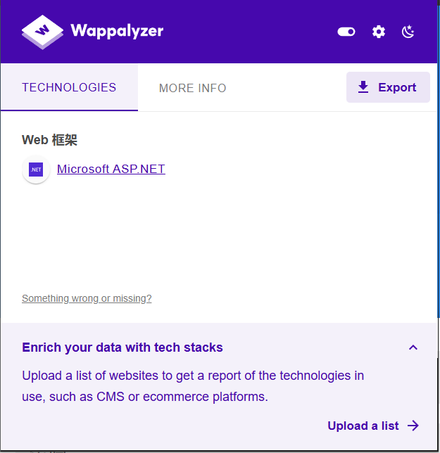

简单尝试了弱口令登录，但由于存在验证码限制，只能手工测试了几个常见口令，最终也未能成功登录。没有弱口令，没有JS文件，只能开扫目录，还好没有WAF拦截。

这一扫，还真扫出东西了，`/dev`目录没删，一看就是开发老哥调试的接口。

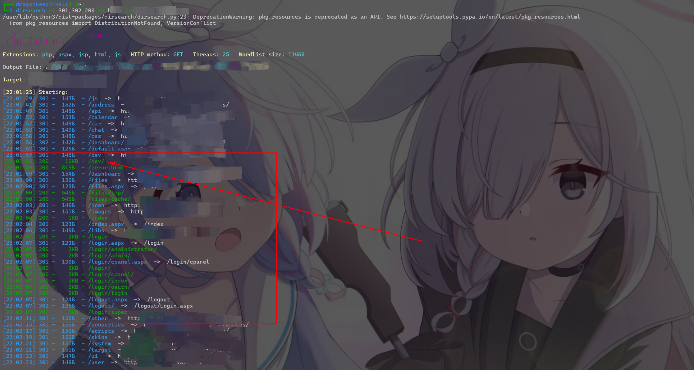

访问`/dev`，一看我去这不数据库账号密码吗，赶紧扫一下端口，看看数据库有没有开端口到外网。

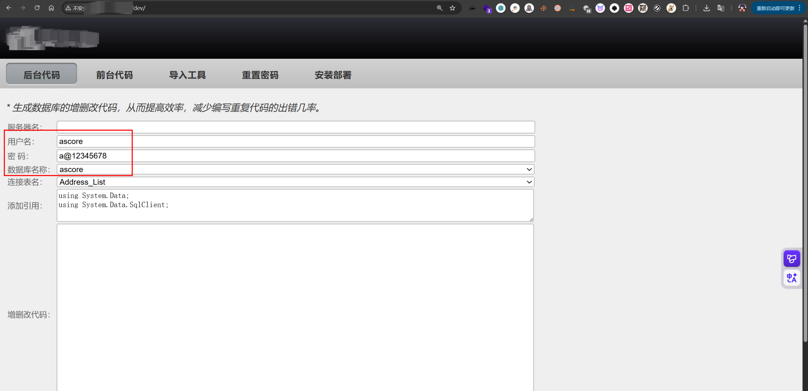

简单使用 Goby 进行扫描，发现目标存在 MSSQL 数据库服务，思路逐渐清晰，随即尝试直接连接。

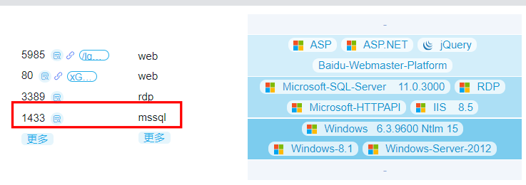

Navicat启动，发现存在大量师生信息，可惜没有身份证，只有学号、手机号。

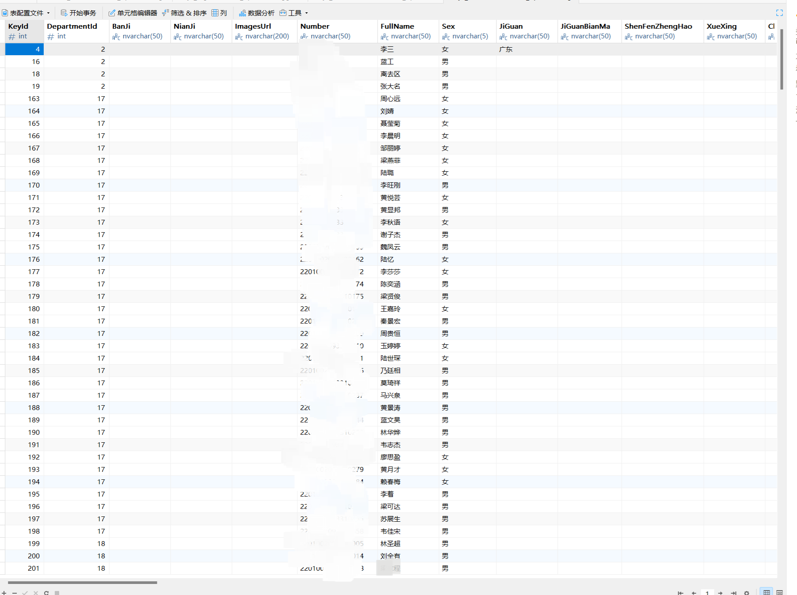

虽然有系统后台账号和密码哈希，但是密码哈希是加盐的，也不好直接爆破。

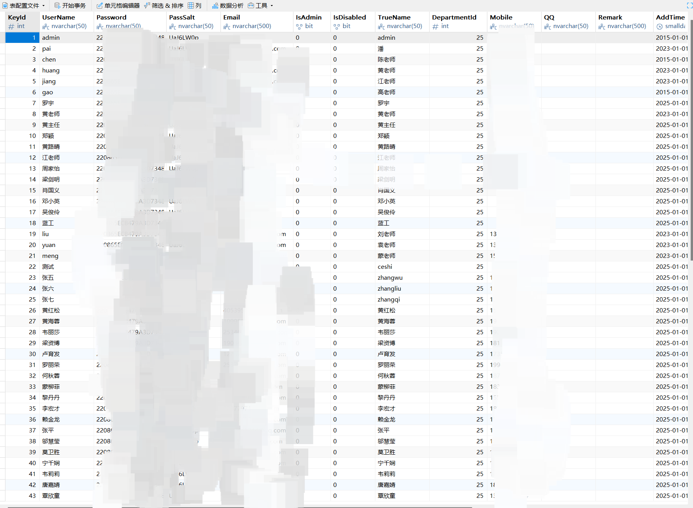

回头看看开发老哥还给我留了一手大惊喜，居然有admin账号直接能重置密码，而且重置完密码是多少告诉我了

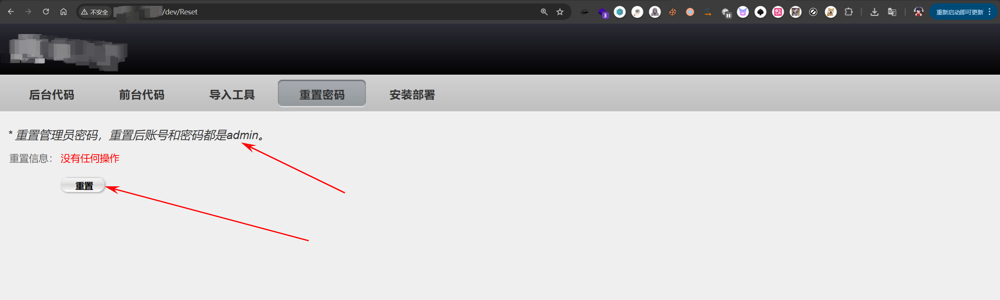

重置完，`admin`/`admin`成功进入后台管理员。

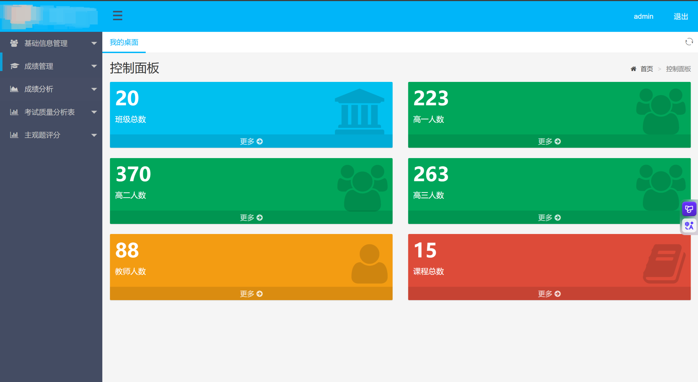

随便点点查看一下功能点，发现学生管理地方可以上传头像

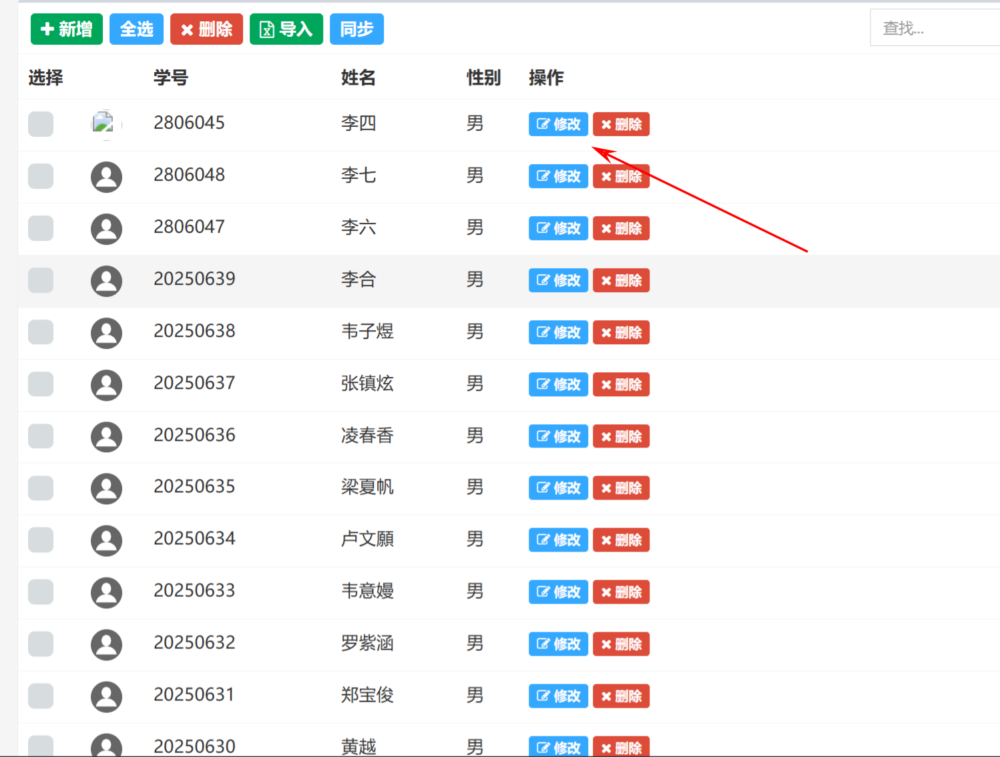

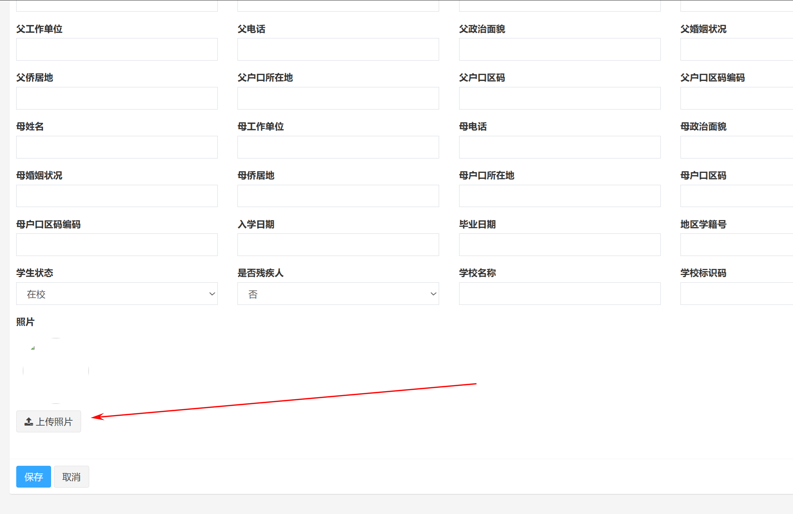

直接上传asp文件，显示上传文件不合规，先上传正常文件，再抓包修改后缀名，都是一些常见的思路。

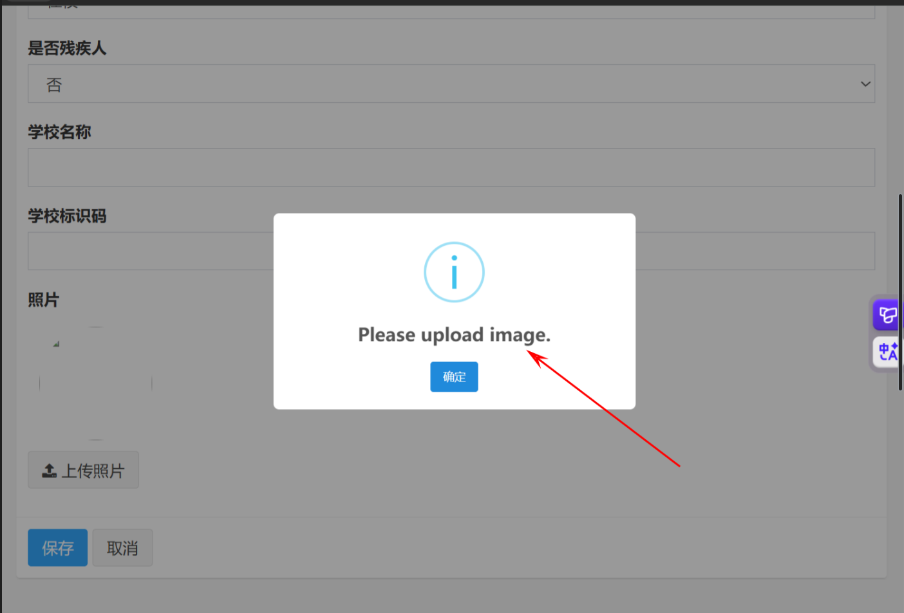

抓包上传后，显示未找到路径，也是十分奇怪，传png文件也是无法找到路径，但是访问路径`/Files/Student/1/2025122812201752676661.aspx`确实是传上去了。

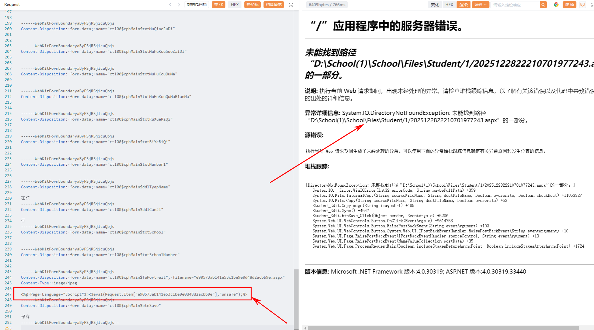

直接`antSword`启动连接，上马成功，点到为止，也没有进行查看服务器其他东西。

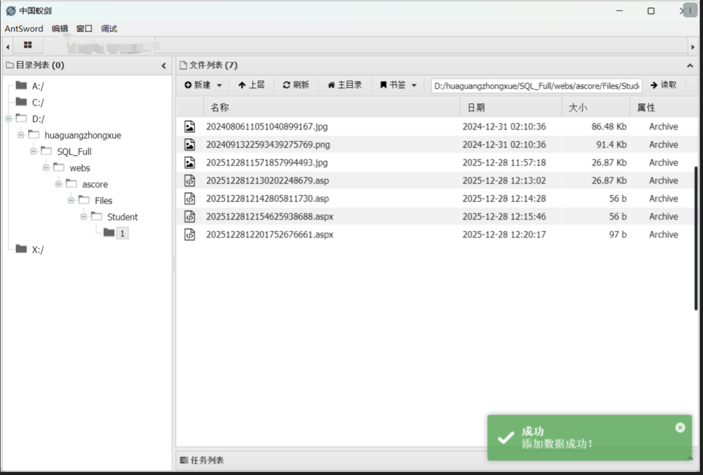

资产测绘上搜索了一下，发现是一个通用的CMS，而且这个开发接口也有很多系统没有删除，想到这种`ASP.NET WebForms`站点比较旧，后台有SQL注入的概率估计比较高。依旧是代理开起来抓包，后台除了删除和添加数据的功能点都点一点，保证参数都能抓到，再一个个包简单测试一下。

也是十分幸运，`/Grade/Report`接口下的参数`ctl00%24cphMain%24txtWhere`单引号报错了，根据参数名猜测应该是拼接到SQL关键字`where`后面

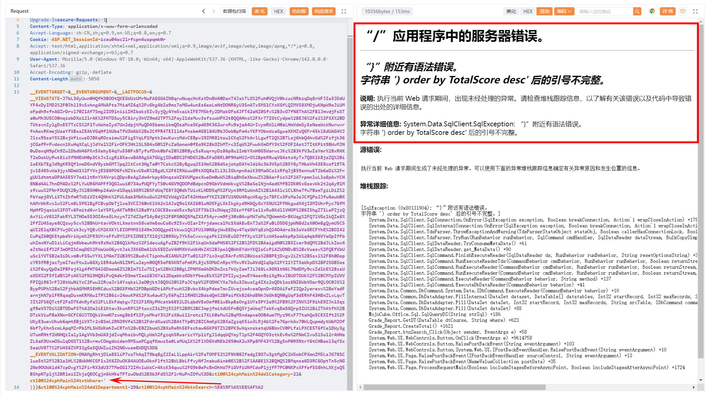

刚开始使用SQLMAP还跑不出来，开了`level5`都没用，思路一下子断了，感觉不太可能注不出来才对，`MSSQL`相关注入还是学得太少了，有空还是得补补。

简单把报错语句贴给AI，才明白少加了括号闭合，其实后面看报错语句其实很明显，当时估计太激动了。。

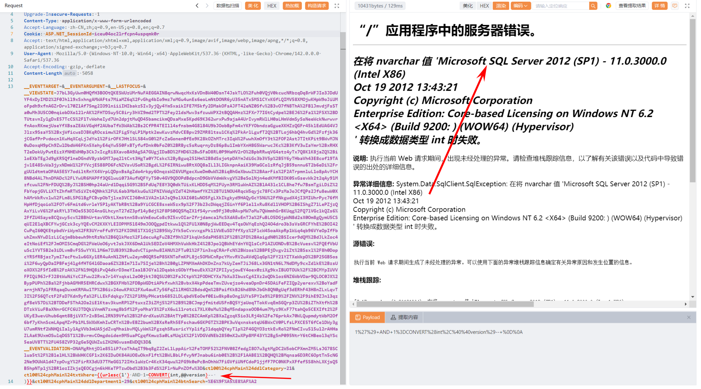

> sqlmap -r sql.txt  --dbms="mssql"  --prefix="')" --level 5 --batch

SQLMAP指定一下前缀`--prefix="')"`就秒出，看来还是不能太心急，容易头昏脑胀。

如果一个参数存在注入的话，大概率其他接口这个参数也能注入，开发编写ORM配置基本都是如此，除非是特意修复过，不然出货概率很大，在一堆的Yakit HTTP请求包中直接搜参数`ctl00%24cphMain%24txtWhere`，果不其然，又找到一个接口`/Grade/Report1`，除了接口不一样，参数啥基本一致，就不贴了。

## 0x 03 反思

相比Java站点，**`ASP.NET WebForms`**这类站点，在没有口令情况下属实难以动手，但一旦能进入到后台，文件上传很大都没有限制后缀，不像现在一些Java框架，直接在配置文件里面写了限制后缀`jsp`等，SQL注入出现的概率也会相对高一些。其实看到**`ASP.NET WebForms`**框架第一时间想的是打`ViewState`反序列化，但是貌似开了`ViewState MAC`（主要还是研究得少，下回系统研究一下），没那么好打。

